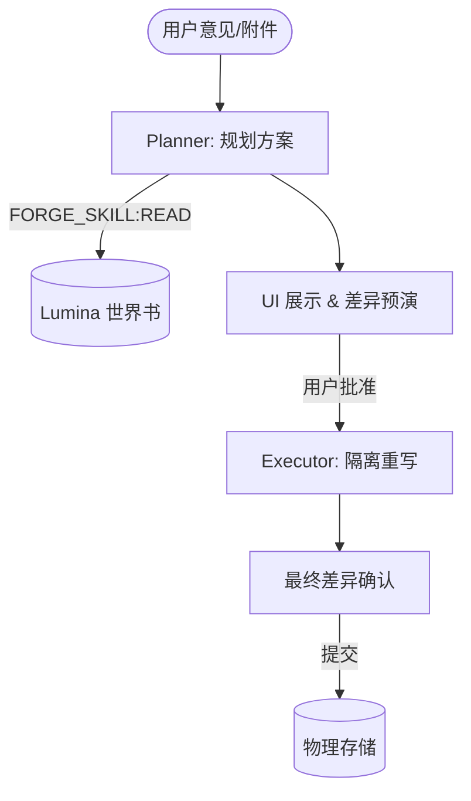
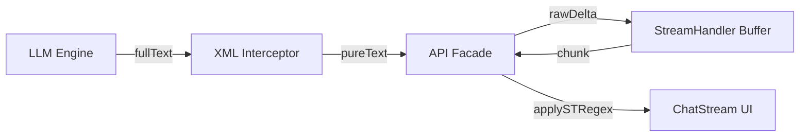

# LuminaWeave 系统架构与设计文档（System Design）

**版本:** v6.0-dev
**最后更新时间:** 2026-04-20

## 一、系统架构理念

作为 SillyTavern 的增强框架，LuminaWeave 的设计核心是 **深度接管与绝对隔离**。通过独立运行于浏览器的"前端微内核"（Lumina Core），实现自身视图层的自治，仅在发生大模型收发时进行"选择性同构写回"。

## 二、核心组件设计与作用边界

### 0. Plugin Platform v2（插件平台运行时） [NEW]

本轮架构重构将 LuminaWeave 前端拆为四个强边界层，并以破坏式迁移为默认策略，不维护旧插件 / 旧主题 / 旧设置 API 的兼容路径。

- **Core Runtime**：业务真相层。负责会话、同步、存储、生成流、Prompt、XML、事务、世界线与宿主桥接。Core 不得 import `theme/`、`shell/` 或具体插件 Vue 页面。
- **Plugin Domain**：领域能力层。插件通过 Manifest v2 注册 `capabilities / selectors / intents / settingsSchema / surfaces / businessRenderers`，不再把固定 slot 组件作为主要 API。
- **Desktop Mode Runtime**：主题桌面层。桌面模式声明 `shellRenderer / navigationModel / surfaceMap / componentOverrides / interactionPolicy / tokens / settingsSchema`，主导大部分 UI 与交互。内置桌面模式的 v2 manifest 已开始携带 shell renderer 声明；`LuminaShellRoot` 现在从 runtime manifest 解析当前 shell renderer，并在内部建立显式 `ShellRuntimeContext / ShellRuntimeActions / ShellRuntimeSurfaces` 契约。Traditional/Freeform shell renderer 均已消费该正式 runtime API；Telegram / Discord 的 shell 交互入口已从 App 下沉到对应 shell composables。
- **Surface Runtime**：连接层。`SurfaceRegistry` 按 `currentDesktopMode + contractId` 解析 renderer，优先级为 `desktop override > plugin business renderer > core default renderer > empty renderer`。Renderer 只接收 state snapshot、intents 与 theme context，不直接写 Core 内部状态。
- **API Services / Facade [NEW]**：`LuminaWeaveAPI` 开始从巨型实例收缩为组合与调试入口。`DesktopSurfaceService` 负责 registered panel registry、desktop mode registry bridge 与 `openPanel/openTab` surface 导航；`HostInteractionService` 负责宿主 toast 与跨环境 async confirm；`ConversationDomainService` 负责会话来源、会话列表、上下文读取与世界线命令的 service boundary；`GenerationDomainService` 承接聊天发送、重生成、PromptInspector 自定义提示词运行与生成状态读取；`SettingsDomainService` 承接设置读写、canonical/legacy key 映射、全局设置导入导出与存储变更监听。上述能力均通过 `LuminaWeaveAPI.services.*` 暴露。现有 `LuminaWeaveAPI.registerPanel/registerDesktopMode/listDesktopModes/getDesktopMode/openPanel/openTab/showToast/confirm/listConversationSources/listConversationSessions/getConversationContext/getConversationMessages/getConversationTimelineGraph/switchConversationContext/*ConversationNode/sendMessage/regenerateLast` 仅作为 facade 委托或 runtime port 保留，后续 UI 应迁移到明确 domain service。

本阶段已在 `luminaweave-extension/src/platform/` 建立初始类型与注册表骨架；插件平台重构执行记录已归档到 `docs/archive/completed-tasks/plugin-platform-refactor/`。Telegram 桌面资料栏已作为桌面模式自有的 `telegram.infoPanel` surface override 注册，App / Shell 只负责打开 contract 并传入角色频道状态与意图。

### 1. Lumina Core（核心底座）

沟通原生 ST 平台和诸多子插件的中间层，包括：

- **核心快照与记忆中心 (MemoryManager)** [NEW]：负责协调所有子插件的状态持久化。
- **全局文本测量服务 (MeasureService) [NEW]**：集成 `@chenglou/pretext` 库，提供毫秒级、基于 LRU 缓存的文本高度预计算，服务于 Timeline 布局与虚拟列表。
- **上下文自动解析 (Context Resolver) [Standardized]**：
### 2.3 Shared 层 (共享引擎)

Shared 层不再仅仅是类型定义，它承载了 LuminaWeave 的“业务大脑”：
- **SyncEngine**: 无状态的差异比对算法，确保多端看到的消息 ID 与指纹判定逻辑完全一致。
- **TransactionEngine**: 事务流水管理，负责序列自增、幂等校验逻辑。
- **BaseXMLInterceptor**: 基础解析引擎。
    - **三层探测机制 (Triple-Layer Discovery)**：
        - `SillyTavern` (容器): 探测全局变量。
        - `getContext()` (数据): 获取当前活跃的会话及其属性快照。
        - `TavernHelper` (工具): 访问更底层的原生控制函数 and 扩展 API。
    - **EventEmitter 定位器**：针对 `eventSource` 执行 `Context > Main > Window` 的层级搜索，确保跨环境事件监听的 100% 成功率。
    - **逻辑解耦**：所有业务模块（Lorebook, Storage 等）统一接入，不再关心宿主运行模式，极大地增强了系统的鲁棒性。
- **生命周期网关与事件流 (EventFlow) [NEW v6.0]**：引入基于 Kotlin Flow 风格的阻塞式异步事件机制。
    - `beforeGenerationStartFlow`: 用于在生成触发前收集操作（如 DCC 压缩）。
    - `messageReceivedFlow`: 允许 UI 与存储层在收到流式消息后异步协调刷新。
    从之前将挂载逻辑硬编码进 `sendMessage` 的老旧耦合中解放出来，将重型操作统一注册为流响应。在执行生成操作前按条件切片安全执行等待处理，彻底杜绝数据在流生成时的竞态不同步。
- **同构 Bridge 架构与多端适配层 [NEW v6.0]**：
    LuminaWeave 不再直接在业务层构造网络请求，而是通过 `luminaweave-extension/shared/api/IBridge.ts` 定义了一套平台无关的业务接口，并由 `BridgeDispatcher` 在运行时注入具体的物理实现：
    - **HttpBridgeAdapter**：传统的 Web 环境适配器。封装了 `fetch` 与 `fetch-event-source`，内置 CSRF 自动刷新与重试逻辑，服务于标准的 SillyTavern + Lumina Server 部署环境。
    - **TauriBridgeAdapter [NEW]**：原生环境适配器。适配 TauriTavern (Android/Native)，优先使用 `window.__TAURITAVERN__.api.extension.store` 官方 ABI，并降级支持原生 `invoke` 机制。该适配器还实现了符合官方规范的 Key 过滤逻辑（支持 `.` 与 `-`），补全了包括 `renameKey` 与 `listTables` 在内的全量存储管理能力。
    - **Host Layout Contract [UPDATED]**：UI 层在 TauriTavern 中新增对 `window.__TAURITAVERN__.api.layout` 的订阅，统一读取 `safeInsets / viewport / ime.keyboardOffset` 快照，并向内部下发 `--lw-safe-* / --lw-ime-bottom / --lw-keyboard-offset` 等 CSS 变量；当宿主 ABI 不可用时，才回退到 `visualViewport` 推断。
    - **移动端 IME 已知问题 [NEW 2026-04-19]**：根据 `ime_filtered4.log` 的现网日志，当前 Android / TauriTavern 适配仍存在一组已确认但尚未完全收敛的时序问题：
      - 同一次 `focusin` 后，前端经常先收到一帧 `imeActive=false, keyboardOffset=0` 的快照，随后才收到真实的 `imeActive=true, keyboardOffset>0`。这意味着首次可见性同步可能仍然基于 0 inset 执行一次，表现为“点击输入框后先被键盘挡住，输入一次或再次触发布局后才恢复正常”。
      - 在输入框保持焦点期间，宿主快照会出现 `imeActive=true/false` 来回切换；前端因此可能提前执行 `reason=ime-hidden` 的 session 清理，随后又重新 commit IME inset，导致一次输入周期内重复进入“清除 -> 重建”。
      - `activeSurfaceKind` 在焦点切换边缘会出现 `fixed-shell` 与 `composer` 的切换；当前前端已记录该字段，但尚未完全消化这类 surface 抖动，因此它仍是移动端适配不稳定性的观测点之一。
      - 显式 IME 模式下，`scrollRoot` 可见性校正会在单次键盘生命周期内被重复触发；从日志看，这种重复校正既发生在 `keyboardOffset=343` 的真实键盘阶段，也发生在 `keyboardOffset=0` 的过渡帧。
    - **问题边界说明 [NEW 2026-04-19]**：上述问题当前只被记录为“宿主 Layout 快照生命周期与前端 IME session 状态机之间仍存在时序抖动”。现有日志足以确认症状与触发链路，但还不能单凭日志断言根因完全在宿主 ABI 或完全在 Lumina 前端；后续修复需要继续对齐 `focusin/focusout`、宿主 `layout` 推送与本地 session commit/clear 的先后顺序。
    - **流式归一化 (Streaming Normalization)**：通过 `IStreamingHandle` 接口抽象了不同环境下的流式输出（SSE / 轮询 / 原生事件），使 `NexusClient` 等消费者只需订阅统一的回调（`onToken`, `onDone` 等），无需关心具体的传输协议。
    这一架构彻底实现了“一套核心业务逻辑，多端透明运行”的目标。

### 2. UI 渲染宿主 - 可选的 Shadow DOM 沙盒隔离层 [v5.7 优化]

在 ST 定义的插槽位使用 Vue.js 3 开辟独立绘制区域。默认开启 Shadow DOM 以隔离原生 CSS 污染。
- **严格样式选择性注入 (Strict Style Isolation)**：`index.ts` 中的 `injectStyles` 仅克隆包含 `data-vite-dev-id` 或内容中带有 `LuminaWeave` 特征标识的样式节点。这确保了 Shadow DOM 内部仅应用插件自身样式，彻底杜绝 SillyTavern 全局样式（如对 `input` 和 `button` 的强制覆盖）造成的 UI 异常。
- **Tailwind Utility Layer + Lumina UI Primitives [NEW]**：UI 实现层开始接入 Tailwind CSS v4，但 Tailwind 只作为 utility layer。入口 `src/styles/tailwind.css` 使用 `tw:` 前缀、只导入 theme/utilities、禁用 Preflight，并通过 `@theme inline` 消费 `--lw-*` 语义 token。业务组件优先复用 `src/ui/primitives/` 中的 Lumina 原语，动态 class 统一通过 `src/ui/cn.ts` 合并。该层不得替代 Desktop Mode manifest、surface skin 或 renderer variant，也不得绕过 Core Runtime 修改业务状态。
- **兼容性降级**：支持在设置中关闭 Shadow DOM 以增强特定浏览器的兼容性。
- **Host Surface 映射 [UPDATED]**：由于 Shadow DOM 内部节点默认不暴露给宿主 overlay classifier，移动端 IME 适配不再依赖 Vue 内部 DOM 直接标记 surface；`index.ts` 维护外层 host container 的 `data-tt-mobile-surface`，折叠态映射为 `free-window`，展开态映射为 `fullscreen-window`。
- **Forge 表单控件宿主隔离 [UPDATED]**：Forge 的 `input / textarea / select / checkbox` 不再依赖浏览器默认样式，而是统一显式声明 `appearance`、背景、文字、边框、placeholder、focus 与 disabled 状态。这样即使关闭 Shadow DOM 或落在宿主全局表单样式较强的环境里，浅色模式也不会被宿主暗色控件样式覆盖。
- **IME 提交保护 [UPDATED]**：聊天输入与 Forge composer 的 Enter 提交流程新增 composition guard，统一识别 `isComposing / nativeEvent.isComposing / keyCode=229 / compositionstart-end`，确保拼音、假名等候选确认不会被误判为发送或生成。

### 3. PluginManager（插件管理器解耦层）

所有视图应用（ChatStream、Timeline、Status 等）均抽象为 `src/plugins/` 下的独立模块，由 `PluginManager` 在根组件 `App.vue` 启动时统一动态注册。
- **App Shell 分层 [UPDATED]**：`App.vue` 现在作为运行时编排入口，仅负责状态组装、composable 调用与事件绑定；`shell/AppRootContainer.vue` 负责 root 级宿主容器、展开态与视口/定位边界；`shell/LuminaShellRoot.vue` 只负责内部 shell 内容编排与 traditional/freeform 分支。

### 3.1 Desktop Mode Registry（桌面模式注册层） [NEW]

- **桌面模式协议分层**：前端主题不再只等于根节点浅深色变量。当前系统引入单轴 `Desktop Mode` 模型，并在用户层直接暴露桌面模式切换。协议统一描述三层主抽象：
  - `shell.kind`：决定该桌面模式落在哪种壳层形态；当前仅允许 `traditional` 或 `freeform`。
  - `navigation preset`：决定 Header、角色轨、Dock、Stage Strip、辅助区入口等导航组织。
  - `surface preset`：决定主内容区、辅助区、聊天流、设置面板、时间线等表层容器的承载方式与默认 variant。
  其中 `design tokens`、`surface skins` 与少量受控 `renderer variants` 只作为下层落地附件。
- **壳层主导 / 表层兼容 [UPDATED]**：桌面模式优先通过 `shell / navigation / surface` 驱动 Shell 组织，并在设置中以“桌面模式”方式暴露；少量受控 `renderer variant` 仅作为表层兼容扩展。当前 `Discord`、`Telegram` 与 `传统桌面`、`自由工作台` 同级，其数据来源仍受限于统一 `ConversationService` 暴露的会话摘要，不直接触碰会话状态机。
- **设计规范分层 [NEW]**：长期设计契约收敛到 `docs/overall/design/`，作为类似接口层的 Core Design Spec，定义 Typography 等跨桌面模式共享的最低 token 契约。每个桌面模式在 `docs/overall/modules/desktop_modes/<mode>/design.md` 维护完整 Desktop Design Language，可表达 Telegram Liquid Glass、Discord Channel Workspace 或未来 M3 Expressive 等强个性化视觉；代码实现仍通过 `DesktopModeManifest / designTokens / surfaceSkins / rendererVariants / settingsManifest` 落地。
- **消息渲染矩阵 [UPDATED]**：聊天消息的视觉协议已经从 `lumina-chat` 插件迁移到 Desktop Mode。每个桌面模式都需要通过 `settingsManifest + surface skin` 输出角色级消息矩阵：`assistantMessageShape / userMessageShape`、`assistantAvatarPlacement / userAvatarPlacement`，以及统一排版变量 `chatFontFamily / chatFontWeight / chatFontSize / chatPageWidth / chatLineHeight / chatParagraphSpacing / chatLetterSpacing`。在统一排版之上，`assistantTypographyMode / userTypographyMode` 可选择跟随统一值或输出角色级 `fontSize / lineHeight / letterSpacing` 覆盖；`ChatStream` 与 `ChatPreview` 只消费当前桌面模式解析后的 CSS vars 与 data attributes，不再读取旧 `lumina-chat.*` 外观键。
- **Telegram 桌面模式边界 [UPDATED]**：`telegram` 是 traditional shell 下的独立内置模式，桌面端由 Shell 直接渲染三栏布局，不保留 mac 三色按钮窗口栏。其扩展边界由 `headerVariant='telegram'`、`leftRail='character-rail'`、`surfacePreset.*='telegram'` 以及 `telegram.frame / telegram.chatList / telegram.conversation / telegram.infoPanel / telegram.composer` 专用 surface contract 描述。`panelChromeStyle` 控制 `floating-rounded / edge-to-edge` 两种桌面面板外观，`topBlankSpace` 只控制三栏顶部呼吸空间；这些设置只输出 theme css vars，不改变业务状态。上下文插件只通过受控 component skin 扩展表层，当前新增 `stats.panel` 与 `director.panel`，并继续复用 `timeline.root / lorebook.workspace / lorebook.editor / settings.*` 的 Telegram renderer variant。左栏搜索 query、筛选 tab、`+` 二级菜单、工具入口、聊天顶部更多菜单、composer 工具菜单等均属于 Telegram shell view-model 状态，只能消费 `CharacterChannelState` 与现有会话上下文，不进入 `CharacterChannelService` 或 `ConversationService`。左栏固定工具入口只包含 `lumina-launcher` 与 `lumina-forge`，点击入口通过 shell action 切换主区 surface 并清除角色概览选中态，不创建聊天、不打开会话。桌面端左右栏宽度拖拽同样属于 shell view-model：左栏持久化到 `luminaWeave.telegram.leftRailWidth`，右栏复用 `luminaWeave.widgetWidth`，最大宽度按视口与中间聊天区最小宽度动态计算。移动端底栏固定为 `聊天 / 角色 / 设置 / 个人资料` 四个意图；Timeline、Lorebook、Memory、Director、Stats 等消息型工具只能通过聊天顶部上下文入口、composer 工具菜单或会话资料页摘要入口打开既有面板，不能成为 Telegram 主导航目标。移动端上下文工具由 `mobile-widget:*` 临时页承载，页面自身负责单列和安全区适配。该模式不得绕过 `ConversationService / STAdapter / PersistenceService / PromptBuilder`。
- **Telegram stack navigator [NEW]**：Telegram 模式不再依赖全局 `lw-panel-header` 作为主导航，desktop/mobile 均由 Telegram shell 自管导航。桌面端左栏、中栏、右栏是独立 stack；左栏 stack 只在 `会话列表页` 与 `角色列表页` 间切换，其中会话列表页继续包含现有搜索、筛选、工具入口和角色聚合列表，并额外支持按对话文件拆分显示。移动端底部 tab 固定为 `对话 / 角色 / 设置 / 个人资料`，每个 tab 内容区拥有独立 stack。上述 stack 状态属于 shell view-model，只能发起既有打开会话、创建会话、打开 surface 等 intent，不持有核心会话真相。
- **注册方式**：`src/theme/themeRegistry.ts` 维护内置桌面模式注册表，并开放 `registerDesktopMode() / listDesktopModes() / getDesktopMode()`。设置系统把每个桌面模式的 `settingsManifest` 视为一类伪插件设置来源，以复用现有设置总线与存储作用域。用户层正式暴露 `activeDesktopMode` 与 `desktop-mode-*` 命名空间，旧 `activeThemePack` 与 `theme-pack-*` 仅作为兼容映射。
- **兼容边界**：桌面模式可以决定壳层类型、导航组织、表层容器 variant，并向下分发 token / surface css vars / 受控 `rendererVariants`；但不得直接改变 `ConversationService / STAdapter / PersistenceService / PromptBuilder` 等核心运行时。

### 4. Shadow Buffer & 统一存储代理（Unified Storage Engine）

- **影子图谱缓存**：所有修改首先发生在 `localChatData`（影子数据库）中，UI 层单向订阅。
- **多级作用域（Scope Resolver）**：`Global`、`Character`、`Chat`、`Session` 等多级持久化。
- **选择性同步（Selective Sync）**：用户发送消息后，`commitToST()` 将本地 `localChatData` 压回 `window.chat`，然后通过 TavernHelper 调用生成函数。
- **统一会话文档 (ConversationDocument) [UPDATED v6.0-dev]**：
    - 每个会话现在以单个 `ConversationDocument` 作为业务真相源，统一承载 `chat / forge` 的节点数据、插件状态、`activeLeafId`、摘要与事务游标。
    - 新文档主版本字段固定为 `schemaVersion`；旧 `metadata.version` 仅用于识别 legacy 数据，不再对前端公开。
    - 服务端物理结构收敛为 `data/conversations/conversation_<id>.json`，事务日志独立为 `data/transactions/conversation_<id>.tx.jsonl`。
- **会话类型扩展 (Conversation-aware Nodes) [NEW v6.0-dev]**：节点模型开始扩展 `conversationType`、`conversationId` 与 `nodeKind` 等元数据，用于承载主聊天、Forge 及后续更多扩展会话。系统正在从“只为聊天消息服务”的节点设计，演进为“统一会话节点容器”。
- **统一会话查看上下文 (Conversation Context) [NEW v6.0-dev]**：在节点模型之上新增前端级 `ConversationContext` 解析层，统一提供当前 `source/session/activeLeaf/messages/lorebookView/memorySnapshot`。消息型插件默认消费这个解析层，而不是各自直连主聊天状态。
- **会话摘要角色元数据 [NEW]**：`ConversationSummary` 现额外携带 `characterId / characterName / characterAvatarUrl`。该字段从会话节点中最近一次非用户消息推导，用于像 Discord 角色卡侧栏这类主题级导航聚合，不改变节点真相源本身。
- **空会话角色归属持久化 [NEW]**：Discord 角色频道按角色新建 chat session 时，系统会在新建空 `ConversationDocument` 的 `pluginState.chat` 中立即写入角色元数据；摘要解析在无消息节点时回退到该持久化字段，从而保证 server/local/tauri 三种桥接路径下的新空会话刷新后仍能稳定归属到正确角色分组。
- **角色频道历史会话管理 [NEW]**：Discord 角色频道对单角色历史会话采用折叠式展示，默认仅暴露最近若干条，会话过多时通过“查看更多”延迟展开；单条会话的重命名与删除仍通过 `ConversationService -> ChatConversationGateway -> STClient -> BridgeDispatcher.conversation` 串联，保证宿主 chat 文件、统一会话摘要索引与本地 `ConversationDocument` 一致迁移或删除。
- **角色频道宿主接口分层 [UPDATED]**：
    - 角色频道 UI 改为纯 View，只消费 `CharacterChannelState` 与意图回调，不再直接读取 `lwApi.getCharacterRoster()`、`lwApi.getChatSessionCharacterMeta()` 或上下文 store 内部会话数组。
    - `CharacterChannelService` 作为角色频道专用的 model/service 层，负责把 `ConversationSummary + 角色 roster + 会话 character meta + 最近历史摘要` 组装成稳定读模型，并维护展开态、busy 态与切换状态。
    - 宿主侧能力被拆为 `ChatSessionDirectoryPort`（roster / list / open / create / rename / delete / close）与 `ChatHistoryAccessPort`（current ref / window info / recent history / search / findLast / summary / stable id）。
    - `CompositeChatHostProvider` 当前统一回退为 `Helper augment + ST` 路径；原先预留的原生宿主读取层暂时停用，但 `ChatHistoryAccessPort` 仍保留为显式能力边界，避免未来重新接入宿主 ABI 时再次把读取逻辑散落回 UI。
    - 角色频道在组装分组时会主动屏蔽角色名为 `Assistant` 的 roster 项与会话项，避免宿主默认助手名称污染角色频道导航。
- **统一会话世界线服务 (ConversationService) [UPDATED v6.0-dev]**：
    - 通过 `ConversationSourceAdapter` 注册 `chat / forge` 等来源，统一向上暴露 `listSources / listSessions / getContext / switchNode / branch / rollback`。
    - 全局 viewing context 由服务层维护并通过领域事件 `CONVERSATION_CONTEXT_CHANGED / CONVERSATION_WORLDLINE_*` 向 UI 广播。
    - `chat` 来源对非当前 ST 活跃会话采用“独立存储视图优先”，只读取/回写 Lumina 独立存储；当前活跃聊天才继续参与宿主物理同步。
    - `forge` 来源通过独立的 `ForgeConversationGateway` 读取/切换工作会话，`ConversationService` 不再直接依赖 Forge 的 Pinia store。
    - 旧 `chat-only` facade 已从 `LuminaWeaveAPI` 移除；所有消费方统一改走 `getConversation* / switchConversation* / branchConversationNode / rollbackConversationNode`。
    - `ChatConversationGateway` 不再默认把 chat 会话管理直接绑死在 `STClient` 上，而是优先依赖 `ChatSessionDirectoryPort`；这样 chat CRUD 的统一收口保留不变，但宿主读取路径已可按环境插拔。
- **Prompt Preset Registry 持久化 [UPDATED]**：
    - Prompt Preset 领域层现在拆成三份全局持久化数据：`lumina-prompt-presets.registry`（用户自定义预设）、`lumina-prompt-presets.bindings`（各 profile 当前绑定）与 `lumina-prompt-presets.builtin-overrides`（内置预设条目启停覆写）。
    - Registry 初始化顺序固定为：先生成内置预设定义，再归一化并叠加 `builtin-overrides`，最后再挂接用户自定义预设与 bindings。
    - `builtin-overrides` 的结构固定为 `Record<presetId, Record<entryId, boolean>>`，只允许覆盖 built-in preset 的 `entry.enabled`；若命中不存在的 preset/entry，或值与内置默认值相同，启动时会自动清理并回写。
    - Forge Prompt Preset Workbench 对内置预设继续保持“结构只读”，仅放开条目 checkbox；Prompt composer、设置概览、主模型/执行模型/测试聊天都统一读取覆写后的结果，避免 UI 状态与实际提示词合成脱节。

### 5. 消息归一化流水线 (Normalization Pipeline) [NEW v6.0]

为了确保消息数据在多端同步与流式生成过程中的绝对一致性，系统建立了一套单向归一化管道：

| 字段 | 含义 | 授权源与同步逻辑 |
|---|---|---|
| `pluginRaw` | **权威源** | LLM 原始输出。作为所有字段的物理事实来源。 |
| `mesRaw` | **内容源** | 当 `pluginRaw` 存在时，通过 `XMLInterceptor` 自动提取。其一致性由 `fingerprint` 保证。 |
| `mes` | **呈现源** | 派生字段。通过 `cleanText` 清洗 `mesRaw` 得到。当 `mesRaw` 变更时自动重写。 |
| `thinkingText` | **本地思维链源** | 从 `pluginRaw` 中的 `<thinking>` 或兼容别名 `<think>` 提取，仅供 Lumina 本地折叠视图使用，不写回 ST。 |
| `fingerprint`| **指纹** | `mesRaw` 的哈希值。作为缓存 Valid 标识。 |

- **存储层自动纠错 (Self-Healing Store)**：`WorldlineStore.upsertNode` 强制注入同步钩子。任何字段缺失或指纹不匹配的节点在存入时都会被自动规范化。
- **指纹驱动的派生缓存**：通过指纹判定内容是否发生质变，从而避免在大规模对话列表滚动时重复解析 XML 标签，确保 O(1) 的渲染效率。
- **流式显示解耦**：流式生成期间，系统会自动跳过指纹计算等重型操作（Streaming Skip），确保 UI 的“打字机”效果不因哈希计算而卡顿，仅在生成结束（Finalize）时固化状态。

- **独立对话存储架构 (v5.5 优化)**:
- **一条消息即一个节点**：节点事实模型保持不变，但其物理承载容器已升级为统一 `ConversationDocument`，不再要求前端感知 `metadata-first JSONL`。
    - **双标识符机制 [NEW]**: 
        - `id`: 稳定的、不可变的随机 UUID，用于时间线定位。
        - `fingerprint`: 基于内容的哈希值，用于精确追踪内容变更与同步。
    - **高度精简**: 彻底剔除所有 ST 线性环境特有字段（如 `swipes` 系列、`send_date`、`message_id`），消除状态比对中的冗余噪音，仅保留树状引用与内容特征。
    - **智能同步引擎 [NEW]**: 内置前端 `DiffEngine`，根据 `id` 与 `fingerprint` 计算差异，实现“追加优先，全量回退”的性能闭环。
    - **分歧检测 (Divergence Detection) [NEW]**: 只有当本地的分支与 ST 的线性流均包含各自唯一的节点时，系统才判定为“不可自动合并的分歧”，触发 UI 比对。
    - **分支对齐同步 (Branch Alignment Sync) [NEW]**: 冲突解决（以 ST 为准）时不再抹除物理节点池，而是通过重新绑定 parentId 将 ST 的序列强制构筑为一条新的活跃路径。
    - **活跃叶子记忆锚定**: 同步时在活跃节点注入 Tier 1/3 快照。
- **事务日志层 (UPDATED v6.0-dev)**: 每个会话独立维护 `conversation_<id>.tx.jsonl`，记录 `id/seq/status/scope/payloadDigest/idempotencyKey/error`；主文档仅保存 `lastCommittedSeq / lastTransactionId` 游标。
    - **事务状态机 (v5.8 新增)**: 写路径统一遵循 `pending → running → committed|aborted|rolled_back`，禁止非法跃迁。
    - **幂等与序列校验 (v5.8 新增)**: 请求需携带 `t**开放扩展机制 [v6.0 增强]:**
- **原生语义切割 (Deterministic Parsing)**：`BaseXMLInterceptor` 引入基于 Tokenizer 的确定性切割，支持通过 `deriveStreamState` 实时探测文本分段。
- **动态注册 (Dynamic Registration)**：向子插件暴露 `registerXMLParser(tagName, options)` 接口，其中 `options` 需明确保定生命周期 (`lifecycle: 'transient' | 'ephemeral' | 'persistent'`)。
- **防回溅泄露保护 (Backsplash Shielding)**：利用 `isPreOrphanZone` 识别流式生成的孤立闭合标签，动态截断泄露到显示区域的原始思考文本。


### 7. 模块导入、构建分块与初始化时序优化 (v4.1, v5.2, v6.0-dev)

- **导入规范化与分块边界 [UPDATED]**：为了消除 Vite 编译路径歧义，稳定运行时入口仍保持显式导入；但大型功能面、第三方编排运行时和重型画布不再要求全部静态进入主入口。Forge Workflow runtime、Local Nexus runtime、Timeline 大画布、Forge 专属块组件、Settings/Lorebook/Director/Stats/Launcher 等 surface 按功能入口异步加载，避免把 LangChain、AI SDK、LogicFlow/ELK 等依赖压入首屏同步入口。
- **ESM 分块分发 [NEW]**：前端扩展构建已从库模式单文件输出切换为 Vite/Rolldown ESM 多 chunk 输出。`manifest.json` 继续指向 `dist/index.js` 与 `dist/style.css`，但安装、同步和发布必须携带完整 `dist/`，尤其是 `dist/assets/*.js` 异步 chunk。构建固定输出 `dist/index.js`、`dist/style.css` 与 `dist/assets/[name]-[hash].js`，并保留 SillyTavern 宿主脚本 external。
- **构建模式与分析工具 [NEW]**：`npm run build` 使用 `github` 模式生成正式无 sourcemap 分发产物；`build:debug` 与 `watch` 使用 `debug` 模式保留 inline sourcemap。`watch` 仅排除 `dist/` 与 `node_modules/` 的文件监听，不把 `optimizeDeps` 作为 build-watch 优化路径。`npm run analyze` 通过 `vite-bundle-analyzer` 生成 `dist/bundle-report.html`，用于识别入口包、异步 chunk、第三方 vendor 与 sourcemap 占比；分析后发布前需要重新执行正式 build。
- **配置先行原则 (v5.2) [NEW]**：`index.ts` 在挂载 Vue 应用前，强制 `await lwStorage.loadIndependentGlobalData()`。这是因为 Shadow DOM 的创建是不可逆的底层动作，必须先从独立存储中读取 `useShadowDom` 标记，才能决定后续的挂载目标（Shadow Root 或普通 Div）。
- **初始化导入守卫与时序管控 (v6.0) [UPDATED]**：
    - `LuminaWeaveAPI.init()` 增加了强时序控制：`initializeAllPlugins()`（插件及其模型注册）必须优于 `syncFromST()`（历史数据同步解析）。
    - **冷启动日志静默 (Silence Mode)**：`EnvDetector` 在探测阶段执行静默控制，消除 Helper 缺失时的报错干扰。
    - **组件激活锁 (Activation Lock)**：`ChatManager` 仅在环境确认就绪后通过 `activate()` 激活，确保首次同步时监听器已准备好处理响应式变动。
    - **系统初始化死锁修复**：在初始化阶段通过非阻塞 `emit` 转发消息流信号，隔离 UI 渲染对 API 初始化完成的硬性等待，打破循环依赖。
    - 引入 **沙箱分层兜底机制**：`MutationEngine` 沙箱对核心内置模型（如 `characters`, `inventory` 等）实施 `has` 拦截及占位代理（Placeholder Proxy）。即使用户或历史消息中存在提前访问，系统也会优雅降级而非中断解析流程。

### 8. LorebookManager (世界书同步代理) [NEW]

专门负责世界书的高阶管理，其数据一致性通过 **官方函数代理 (Official Function Proxying)** 保证：
- **读操作**：直接监听并解析 `window.world_info`。系统会自动将原始书名列表标准化为对象数组 `[{ name: string, id: string }]`，并统一剥离 `.json` 后缀以增强 UI 显示与 API 调用的鲁棒性。
- **写操作**：封装 `updateWorldInfoEntry` 与 `saveWorldInfo`。修改发生时，Lumina 仅负责发起 UI 指令，通过 ST 内部函数驱动磁盘落盘，从而保持与官方面板的实时同步。
- **边界约束**：禁止将高频易变数据（如单回合的 `<Next_Plan>` 或即刻触发的临时规则）注入世界书，以防造成严重的 UI 卡顿与磁盘 I/O 磨损。此类数据应由 `DirectorPromptBuilder` 拦截处理。
- **解耦式动态表协议 [NEW]**：Tier 1 状态不再硬编码字段，转而使用统一的 `TableRegistry`。每个表通过 `schema` 定义自说明其数据结构，系统自动遍历并注入 Prompt。

### 9. 提示词与宏注入系统 (Prompt Injection & Macro Pipeline) [REFACTORED]

系统彻底抛弃直接深度接管 ST 提示词组装序列的“重发式”侵入逻辑，由于破坏极易随着 ST 引擎升级而失效，现转而采用更高兼容性的**原生融合架构**：

1. **拟态虚拟世界书 (Mimic Virtual Lorebook)**
   - `PromptWorldInfoMount` 负责维护一本插件侧定义的“虚拟世界书”。它在 ST 的 `window.world_info` 体系内动态同步一个专有的输出目标（名称可配置，默认为 `LuminaWeave_System`）。
   - 该世界书仅作为插件规则与提示词片段的“最终渲染输出地”，插件内部 state 是唯一的事实来源。
   - 所有静态规则、框架协议、系统级预设，全部转化成该书下的 `Constant`（常量）条目。这使得 ST 的原生构建引擎（及 Token 裁剪阈值控制）完美接管提示词拼装，彻底解除了代码层层面对 `mesRaw` / `mes` 的脏读取。
2. **动态宏注入管道 (Dynamic Macro Registration)**
   - 作为世界书体系的底层补充，`MacroInjector`（旧为 `PromptBuilder`）提供极度轻量的“最后一公里”替换服务。
   - 当拦截到最终将要传递给模型的 `payload` 时，扫描其中的预设占位符（如 `{{lumina_director_rules}}`）并进行实装，用于精准注入需要绝对前置或后置指令。
3. **插件颗粒度授权 (Sub-plugin Permissions)**
   - 权限管控下放到子插件维度，用户可以随意启停 Timeline, Director 的独立提示词流入，保留绝对的数据安全与控制感。
4. **上下文化 Prompt Registry [NEW v6.0-dev]**
   - `PromptRegistry` 不再默认以主聊天为全局协议中心，而是为每个片段与 XML 协议说明声明 `chat / forge / director / shared` 上下文。
   - `PromptBuilder` 在构建 Prompt 或世界书挂载内容时，必须按上下文过滤片段与协议。
   - Forge Planner/Executor 只读取 Forge 与 shared 协议说明，不再混入主聊天专用的 `Chat_Reply` 等标签说明。
5. **统一 Prompt Preset 领域层 [NEW v6.0-dev]**
   - 前端新增 `PromptPresetRegistry + PromptPresetComposer + PromptPresetProfiles` 三层结构：Registry 负责内置预设、用户预设、绑定与迁移；Profiles 声明 `forge-main / forge-executor / forge-test-chat` 三类 profile 的可用 slot 与 special prompt；Composer 保持纯函数，只消费调用方传入的 sources。
   - Prompt Preset 持久化键统一为 `lumina-prompt-presets.registry` 与 `lumina-prompt-presets.bindings`。Forge 测试聊天历史上的 `lumina-forge.testChatPresets` / `lumina-forge.testChatActivePreset` 在首次读取时迁移到新结构。
   - `PromptBuilder` 不再直接维护一套独立拼接分支，而是退化为兼容门面：内部改为调用统一 composer，并在 legacy API 出口合并前置 system 消息，维持旧调用方语义。

### 10. 可扩展的 XML 解析与切割流水线 (Interceptor Pipeline) [NEW]

LuminaWeave 提供了一套开放式的正则流式拦截机制，要求所有非对话状态必须通过 XML 标记其生命周期，并以此决定它们如何参与 Prompt 组装。这是“数据标识驱动生命周期 (Tag-Driven Lifecycle)”的核心：

**数据分类与归处 (Lifecycle Schema):**
- **Transient (阅后即焚)**: 仅作为辅助推演过程（如 `<Thoughts>`），提取后直接丢弃或仅记录于 Console，绝不写入 ST 聊天记录，防止污染 Tier 2 上下文。
- **Ephemeral (单次必需)**: 作为下一次生成的指导方针（实现 **规划链 Chain of Planning**），如 `<Current_Plan>` 和 `<Next_Plan>`。提取后暂存于 `DirectorStore`。
- **Persistent (持久状态)**: 结构化突变（如 `<Inventory_Change>`）。支持动态表名感应与 **引导式表头初始化**。
- **Core (核心对话)**: 剔除以上所有标签后的纯文本，如 `<Chat_Reply>`。

**开放扩展机制:**
- **统一元数据注册源 (XMLTagRegistry) [UPDATED v6.0-dev]**：canonical 标签名、别名、生命周期、状态文案、UI 隐藏标记与协议排序统一收敛到 `XMLTagRegistry`。`PromptRegistry` 不再承担 XML 元数据真相源。
- **协议可见性按 Prompt Context 过滤 [UPDATED v6.0-dev]**：`XMLTagRegistry` 的协议展示能力新增 `promptContexts` 边界。相同标签元数据仍然只有一份真相源，但 System Protocol 在 `chat`、`forge` 等上下文中只暴露当前场景需要的标签说明。
- **元数据/处理器双层模型 [UPDATED v6.0-dev]**：
  - **元数据层**：插件通过 `XMLTagRegistry.register()` 注册标签、别名与生命周期。
  - **行为层**：插件通过 `XMLInterceptor.registerHandler()` 或兼容入口 `registerXMLParser()` 挂载副作用处理器。
  - 这样既保持插件可热插拔扩展，又保证 Prompt 协议、流式状态与解析行为都读同一份标签元数据。
- **thinking 标签规范 [NEW v6.0-dev]**：`thinking` 为唯一 canonical 名称，`think` 仅保留为兼容别名。解析后独立写入 `thinkingText`，由聊天与 Forge 共用的折叠视图渲染，不混入正文。
  - 思考区默认只在 `streaming && no_visible_body` 时展开；正文文本或 `<V>` 组件一旦出现，折叠视图自动收起，并通过受控面板提供过渡动画。

### 10.1 通用增量更新引擎 (Incremental Mutation Engine) [NEW]

为了免去子系统重复开发数据维护逻辑的负担，核心框架提供一套通用增量更新协议。各子插件（如记忆系统、物品栏）仅需专注于“定义数据模型”及“视图渲染”，而大模型端只要输出标准化操作函数指令，系统即会自动拦截并执行对应动作（CRUD），实现模型直调 UI 的自动化闭环：

- **动态数据模型 (Decoupled Tables) [v5.5 增强]**：
  - 采用注册制加载表格，核心模型包含：`global`, `characters`, `inventory`, `skills`, `plot`。
  - 支持第三方插件动态扩展表格，无需修改核心 Store 逻辑。
  - **自说明提示词 (Self-Documenting Prompts)**：每个表格附带 `schema` 描述，自动注入 Prompt，确保 LLM 对动态扩展的表结构保持最高依从性。
- **引擎自动化解析拦截 (Updater Handler)**：
  流式切割流水线探测到 `<Mutation>` 节点后，通过 target 路由到子插件注册的数据模型，执行动作对应的 `add/insert(index, obj)`，`update/replace(index, obj)` 或 `delete(index)` 操作。系统保障数据原子性。子系统仅需通过 Vue Store 的监听即可实现界面的自动响应。

### 10.2 快照与增量绑定的时间游走 (Delta-Snapshot Time Travel) [NEW]

为了支持在时间线图谱 (Timeline) 中任意穿梭而不丢失对应的 Tier 1 状态（如回到过去的节点，物品栏和好感度也应回退至当时的状态），系统采用 **增量 (Delta) + 快照 (Snapshot)** 的混合追踪架构绑定于 `ChatMessage.extra` 字段：

1. **增量记录 (Deltas)**：
   绝大部分普通的生成节点，仅在 `extra.tier1Delta` 中保存本次大模型呼出的 `<Mutation>` 操作集合（如 `[{target:'inventory', action:'add', value:{...}}]`）。
2. **定点快照 (Snapshot)**：
   为了防止由于极长对话导致的回溯重放性能开销，系统每隔 N 个节点（或在分支产生分化时）会在当前节点的 `extra.tier1Snapshot` 中写入一份包含所有模块全量数据的完整副本。
3. **时空倒流/分支切换 (Time Travel/Branching)**：
   当用户点击图谱上的任意历史节点进行切换 (`branchFromNode`)，或者对某条时间线进行剪枝回滚 (`rollbackFromNode`) 时：
   - 系统沿着该节点向上（父节点方向）溯源，直到找到最近的一个带有 `tier1Snapshot` 的定点。
   - 读取该快照注入至 `MutationEngine/Tier1Store` 恢复基准状态。
   - 然后从该快照节点按顺序向下重放 (Replay) 直至目标节点的所有 `tier1Delta` 变更，无缝、精确地重构目标时空的局部变量。

### 10.3 类人记忆向量化方案 (Vector Memory System) [NEW]

为了模拟人类极其精准的剧情召回能力，系统引入了 `MemoryVectorService`:
- **自动切割与索引**: 剧情总结生成的“小总结”被自动分割为带上下文标签的片段。
- **语义加权召回**: 结合最近对话的关键词统计进行 Embedding 检索。

### 10.4 动态上下文压缩 (DCC) 与发送范围控制 [REFACTORED]

为了实现基于”全量+概况+隐藏”的非侵入式上下文管理，系统引入了专用的 **ContextCompactor** 逻辑：

- **分层算法 (Tiered Compaction Strategy)**：
  - **核心计算逻辑**：从活跃叶子节点（Active Leaf）反向向上溯源。
  - **全量区 (`compressionState = 'full'`)**：在用户设定的 `Full Range` 阈值内（支持条数/Token/字符），消息保持原始内容。
  - **概览区 (`compressionState = 'summary'`)**：超出全量但仍处于 `Overview Range` 内、且具备有效摘要的 AI 消息，内容被替换为摘要文本（`mesST` 含 `剧情概览：` 前缀）。
  - **概览区降级 (`compressionState = 'full_in_summary'`)**：处于概览范围内但无有效摘要（如用户消息、尚未生成摘要的 AI 消息），以全量形式保留。`enableFallbackSummary=true` 时可改为截取前 100 字摘要。
  - **隐藏区 (`is_hidden = true`)**：超出两级阈值的消息，阻止其进入模型上下文。
  - **钉固 (`compressionState = 'pinned'`, `isPinned = true`)**：被钉固的消息豁免隐藏区，始终以最优摘要形式（`mesSummary` > `Story_Summary` > `Current_Plan` > 截取 200 字）保留在上下文，并在 `mesST` 中添加 `[📌 钉固]` 前缀。
- **数据字段解耦 (Field Decoupling)**：
  - **mesST (权威写回字段)**：DCC 处理后的最终产物，同步引擎 `STSyncService` 强制将其写入 ST。
  - **mesSummary (摘要存储)**：缓存 AI 生成或提取的消息级剧情快照。
  - **isPinned (钉固标记)**：用户可手动钉固重要消息节点，使其永不被隐藏。
- **is_hidden 物理标记**：计算出的隐藏区消息通过 `STClient.updateMessages(..., { is_hidden: true })` 写入原生属性。
- **统一访问与生命周期管理**：
    - **Explicit Property Assignment**：显式计算并分配 `mesST`、`is_hidden`、`compressionState`，无代理拦截。
    - **透明访问**：同步引擎和视图直接读取计算好的物理属性。
- **同步集成与一致性**：压缩计算发生在 `commitToST` 的预处理阶段，确保”计算 → 压缩 → 写入 ST → 生成”是一次性的原子操作。
- **设置项**（`lumina-chat.contextControl.*`）：`fullMode/fullValue*`、`summaryMode/summaryValue*`、`tokenMaxFloat`、`tokenSplitAllowed`、`enableFallbackSummary`（是否启用无摘要消息兜底截断，默认关闭）。

### 10.5 LLM 引擎分布式架构 (Factory/Data/Logic) [NEW v6.0]

为了消除单例状态污染并支持多会话并行生成，LLM 引擎从混合单例重构为清晰的三层架构：

1.  **Factory 层 (`llmEngine.ts`)**: 
    - 职责：作为单例入口，负责 `GenerationSession` 的工厂化创建及全局业务配置（如预设解析）。
    - 隔离：不保存任何生成过程中的中间状态。
2.  **数据层 (`GenerationSession.ts`)**: 
    - 职责：原子化数据容器。保存 `chatId`、`nodes`、`finalText` 以及后端确认的 `committedInfo`。
    - 意义：支持同时存在多个独立的生成会话（如：主聊天会话 + 制卡后台会话 + 剧情导演会话）。
3.  **逻辑层 (`LuminaGenerationTask.ts`)**: 
    - 职责：逻辑执行者。封装了与后端 Nexus 的 SSE 通讯、状态轮询、看门狗自动恢复以及回调分发。
    - 独立性：每个 Task 绑定一个 Session，随用随弃，不产生全局副作用。

### 11. 发送流程 (Vercel AI SDK + SSE 增强版)

```
handleSend() → lwApi.sendMessage(text)
  ↓
crudChatRecord('add', text, {is_user:true})
  ↓
triggerGenerate('normal')
  ↓
llmEngine.createSession(...)                  // 【v6.0 变更】初始化独立数据容器
  ↓
Task = new LuminaGenerationTask(session)      // 【v6.0 变更】生成原子逻辑任务
  ↓
probePrompt()                                 // 拦截并获取 ST 的组装载荷
  ↓
DirectorPromptBuilder.build(payload)          // 【拦截重塑】注入前置状态、`<Next_Plan>`与后置格式锁
  ↓
Task.run(mutatedPayload, callbacks)           // 【v6.0 变更】执行逻辑，结果异步回写至 Session
  ↓
onDone + onBackendCommitted                   // 【并行竞态处理】Task 回调触发表层状态同步
  ↓
finalizeGeneration()                          // 【原子收口】满足条件后执行权位同步与状态回刷
  ↓
Nexus XML Interceptor                         // 【流式切割】剥离 XML 标签并触发对应的注册扩展
```

#### 11.1 Forge / 制卡会话 (card_maker) 架构 [v6.0 增强]
制卡作为高精度、长周期的 Agent 任务，采用了 **角色分离 (Role Separation)** 与 **透明追踪 (Transparency Trace)** 架构：

- **Planner-Executor 双模型协作流**：
    - **规划者 (Planner)**：驻留在 `lw_card_*` 会话中，负责意图理解与方案导出。
    - **前端合成引擎 (Prompt Preset Composer)**：Forge 主模型、执行模型与测试聊天统一通过 profile 驱动的 Prompt Preset Composer 合成 Context。调用方负责收集世界书、角色卡、聊天历史、工作流快照与执行任务，再显式传给 composer；底层不直接读取 ST 当前世界书或角色卡。
    - **隔离执行器 (Isolated Executor)**：采用双重隔离模式。重写任务由前端合成精简指令（指令+条目+计划），极大提升了条目修订的精度与格式遵循度。旋

- **detailMode 分流的可见阶段 + 七层后台模型 [UPDATED v6.0-dev]**：
    - **前台可见阶段**：
      - `detailed`：`alignment / entity_world / state_topology / narrative_style / variables_index / output_delivery`
      - `quick`：`kickoff / build / finalize`
    - **后台层模型**：`concept / entity / state_machine / description / variables / summary / output`
    - `workflowSnapshot` 同时保存内部 `stage` 与前台 `visiblePhase`；前者用于编排判断，后者用于 UI 展示与提示词注入。
    - 前台阶段负责用户可见进度与节奏控制；后台层模型负责真正的条目组织、表单蓝图和虚拟工作区推进。

- **双节奏模式与启动协议 [NEW v6.0-dev]**：
    - Forge 会话新增 `detailMode: detailed | quick`。
    - Runtime 同时维护 `collectionMode: conversation | temporary | persistent`，作为“自然对话 / 临时组件 / 持久表单”三种收集边界。
    - `detailed`：优先自然语言追问，可插入临时组件辅助收集；只有字段缺口已稳定时才切入持久表单。
    - `quick`：只暴露当前推进所需的最小问题与最小临时组件/表单。
    - 启动阶段默认先走 `conversation` 或 `temporary`，消息中若存在多个临时组件，则由前端统一在底部渲染提交区，而不是要求模型显式输出独立提交按钮。

- **统一世界线节点化 (Unified Worldline-backed Forge) [NEW v6.0-dev]**：
    - Forge 会话不再仅使用独立消息数组，而是使用与主聊天相同的 `WorldlineStore` 节点图结构。
    - 每个 Forge 节点通过 `conversationType='forge'`、`conversationId=sessionChatId` 等元数据标记来源。
    - 这使 Timeline、Staging Area、后续 Diff Center 以及更多扩展能力可以围绕同一套节点流协作，而非重复维护一套“制卡专用消息格式”。

- **统一工作流时间线 (Unified Forge Timeline) [UPDATED v6.0-dev]**：
    - Forge UI 不再通过“消息列表 + 临时 activityLog”拼接执行状态，而是引入持久化 `timelineItems`。
    - `worldlineNodes` 继续保存真正的消息节点，负责 Prompt 构建、世界线切换与正文渲染。
    - `timelineItems` 负责统一编排消息引用节点与操作节点（如技能执行、规划、表单提交、审阅、冻结结果），UI 以单一时间线顺序渲染两者。
    - 这使得运行中/已完成的系统动作可以稳定落盘、刷新恢复，并在视觉上与 Assistant 正文保持同一条工作流语义。

- **Forge Runtime Orchestrator（前端编排层）[UPDATED v6.0-dev]**：
    - Forge 在前端新增 `LangGraph runtime orchestrator`，统一接收 `ForgeUserCommand`，读取 `workspace/session/worldline/structuredState/draftTree/staging/commitReady/virtualLorebook`，产出 `workflowSnapshot / executionRequest / effects / requiresGeneration`。
    - Runtime Context 新增 `detailMode` 与 `forgeMemoryTree`，供 Planner / Analyst / Executor 共享。
    - `CardMakerStore` 退回为真状态源与 effect applier；不再直接承担 Prompt 装配、流式 XML 事件解释与 staging 写入等跨层编排职责。
    - effect 层至少覆盖 `append_message`、`add_operation`、`set_detail_mode`、`set_entry_mode`、`set_active_layer`、`submit_form_result`、`memory_upsert`、`memory_remove`、`memory_read`、`history_read`、`lorebook_read`、`upsert_staging_entry`、`move_staging_to_commit_ready`、`move_commit_ready_to_staging`、`freeze_workspace`、`persist_session`，并允许补充运行中 trace 所需的 operation upsert/complete effect。

- **Forge 独立文件化记忆 [NEW v6.0-dev]**：
    - 每个 Forge 会话持久化 `forgeMemoryTree`，与 `structuredState`、`draftTree`、`virtualLorebookEntries` 并列保存。
    - 默认目录约定包括：`启动/用户偏好`、`约束/硬性限制`、`约束/禁忌`、`参考内容/*`、`设定决议/核心想法`、`设定决议/世界观`、`设定决议/角色骨架`、`设定决议/叙事与表现`、`规划/待确认问题`。
    - 用户明确表达偏好、协作方式、硬性限制、禁忌、参考内容或确认设定时，控制层会自动按稳定路径写入该记忆树；`memory_update` 事件保留真实来源角色（如 `planner / analyst / system / user`），并在统一时间线中留下痕迹。

- **组件驱动的表单采集协议 (Component-first Intake Protocol) [NEW v6.0-dev]**：
    - Planner 在“信息不足”阶段默认先自然语言回应；只有当结构化录入明显更高效时，才输出基于 LuminaView `<V>` DSL 的收集组件。
    - 首批目标组件包括：`ForgeForm`、`ForgeInput`、`ForgeTextarea`、`ForgeSelect`、`ForgeChecklist`、`ForgeChoiceGroup`、`ForgeFacetChecklist`、`ForgeSummaryCard`、`ForgeMissingFields`；`ForgeMessageSubmit` 降级为可选的提交配置声明，不再是必需渲染块。
    - `ForgeChoiceGroup`、`ForgeFacetChecklist` 统一使用富选项模型 `body + actionLabel`：函数式 DSL 允许 `ForgeChoiceGroup("formId", "fieldKey", "标题", "正文1|按钮1", "正文2|按钮2")`，管道式 DSL 则在最后一槽使用 JSON 数组。
    - 用户提交后，前端将结果整理为结构化表单状态或 `FORGE_FORM_RESULT` 一类协议块回送给 Planner；临时组件的消息级提交区由前端自动渲染，并在 `structuredState.submitConfigs` 中持久化最近一次自定义提交文案。
    - `quick` 节奏下若 Planner 判断仍需结构化收集，但当前层本地表单已存在，则优先输出 `<form_prefill>` 只回填建议字段值，而不是重复生成一整套 `<V>` 表单定义。控制层只会写入当前仍为空的字段，避免覆盖用户手动编辑。
    - 启动阶段不再使用“结构化流程 / 自由对话流程”双入口，而是切换为 `详细定制 / 快速开始` 双节奏；消息内如果有多个待填组件，统一由底部单个提交入口提交。

- **V 协议复用与渲染实现解耦 [NEW v6.0-dev]**：
    - `LVParser` 与 `ViewComponentRegistry` 继续作为统一协议入口。
    - 新增按上下文选择组件实现的渲染绑定层；至少区分 `chat` 与 `forge` 两类上下文。
    - 相同 DSL 名称可绑定不同渲染实现，例如 `Choices(...)` 在聊天区使用默认分支块，在 Forge 中使用可直接操作结构化状态与层推进的专属组件。

- **Prompt / 协议 / 控制三层拆分 (Prompt-Protocol-Control Separation) [NEW v6.0-dev]**：
    - **Prompt 层**：只定义 Planner/Executor 行为规则、当前阶段上下文与输出约束。
    - **Prompt 层**：现已扩展为 Planner / Conversation / Analyst / Executor 四类角色；Planner 负责主流程推进，Conversation 负责轻量协作回复，Analyst 负责隔离读取上下文并只回注摘要，Executor 负责局部重写。
    - **协议层**：统一定义 `<V>` 展示型 DSL、`<forge_skill>` 追踪型标签、`<draft_plan>` / `<entry_update>` / `<memory_update>` / `<context_read>` / `<analysis_handoff>` / `<form_prefill>` 等操作型标签。
    - **控制层**：由前端控制器与存储层解释模型意图、驱动步骤状态机、调起 Analyst / Executor、维护 Staging Area 与 forgeMemoryTree，并在用户确认后执行正式写回。
    - **运行时服务拆分 [UPDATED v6.0-dev]**：
      - `ForgePromptContextService` 负责收集 Forge runtime sources（历史、记忆、工作流、任务），并把 planner / conversation / analyst / executor 请求分发到统一 Prompt Preset Composer；自身不再手写条目顺序。
      - `ForgeExecutionGateway` 继续复用 `llmEngine + LuminaGenerationTask + Nexus SSE`，但把 XML 流解析为 typed runtime events，而不是直接写 Store。
      - `ForgeWorkspaceSessionService` 负责 session 序列化/反序列化，`ForgeSessionRepository` 继续做本地与后端镜像。
      - `ForgeTestChatService` 也接入同一套 Prompt Preset Registry/Composer：`engine='composed'` 时走统一 slot 组合；`engine='st_preset'` 时保留 ST 当前预设直通兼容路径。

- **活动追踪与 Staging Area (UI/State Logic)**：
    - **Action Trace**：前端监视 XML 流中的特定标记，向实时追踪流推送模型动态（Reading/Thinking/Writing）。
    - **Staging Area (暂存区)**：所有模型修改均进入暂存状态。UI 自动调取 `ConflictDiffViewer.vue` 展示修改建议。用户确认后，通过后端事务 API 物理提交。
    - **Virtual Workspace Freeze**：Forge 默认提交目标不再是真实世界书，而是虚拟工作区。`proposal -> approved_for_workspace -> publish_candidate` 三段状态用于区分提案、工作区冻结准备和后续发布候选。
    - **Draft Projection 来源元数据 [UPDATED v6.0-dev]**：`proposal / approved_for_workspace / publish_candidate` 节点投影必须携带 `layer`、`sourceTag`、`sourceMessageId`、`sourceSessionId`，供统一时间线、审阅面板和后续发布流程追溯。

- **素材引导层 (Seed Ingestion)**：
    - **Snippet Extraction**：通过启发式算法自动识别附件中的关键对话与描写，作为冷启动种子。

- **Forge Workspace UI (Codex-like Workshop) [NEW v6.0-dev]**：
    - Forge 主界面向深色开发工作台收敛，但当前已拆为“主对话区 + 辅助区系统”。
    - 启动阶段在主对话区前置入口模式卡片；进入工作态后，Forge 专属 `<V>` 组件直接嵌入消息流承载表单、摘要卡、层导航和选择动作。
    - `ForgeActivityTrace` 以消息流内联 trace 形式存在，不再要求独立的右侧运行轨。
    - 自由工作台模式下，Forge 主窗新增会话级 `auxPresentationMode = embedded | detached`。`embedded` 直接在主窗右侧渲染单一辅助栏；`detached` 则将 `虚拟世界书 / 记忆管理 / 审阅中心 / 导出发布 / 后置轨` 注册为独立 workspace panel，通过 `openWorkspaceApp('panel:...')` 打开并共享同一 `CardMakerStore`。
    - Forge 主窗在 `detached` 态下切换为贴窗体布局：去掉内部 hero/topbar、外层边距与卡片壳感，只保留 `WorkspaceWindow` 顶栏；原会话列表、模式切换、素材导入、Prompt 预览与重置等操作迁移到窗口顶栏 actions，其中非高频动作收纳到二级菜单。
    - 传统桌面模式下，Forge 不在全局 Shell 维持独立漂浮窗，而是在 Forge 前台内部提供单一辅助区切换器；当前只渲染一个辅助面板，离开 Forge 后入口随主界面一起隐藏。
    - `ForgeStagingArea` 仍负责 `proposal / approved_for_workspace` 审阅逻辑，但承载位置已从主窗底部默认区域迁移到 `审阅中心` 辅助面板。
    - 整体目标不是“传统聊天页”，而是“面向复杂制卡流程的工作台界面”。
    - Forge 顶层 Prompt 采用 A.U.T.O 半专用化模板，显式感知 `visiblePhase / 七层 / 结构化收集 / 虚拟工作区 / <thinking>` 规则，并通过 Forge 专属协议快照约束 `<forge_skill>`、`<draft_plan>`、`<entry_update>` 与 Forge `<V>` 渲染。
    - Forge 设置入口改为双层承载：统一设置总览中的 inline summary 只展示三处 active preset 绑定；详细设置页提供 Prompt Preset workbench，支持按 `主模型 / 执行模型 / 测试聊天` 切换目标，并编辑 entries、special prompt、角色卡模式与自定义角色卡。



### 11.2 异步更新协议 (Step 2.4)
集成于 `ForgeAgentController`，通过监听回合计数器触发“后台反思流”。反思生成的变量突变指令进入 Staging Area，流程复用上述的透明流水线。

### 12. llmEngine 路由策略 (Vercel AI SDK Provider)

```js
// 后端按节点 Provider 类型选择 Vercel AI SDK Provider，并以 SSE 推送 token
POST /api/plugins/luminaweave/nexus/generate-sse
```

### 13. ST 正则后处理与过滤网关 (v5.2)



为了确保流式输出过程中“平滑度（Smoothness）”与“正则过滤（Regex Filtering）”的兼容性，系统在 `LuminaWeaveAPI` 层面实现了一个 **事件网关 (Event Gateway)**：
- **原始数据流**：`StreamHandler` 仅负责管理原始文本的缓冲与分发，确保差量计算（Delta）基于稳定的原始字符，解决正则替换导致的长度偏移问题。
- **统一流式语义**：过滤模式下，`XMLInterceptor.deriveStreamState()` 基于同一份原始 XML 缓冲同步推导 `displayText/statusText/filteredCount`，`StreamHandler` 成为唯一派生点，负责平滑输出、状态稳定和恢复重建。
- **轻量事件网关**：`LuminaWeaveAPI` 转发 `BUFFER_UPDATED` 时不再自行重算过滤统计，仅对 `displayText` 应用 `applySTRegex` 后透传给 UI，避免同一批缓冲被重复解释成不同状态。
- **最终一致性**：生成结束时，`onDone` 强制对完整文本再次应用正则，并由 `crudChatRecord` 写入影子数据库，确保物理保存的数据与视图层完全一致。
- **后端终态透传**：`/nexus/status/:chatId` 返回 `status`、`errorMessage` 与 `rawBuffer`。其中 `rawBuffer` 保留了未被清理的完整 XML 标签流，供前端焦点恢复（Focus Restore）时准确接管状态；前端轮询在 `isGenerating=false` 时按 `success | error | aborted` 分流，分别触发正常收尾或错误事件，避免“静默结束”。
- **可恢复生成会话**：后端为每次生成分配 `generationId` 并写入状态；前端在刷新/后台恢复后优先拉取 `/nexus/status/:chatId` 对齐最新 `rawBuffer`，再通过 `/nexus/stream/:chatId?generationId=...&from=...` 订阅并从偏移续传，直到终态；若 SSE 订阅失败则降级为持续 status 轮询直至终态。若生成期间长时间无任何 SSE 订阅者，后端会在超时后自动中止本次生成以避免资源泄露。生成持久化完成后，后端会通过 SSE 事件 `committed` 主动通知（携带 `lastTransactionId/activeLeafId`），前端据此展示“同步对话中...”并触发一次权威同步更新消息列表。
- **中断一致性策略**：`GENERATION_STOPPED` 事件改为先执行同步再收尾；主动停止触发 `aborted` 终态并执行一次强制对齐同步，确保 `activeLeafId`、ST 线性流与影子节点池不出现回退。
- **复用去重策略**：命中同内容子节点时仅切换 `activeLeafId` 并回写当前活跃链路，不再向 ST 追加同 ID 消息，避免归一化阶段生成 `_dup_` 节点。

## 四、对 ST 原生接口的交互方案

### 模型数据网关（Model Gateway）

- **TavernHelper.generate() 优先**：通过 `custom_api` 参数直接将请求路由至第三方 API，无需经过 ST 后端。
- **降级直连 Fetch**：TavernHelper 不可用时，直接从 `lwStorage` 读取用户配置的 API URL + Key，发起跨域 OpenAI 兼容请求。

### PromptInspector dryRun 探针

`probePrompt()` 独立使用 ST 的 `Generate(type, {}, true)` dryRun 模式，监听 `GenerateAfterData` 事件以截获最新完整 Prompt，**不参与**正常生成流程。

### 4.2 事务隔离与回滚

采用 **Client-Managed Transactions** 模式，由 Shared 层的 `TransactionEngine` 驱动：
1. **序列校验**: 每个物理写请求附带 `expectedSeq`。
2. **状态对齐**: 适配层（Bridge）负责物理 I/O，而 Engine 负责在 JS 层处理冲突补偿与对齐。
3. **回滚机制**: 发生深度冲突时，触发 `reconciliation` 流程，利用事务 ID 回滚至安全点。
自动从 ST 内存全量拉取。
    2. **权威同步 (Authoritative Push)**: 插件本地存在数据且 ST 仅有陈旧数据时，以插件侧为主，自动向 ST 触发差量追加/更新。
    3. **安全拉取 (Safe Pull)**: 当 ST 存在新生成的游离消息且插件本地无新变动时，静默拉取并合并 ST 消息至本地树中。
- **分歧决议策略 (Conflict Resolution Policy) [v6.0 完善]**: 
  - **通知并等待 (Notify and Wait)**：命中 `hasDivergence` 时触发 `CHAT_CONFLICT` 信号并中断物理同步，将决议权完全交还用户，严禁在未确认前执行不可逆覆盖。
  - **增量后代跟随 (Incremental Descendant Following)**：在 `Lumina-First` 模式下，若 ST 侧新节点是当前活跃指针的直接后代（如生成追加），系统会自动跟随刷新，保障操作连贯性。
- **忽略 ST 信息 (Force Ignore ST)**: 支持通过 `options.ignoreST=true` 或全局设置 `lumina-chat.syncIgnoreST=true` 在“本地已有权威数据”前提下强制忽略 ST 侧新增/编辑，始终选择 `commitToST` 以插件侧为准回写（不触发冲突弹窗）。
- **主动分歧嗅探 (Proactive Sniffing)**: 当本地分支与 ST 的线性流产生**真实的不可自动合并**（hasDivergence）分歧时，强制中断同步，抛出 `CHAT_CONFLICT` 事件并交由全局弹窗解决。
- **Swipes 规范化递归 (Swipes Parsing)**: `_normalizeSTMessage` 负责递归解包 ST 的 `swipes_info` 结构。支持将当前活跃的 Swipe 内容合并入 `mes` 字段，确保比对视图内容的完整性；当 `swipe_id` 变化时，系统将其视为切换到同父级的另一条世界线，而不是原节点正文被编辑。
- **双向数据映射 (Dual-Field Mapping)**: `commitToST()` 在回写时同时维护 `mes` (展示层) 与 `message` (逻辑层) 字段，实现对 SillyTavern 不同版本 API 的全量覆盖。
- **拓扑链还原**: 利用 `parentId` 的指针递归，确保在从独立存储恢复数据时，能完整还原发散的时间线图谱。

### 15. 解耦转换与动态视图路由 (v4.7)

- **MVVM 单向数据流约束**: UI 组件（Vue 组件、LuminaTimeline、ConflictDiffViewer）被严格限制。它们只负责“视图渲染”与“发起意图 (Intent)”，严禁包含同步判定逻辑或调用底层的持久化 API (`commitToST` / `saveToIndependentChat`)。所有状态更改必须通过 `useChatStore` 和 `useTimelineStore` 的单向流完成。
- **ST Adapter Layer (st-adapter 命名空间)**：将 ST 环境 I/O、消息协议与同步门面收敛为稳定边界，后续“对比什么/怎么对比”只需调整协议层（指纹/文本解析），避免业务层散落口径。
- **View Router (动态面板总线)**:
    - **Panel 注册**: 允许任何插件通过 `lwApi.registerPanel` 挂载 UI 单元。
    - **多模态展示**: 统一由 `openPanel` 调度，根据配置或实时参数决定以 Modal (弹窗) 或 Tab (标签页) 形态呈现。
    - **传统桌面移动端临时标签页 [NEW v6.0-dev]**: 当视口进入移动端尺寸时，原先的 widget / auxiliary panel 不再强制占据右栏，而是转换为临时 Tab 进入主内容区；顶部状态区同时隐藏 `weather-chip` 与用户头像，降低头部噪音。Telegram 模式下的 Timeline、Director、Lorebook、Stats、Settings 上下文工具优先进入 Telegram 当前 tab stack 的工具页，必要时仍可通过 `mobile-widget:*` 临时页承载，不进入底栏主导航。
    - **自由工作台台前调度模型 [NEW v6.0-dev]**: 当前自由工作台由 `App.vue -> LuminaShellRoot.vue` 的内部 shell 分支承载，root 级宿主 frame 则下沉到 `AppRootContainer.vue`。自由工作台本身已从“主窗 + 辅助窗”二元模型升级为 `workspace stage + window instances + dock` 的统一窗口系统。窗口布局采用二维 `x/y/width/height` 状态，允许相互覆盖；系统仅做舞台边界约束，不再执行碰撞避让重排。
    - **Stage Strip / Dock 编排 [NEW v6.0-dev]**: 左侧 Stage Strip 维护最近舞台组，底部 Dock 作为启动台与核心插件入口；两者默认不常驻，而是由工作台菜单、手动开关、空舞台状态或桌面端边缘悬停触发显隐。点击已存在于其他舞台的 App 时，优先切回所属舞台，而不是无条件创建重复窗口；关闭最后一个窗口时保留空舞台。
- **阻尼交互层 [NEW v6.0-dev]**: `WorkspaceWindow` 在拖拽与缩放收尾阶段增加轻微阻尼 / settle 动画，并为窗口进场、关闭与切换提供更明确的过渡；窗口只执行舞台边界裁剪与弹性回收，不再在靠近舞台边缘时强制磁吸。宽高在 `1/3`、`1/2`、`2/3` 等比例附近提供分段卡点，用“目标位置 + 微小残余位移衰减”的方式模拟 iPadOS 式手感，避免生硬停靠。
- **多会话时间线数据源 (Timeline Source Switching) [NEW v6.0-dev]**：
    - `useTimelineStore` 现已退化为纯 view-model，不再内置 `if chat / if forge` 分流；来源状态与世界线命令统一由 `ConversationService` 提供。
    - 当前至少支持 `chat` 与 `forge` 两种来源，未来可继续扩展。
    - 时间线、Lorebook 与其他消息型视图默认跟随 Header 中的全局上下文切换器，不再在各自界面常驻重复 source switcher。
- **条件呈现设置 (Conditional Settings) [v5.8.2]**:
    - **showIf 协议**: 支持在 `settingsManifest` 中注册谓词函数，根据全局状态感应实时切换设置项可见性，显著简化复杂插件的配置界面。
    - **自研扩展组件**: 引入 `LuminaStepper` 等业务驱动的 UI 单元，替换原生及过时的配置控件。
- **主题设置并入 [NEW v6.0-dev]**：
- `Settings` 层不再只消费 `PluginManager.registeredSettings`，而是通过独立目录同时整合插件设置与当前激活桌面模式的 `settingsManifest`。
- 桌面模式设置使用独立命名空间持久化，例如 `desktop-mode-discord.messageDensity` 或 `desktop-mode-telegram.appearanceMode`，从而允许不同桌面模式拥有各自的外观参数，而不会互相污染；旧 `theme-pack-discord.messageDensity` 继续作为兼容别名读取。
    - 现阶段表层样式优先级为：`Desktop Mode shell/navigation/surface preset + surface skin > 旧局部兼容主题（如 lumina-chat.theme） > 组件默认值`。

### 16. st-adapter：ST 适配层与差量同步 (v5.9) [REFACTORED]

st-adapter 的目标是把“**ST 环境交互** / **协议转换** / **同步门面**”收敛成一个可维护的命名空间与依赖方向：业务层不再直接触达宿主 API，也不直接拼装 ST 消息结构。

#### 16.1 模块划分与依赖方向

- **协议层 (Pure / Deterministic)**：`src/api/core/st-adapter/STProtocol.ts`
  - **职责**：统一文本解析与清洗、Canonical 指纹计算 `fingerprint`、ST 写回指纹 `stFingerprint`、ST ↔ Lumina 消息互转、独立存储序列化/反序列化。
  - **约束**：不得调用任何宿主 API（不读 `SillyTavern`/`TavernHelper`），保证单测可预测。

- **I/O 层 (Host-bound)**：`src/api/core/st-adapter/STClient.ts`
  - **职责**：封装与 SillyTavern 的物理交互（读写 chat messages、flush、读取 preset、宏替换、CSRF token 等）。
  - **关键点**：`getCsrfToken()` 在此集中管理缓存与降级。

- **门面层 (Facade)**：`src/api/core/STAdapter.ts`
  - **职责**：对业务层暴露“同步相关”的高阶接口：`compareStates()` / `applyDelta()` / `getSnapshot()` 等。
  - **实现**：内部组合 `STProtocol + STClient`，并统一写入 `_lw_sync_*` 来源标记。

依赖方向强制为：`STAdapter → (STProtocol, STClient)`；业务层（如 `ChatManager`/`STSyncService`）只依赖 `STAdapter` 和/或 `STProtocol`，不得再直接依赖 I/O 细节。

#### 16.2 指纹口径（统一对比与“ST 编辑”识别）

- **canonical `fingerprint`**：以“内容本体”为基准（通常来自 `mesRaw`），经统一清洗后计算；用于“内容是否发生质变”的判定。
- **`stFingerprint`**：以“写回 ST 的内容”为基准（通常来自 `mesST`），经统一清洗后计算；用于识别“ST 侧展示/发送口径变化”（如 DCC 压缩、用户在 ST 面板编辑造成的差异）。

> 对比逻辑统一以 `id + fingerprint + stFingerprint + (name/role/is_hidden)` 驱动。需要调整对齐策略或对比口径时，优先修改 `STProtocol` 的文本解析与指纹生成函数。

#### 16.3 差量写回与回灌抑制

- **按需写入**：`STAdapter.applyDelta()` 会在检测到差异时，选择性调用 `STClient.updateMessages / appendMessages / deleteMessages`。
- **写回来源标记**：所有写回统一注入 `_lw_sync_source='lumina'`、`_lw_sync_ts`、`_lw_sync_chat_id`，供回读时在时间窗内抑制回灌。

#### 16.4 迁移映射（旧模块 → 新命名空间）

- `STBridge` → `STClient`（宿主 I/O）
- `ChatConverter` → `STProtocol`（协议转换 + 指纹）
- `SyncUtils.compareStates/applyDelta` → `STAdapter.compareStates/applyDelta`（门面 API）

- **物理回滚与图谱同步策略 (v5.0) [NEW]**:
    - **图谱化存储 (Node Pool)**：底层存储从线性 List 升级为 Graph（节点池），通过 `parentId` 链接形成树图。
    - **性能优化 (Optimized Traversal)**：`WorldlineStore` 维护全局的邻接表（Children Map），将 `getChildren` 和 `removeSubtree` (物理剪枝) 等依赖子节点的查询操作复杂度降至 $O(1)$ 或 $O(N)$ 遍历，确保在大规模数据下的响应稳定性。
    - **活跃路径溯源**：`TimelineManager.getTrace(activeLeafId)` 负责从池中动态计算出当前的线性对话流，供 ST 同步使用。
    - **节点合并算法**：`SyncEngine.mergeNodePool` 确保从 ST 读取新消息时，能正确识别重复节点并链入新分支。
- **读时迁移机制 [UPDATED v6.0-dev]**：legacy `chat_*.jsonl` 与 `forge_sessions.json` 在读取时被迁移为 `ConversationDocument`，首次写入后统一落新格式；前端桥接层只消费迁移后的统一 DTO。
    - **差量截断机制**: `applyDelta`时比较 Lumina(L) 与 ST(S) 的长度。若 `L.length < S.length`，则从 S 的尾部反向执行 `STClient.deleteMessages`，实现物理意义上的世界线重置。
    - **Dagre 布局引擎 (v5.3) [NEW]**：
        - **高效分层布局**：放弃 `elkjs`，改用 `@logicflow/layout` 中的 Dagre 算法，通过 `rankdir` 实现横/纵向逻辑流自动分层。
        - **轴向对齐布局**：优化 `trackIndex` 映射逻辑，同一分支节点在主轴（深度）一致的同时，在侧轴（轨道）上也严格对齐，彻底消除“阶梯式”重叠干扰。
        - **精准高度感应**：集成 `MeasureService` (pretext)，动态计算 HTML 节点高度并注入 LogicFlow，确保布局无重叠。
        - **动态画布坐标系 (Infinite Canvas)**：放弃基于文档流的 Flex 布局，改用 Absolute 定位 + 动态计算的 `canvasWidth/Height`，支持两个维度的平滑滚动与逻辑自由。
        - **多视角映射 (Orientation Agnostic)**：支持横向 (Depth=X, Track=Y) 与纵向 (Depth=Y, Track=X) 排列状态切换，UI 逻辑自动同步更新贝塞尔连接线锚点。
        - **缩放同步容器 (Master Transform Group)**：引入 `l-canvas-content` 抽象层，封装 SVG 连线与 HTML 节点，实现统一的 `transform: scale()` 变换，确保 zoom 过程中连线与节点坐标 1:1 同步。
        - **Zero-noise 剪枝策略**：递归遍历时，若节点非活跃且其父节点也非活跃，则停止深度遍历。UI 仅保留平行世界的“入口点”。

## 五、后续预演模块
...

- **Lumina Memory Engine 分布式存储**：切割长文并使用 RAG 设计理念反向挂载，减负 Prompt。
- **状态增量补丁（Incremental Patch）**：提取标准化状态 Patch（如 `Modify("Health", -20)`），触发 `STATE_MUTATED` 事件广播。
- **TavernHelper Bridge 深度整合 [已启动]**：已完成世界书（WorldInfo）同步。下一步将引入角色变量与宏动态注入。

