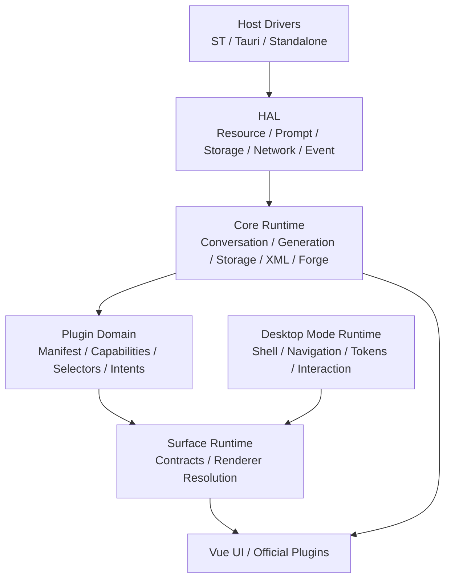
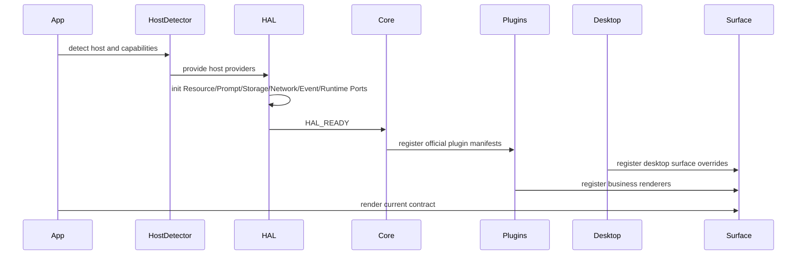
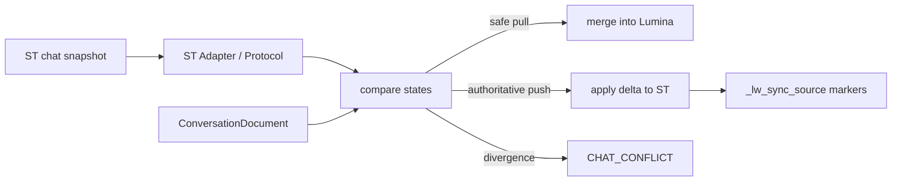

# LuminaWeave 系统架构与设计文档 (System Design)

**版本:** v6.1-docs
**最后更新时间:** 2026-06-28

本文记录 LuminaWeave 长期系统设计、模块边界、数据流和不可破坏的工程约束。短版入口见 `docs/architecture.md`，产品目标见 `docs/overall/PDR.md`。

## 1. 架构目标

LuminaWeave 的核心架构目标是“深度接管”与“绝对隔离”同时成立：

- 深度接管：Prompt、生成流、同步、世界线、事务、资源和工作区由 Lumina 核心统一协调。
- 绝对隔离：宿主 I/O、核心业务、插件能力、桌面模式、surface renderer 和存储层保持明确边界。

系统应避免两类结构性错误：

- UI 或插件直接读写宿主全局对象、ST 消息数组或持久化文件。
- 桌面模式、主题或 surface renderer 复制业务逻辑，绕过 Core/HAL/Service。

## 2. 总体分层



### 2.1 Host Drivers

Host Drivers 只负责宿主物理交互。

职责：

- 探测和访问 SillyTavern、TauriTavern、Standalone 等运行环境。
- 宿主探测按两层分类表达：`runtimeEnvelope` 区分 `plugin-hosted` 与 `standalone-app`，`physicalHost` 区分 `sillytavern`、`tauritavern`、`generic-tauri` 与 `web`。普通 Tauri 客户端不得被归入 TauriTavern 插件宿主。
- 读写宿主资源、事件、网络和基础存储。
- 封装宿主全局对象、TavernHelper、Tauri ABI、local fallback。
- 普通 Tauri Android 客户端的 native layout bridge 只输出宿主布局契约：监听 Android `WindowInsets`，将 raw physical px 转为 Web CSS px 后注入 `--lw-native-safe-*` / `--lw-native-ime-bottom`，由 shell/root layout 消费。`--lw-safe-*` 是归一化注入值，不得由 root 或子树覆盖；root fullscreen panel 保持 full-bleed，状态栏区域默认沿用 panel 背景覆盖，也可由 Activity metadata 派生的 `--lw-activity-statusbar-bg` 覆盖；内容默认通过 `--lw-root-safe-*` padding 避让；子内容只消费 `--lw-content-safe-*` residual；不得把 safe-area 修正散落到普通插件组件内部。独立 Activity 可通过 `statusBar.safeArea = manual` 声明自行适配顶部状态栏区域，此时 root 不消费 top inset，页面继续从 `--lw-content-safe-top` 读取原始剩余值。
- Web / PWA fallback 只暴露浏览器 `env(safe-area-inset-*)` 到 `--lw-web-safe-*`，作为 host layout / native bridge 都不可用时的末级输入。插件和子页面仍不得直接消费 `env(safe-area-inset-*)`。
- ST 世界书、会话目录、物理消息列表、角色资料、Forge 测试聊天宿主资料、环境就绪、生成函数定位等宿主物理操作必须通过 `host-drivers/st/*Driver` 或 HAL ST provider 暴露给 Core / Facade。

禁止：

- 承载业务状态机。
- 组装业务 Prompt。
- 直接决定资源合并、世界线、事务或 UI 行为。

### 2.2 HAL

HAL 是 Host Abstraction Layer，负责把宿主能力和多源资源组装为领域视图。

核心域：

| 域 | 职责 |
| ---- | ---- |
| Resource | 注册、浏览、读取、导入、导出、fork 多源资源 |
| Prompt | Prompt Source、Prompt Assembly Router、Information Planner、Prompt Assembly、来源 trace |
| Storage | extensionStore、local fallback、写入策略、workspace snapshot |
| Network | HTTP、SSE、Tauri invoke、Nexus 生成网关 |
| Event | 宿主事件规范化为 Lumina 领域事件 |
| Runtime Ports | conversation、generation、settings、presets、extensionStore 的运行时能力端口 |

HAL 内部模块禁止直接访问宿主全局变量或 host driver 具体类。需要宿主能力时，必须通过注入接口消费。

例外边界：`hal/adapters/st/*` 是 ST 宿主 provider 的实现层，可以依赖 `host-drivers/st/*`。`hal/prompt/*` 等 HAL 通用模块不得直接 import ST 具体类。

Resource source、世界书物理 I/O、宿主正则同步等带宿主实现的能力必须在对应 adapter / host-driver 注册侧接入；`hal/resource/*`、`core/lorebook/*` 等通用模块只消费端口、注册表或 host-neutral service。

Runtime port 模式：

- `st-plugin-enhanced`：SillyTavern 插件宿主下的 HTTP 增强 runtime，访问 `/api/plugins/luminaweave`。
- `tauri-native`：TauriTavern 原生 runtime，访问 Tauri invoke、原生扩展存储和本地生成能力。
- `standalone-local`：纯前端本地 runtime，用 localStorage / in-memory 能力维持可运行状态。

普通 Tauri App 在专属 runtime port 落地前按 `standalone-app + generic-tauri` 归类，并继续走 `standalone-local`。TauriTavern 仍是 `plugin-hosted + tauritavern`，因为它承载 ST Web 内容并暴露 TauriTavern 专属宿主 ABI。

生产代码不得再通过 `BridgeDispatcher` 或 `ILuminaBridge` 获取运行时能力；Core、插件和 UI 统一消费 `HALContext.instance.runtime`。

### 2.3 Core Runtime

Core Runtime 是业务真相层。

职责：

- ConversationDocument、消息节点、世界线和当前上下文。
- Conversation / Prompt / Generation command services，承接 Facade public method 背后的业务命令编排。
- Generation、流式状态、停止、恢复和错误处理。
- Storage、事务日志、幂等、序列对账和迁移。
- XML/LuminaView 解析、标签注册和显示派生。
- Forge 项目、Agent Runtime SDK、Forge adapter、Prompt context、typed effects。
- API Facade 和 domain services。

约束：

- Core 不 import 具体桌面 shell、theme 或插件页面 Vue 组件。
- Core 通过 HAL 消费宿主与资源能力。
- UI 只能通过 service/store/intents 与 Core 交互。
- `LuminaWeaveAPI` 的 public methods 是兼容 Facade；消息更新、Prompt 探测、生成路由等业务流程应委托 Core command services。
- Command services 不进入 HAL，也不由各宿主 adapter 分别实现；宿主差异通过 host writer、prompt probe、generation invoker、token counter、macro resolver 等窄端口表达。

#### Agent Runtime SDK

Agent Runtime SDK 是 Core Runtime 内的跨插件 agent kernel。它消费 HAL 的 Resource、Prompt、Storage、Network、Event 和 Runtime Ports，并向 Forge、Chat、Director、Dev 等插件 adapter 提供一致的 agent loop、session、tool、approval、trace、skills 和测试边界。

当前代码入口是 `luminaweave-extension/src/api/core/agent-runtime/`。Forge 的 `src/api/core/forge/agent-app` 是第一套 adapter：`ForgePiCoreRuntime` 现在组合 SDK 的 `AgentRuntime` façade，并通过该 façade 复用 setup、session lifecycle、`AgentRuntimeEventBus`、runtime snapshot、`AgentRuntimeExtensionHost` resource discovery 和 SDK registered tools；Forge adapter 仍可复用 `AgentRuntimeCore`、`AgentSessionTree`、`AgentToolRegistry`、`AgentRuntimeExtensionRunner`、`AgentRuntimeExtensionHost`、pi-compatible extension adapter、可选 `workspace-tools/AgentWorkspaceTools`、`JustBashWorkspaceAdapter` 和 Agent Skills parser / formatter。Forge adapter 再通过 typed runtime effect 写入 Forge store、模型请求 trace 和 Inspector presentation，并把 SDK `before_agent_start` hidden context 串入 Forge Prompt Preview / 真实 run 的同一个 prepared prompt，但不得把 Forge Semantic VFS、Forge 工作区 Git 版本策略、ST 发布边界或 Vue UI 上移到 SDK。

职责：

- 管理 agent turn 生命周期：run、continue、abort、preview。
- 输出稳定 lifecycle event 与 runtime snapshot：`agent_start`、`turn_start`、`message_start`、`message_update`、`message_end`、`tool_execution_start`、`tool_execution_update`、`tool_execution_end`、`turn_end`、`agent_end`、`queue_update`，以及 `isStreaming`、`streamingMessage`、`pendingToolCalls`、`messages`、`errorMessage`、active tools summary。
- Event identity 与隔离：除 `queue_update` 使用 `activeTurnId` 外，所有 agent、turn、message、tool lifecycle event 必须同时携带 `sessionId`、`turnId`；message/pending tool 记录也保存 `turnId`。`AgentRuntimeEventBus` 按 `sessionId` 分仓 reducer，订阅、snapshot、event 查询支持 session/turn filter，listener 异常必须被隔离，不能中断后续事件。
- 保持 UI projection 单向：SDK snapshot/events 是可序列化数据，adapter 通过本域 effect/store/presentation 映射到消息展示、工具摘要、模型请求 trace、文件变更列表和项目资源面板；SDK 不 import Vue、Pinia 或 Surface Runtime。
- 管理 tree-structured session history：append-only entries、active node、branch checkout、branch messages。
- 支持 provider-native structured Agent 消息投影：session/event/projection 可以承载 provider 原生 `text`、`thinking` / reasoning、tool call、tool result 和 audit reference；SDK 不规定 Forge 专属 prompt 标签或文件审计格式。
- 定义 Prompt Preview 端口：真实生成与 dry-run 必须共用同一个 prompt assembly 结果；同一 request 可通过 adapter 提供的 cache key 复用 prepared prompt object，真实 turn 消费后显式失效。Preview / `prompt_ready` payload 必须包含本轮 user message；真实 run 的 agent initial state 不重复注入本轮 user message。
- 定义 model provider、tool provider、approval、trace/effect、session store 和 test harness 端口；model provider 负责把接入方的设置引用解析为 pi-ai `Model<Api>`、`SimpleStreamOptions` 和可用模型列表，Forge 等 adapter 不直接读取 Nexus API key；`AgentToolRegistry` 可选接入 `AgentRuntimeEventBus`，把手动注册工具的执行投影为 `tool_execution_start` / `tool_execution_update` / `tool_execution_end`；SDK test harness 提供 mock model、mock tool、mock session store、mock approval 与 mock VFS。
- 定义 extension workflow hook：`before_agent_start` hidden custom context、turn / agent end hook、custom message append、status / widget projection、continuation trigger、tool before/after hook 和 context transform。
- 定义 extension loading boundary：adapter / 代码配置显式传入 extension factories 或 resolved extension paths；扩展可注册 event handlers、custom tools、custom messages、resource discovery hook、provider、status/widget projection。pi-compatible adapter 可把 `ExtensionFactory(pi)` 映射到 SDK extension host，并通过显式 `PiResourceScanner` 与 `PiExtensionLoader` 复用 pi manifest / 目录发现规则；本地 TS/JS 模块加载必须由接入方注入 loader。
- 实现 Agent Skills 规格兼容：解析 `SKILL.md`，校验 `name`、`description`、`compatibility`、`metadata`、`allowed-tools` 与父目录匹配，建立 catalog，格式化 prompt catalog，并输出 diagnostics。
- 定义 FS mount metadata、mount policy、phase/capability、approval hook、audit hook、trace hook。
- 提供可选 Workspace Tools Kit：pi-style 短名 `read`、`write`、`edit`、`delete`、`bash`，并可补充只读 `grep`、`find`、`ls`、`search`；底层 I/O 通过 OpenFS / just-bash 或 adapter operations 注入。
- 提供可选 Research Tools Kit：`AgentResearchProvider` 负责 search / fetch provider 适配，`webResearch` 负责模型可见工具包装；第一版 Tavily provider 适配 Tavily search / extract，浏览器运行时不静态导入 Tavily AI SDK，避免 `@tavily/core` 的 Node proxy 依赖进入扩展启动路径；不把 crawl / map 暴露给 Forge Agent。
- 提供可选 phase/capability filter：接入方定义阶段状态和工具可见性规则；SDK 可按接入方规则过滤工具。

禁止：

- 不直接 import ST 宿主实现。
- 不直接访问 Vue UI、Pinia store 或 Surface Runtime。
- 不拥有 Forge Semantic VFS、Forge prompt 路径或 Forge 工作区 Git 版本策略。
- 不自动扫描用户目录或项目目录。
- 不自动加载 VFS 中的 TypeScript / JavaScript 扩展代码。
- 不把 pi-compatible scanner / loader 作为默认 runtime 行为；这些能力只在接入方显式注入文件系统、模块加载器与权限策略时启用。
- 不默认注册文件写入工具。
- 不默认创建或注册 `bash` tool。
- 不默认创建或注册联网 research 工具。
- 不默认提供 skill activation tool；默认 skill 使用路径是代码提供 skill catalog 和 `SKILL.md` 路径，模型通过 `read` 按需读取完整 `SKILL.md`。
- 不内置 Forge 的 Planner / Analyst / Executor 权限表。
- 不内置 Plan Mode 或固定“规划 / 执行 / 汇报”状态机；这些流程由 adapter / extension workflow 定义。
- 不决定哪个阶段能看到哪些工具。
- 不规定 Forge `<process>` / `<final>` prompt 协议，也不把该标签协议作为过渡兼容层。
- 不根据 `allowed-tools` 自动授予权限。
- 不把 thinking 写入 Forge memory、虚拟世界书、工作区文件或普通用户可见长期历史；thinking 只作为 provider-native structured message block、trace、replay-safe 通道和 UI projection 输入。

### 2.4 Plugin Domain

Plugin Domain 描述插件能力，而不是直接定义固定 UI 插槽。

插件通过 manifest 注册：

- capabilities
- selectors
- intents
- settings schema
- surfaces
- business renderers
- navigation slots
- primary surface
- activity metadata

插件特殊 UI 通过 business renderer 暴露给 Surface Runtime。插件不得把同步、存储、Prompt 或事务逻辑复制到组件内部。
`PluginManifestV2.primarySurface` 是 Shell、Workspace 和路由解析插件主 Surface 的唯一来源，不允许根据插件 ID 拼接或推断 contract。

### 2.5 Desktop Mode Runtime

Desktop Mode Runtime 定义完整工作方式。

职责：

- shell renderer
- navigation model
- surface map / overrides
- component overrides
- interaction policy
- 单注册源：公开注册入口只接受 `DesktopModeManifest`；内部 `DesktopModeRuntimeDescriptor` 由该 manifest 派生 shell renderer、navigation model、interaction policy、settings schema 和受控 desktop overrides。`layoutMode` 仅作为 legacy 命名兼容，运行时策略输入使用派生的 `shellKind`。
- 早期阶段不维护 Theme Pack 兼容 API 或 legacy storage fallback；桌面模式选择只读取 `lumina-settings.activeDesktopMode`，模式设置只使用 `desktop-mode-*` 前缀。
- Activity LaunchIntent 解析：业务层只提交目标、角色、默认/小窗偏好、嵌套/独立页面和 Activity metadata；Desktop Mode Runtime 决定实际呈现为主区、右侧栏、移动临时页、Telegram 移动页面栈或自由工作台窗口。
- tokens
- settings schema
- root safe-area padding 契约。普通 Tauri Android 的 safe-area 默认由 root shell 统一消费，`--lw-safe-*` 保持可观测原值，`--lw-content-safe-*` 表示 root 消费后的剩余量；Activity 可声明独立页面的状态栏背景、图标颜色和 `safeArea` 所有权。Desktop Mode Runtime 先把 `iconColor: auto` 解析为实际 `light` / `dark`：深色外观映射白色图标，浅色外观映射黑色图标；状态栏背景只进入 Web/root shell CSS 层，不进入 native bridge；Lumina 原生 Android 客户端只消费解析后的状态栏图标颜色，TauriTavern 不新增 ABI 且图标颜色 no-op。
- Web / PWA safe-area fallback 同样先进入 `--lw-safe-*` 归一化层，再由 root / residual 变量分发；桌面模式和插件不得绕过该层直接读取浏览器 `env()`。
- component overrides 在写入 desktop mode registry 前整批预检；任一 override 无效时不得留下部分 Surface 或 mode 注册状态。

Composition Runtime 作为 Desktop Mode Runtime 的声明式布局层：

- `DesktopModeManifest.composition.version` 固定为 `1`，desktop/mobile 各有一个根节点。
- 节点判别值只允许 `group`、`surface`、`activity-slot`。`group.direction` 只允许 `row | column`，节点尺寸只允许 `content | fill`，可见性只允许 `visible | hidden`；schema 使用 strict object，拒绝 CSS、Vue component、attrs 和其他未声明字段。
- Surface 节点先由 Zod 校验树结构，再通过 Surface Registry 确认 `contractId` 并调用该 contract 的 input schema。节点 ID 在 desktop/mobile 两棵树之间全局唯一。
- 注册数据流为 `registerDesktopMode -> runtime preflight -> core registry commit -> runtime registry commit`。preflight 无副作用，同时校验 composition 和 desktop overrides；任一校验失败时两个 registry 与 Surface Registry 均保持原状态。
- resolver 只按显式 viewport 选择已校验根节点并返回独立副本，不读取 Shell 状态或宿主全局对象。classic、stage、discord、telegram 均已声明 composition，并统一从该链路渲染；可选字段和无 composition fallback 只等待最终清理。

Shell 与 Workspace 的投影边界：

- `LuminaShellRoot` 始终挂载当前模式的 concrete Shell；runtime descriptor 含 composition 时，通过 Shell 的 composition slot 把 `DesktopCompositionOutlet` 注入其 Activity 区域。递归 outlet 将 `surface` 节点交给 `ThemedSurfaceOutlet`，并把 `activity-slot` 交给通用主 Activity、Telegram 移动页面栈或 Freeform 窗口容器；Shell 不解析 contract 的业务语义。
- Desktop navigation model 的 primary/mobile surface 列表在 composition 完成校验后遍历对应根节点派生，不再与组合树并行维护；非法树不会进入导航投影。
- Workspace 从 `PluginManager.getPlugins()` 的完整启用插件集合派生静态应用目录，而不是只遍历已有 navigation slot。条目仍要求 `primarySurface`，有 main/widget slot 时按 slot 建立入口，只有 `ActivityDescriptor` 时按 Activity 尺寸建立入口；运行时动态 Activity 继续通过通用 DynamicTab outlet 进入窗口。
- Freeform Shell 只拥有舞台、窗口、焦点、移动导航和 Dock 机制。新建舞台创建空容器，不隐式启动 Launcher；窗口标题栏和菜单不按 Forge、Settings 或其他插件 ID 分支。
- `ShellRuntimeContext` 只携带 Shell 机制需要的状态；重复的 `layoutMode` 与业务 launchpad 状态不再作为运行时契约。Discord desktop 的 roster 由 composition 声明，Discord mobile overlay、Telegram desktop tabs 和 Telegram mobile route 通过 Official Surface contract 获取角色、会话与 Chat presentation；Shell 只传递页面栈与容器导航 intent。
- composition 根实例 key 包含 desktop mode、viewport 和根节点，递归节点 key 继续包含 mode、node kind 与 Surface contract；`ThemedSurfaceOutlet` 以响应式 contract id 解析 skin，模式、viewport 或 renderer 身份变化不会复用旧主题状态。

约束：

- 桌面模式可以改变信息架构和交互方式。
- 桌面模式不得改变核心会话、同步、Prompt、事务和存储语义。

### 2.6 Surface Runtime

Surface Runtime 是 Plugin Domain 与 Desktop Mode Runtime 的连接层。

解析优先级：

```text
desktop override > plugin business renderer > core default renderer > empty renderer
```

Renderer 接收：

- contract 对应的 typed input
- state snapshot
- intents
- `DesktopExperienceRuntime`
- theme context
- disposer 注册入口

`SurfaceContractMap` 是进程内 contract 类型事实源；每个可注册 contract 必须提供 Zod input schema。contract、plugin renderer 和 desktop override 均先整批校验再原子写入 registry，未知 contract、map key/owner 不一致、重复注册或非法 input 在节点边界返回稳定错误。

受信任第三方 renderer 通过 module augmentation 增加自己的 contract 类型，并由 `PluginManifestV2.surfaces + businessRenderers` 提交同一批注册。`src/examples/desktop-experience/` 的 `example.characterFocus` fixture 只作为独立装配示例导出：它从 `DesktopExperienceRuntime` 投影当前角色、会话、消息、时间线与生成态，所有订阅和 watcher 均注册到 `onDispose()`，并使用 revision/disposed guard 丢弃迟到异步结果。示例不会在 bootstrap 阶段自动注册，声明式模式也不能绕过 Surface Registry 引用未注册 contract。

`SurfaceOutlet` 解析 renderer 后创建独立 context。等价 input/theme 不重建 context；input、theme 或 renderer 变化时先销毁旧 context。renderer 创建或渲染异常只替换对应节点，并立即逐项执行已注册 disposer；单个 disposer 抛错不得覆盖原始错误或阻断其他清理。

Renderer 不直接写 Core 内部状态。如需打开其他页面，必须通过 runtime 的 activity 能力发起 Activity LaunchIntent；不得直接决定 tab、右栏、workspace window 或移动页面栈。Surface Runtime 不改变持久化边界，普通 Tauri 的 runtime extension store 继续使用 SQLite，浏览器与 standalone-local 的既有 IndexedDB 实现保持不变。

#### Chat Application Controller

`chat.main`、`chat.transcript`、`chat.composer` 与 `chat.promptInspector` 的 renderer context factory 通过引用计数 application scope 共享 `ChatApplicationController`。Controller 订阅 `DesktopExperienceRuntime.conversation`、generation lifecycle、Prompt inspection 与 activity presentation command，产出单一 `ChatApplicationSnapshot` 和强类型 intents：

```text
conversation events ─┐
generation events ───┼─> ChatApplicationController ─> context/messages/generation/prompt snapshot
prompt events ───────┘                            └─> send/stop/edit/delete/regenerate/branch/prompt intents
presentation commands ───────────────────────────> scroll/focus request revisions
```

Official Surface Kit 由角色、会话、transcript、message、streaming、composer、toolbar、header 与 Prompt Inspector 等单一职责组件组成。presentation 只消费 typed Surface context/input，不订阅 `GENERATION_*` / `BUFFER_UPDATED`，不直接调用 conversation/generation 命令，也不导入 Pinia、API Facade、存储、Shell 或具体桌面模式。renderer context factory 将消息渲染设置投影为 `ChatApplicationSurfaceState.messageRenderPreferences`，并在 surface 销毁时取消设置订阅；Shell、Workspace 业务窗口与设置预览通过 `ThemedSurfaceOutlet` 注入受控 skin。用户消息只进入 Markdown `TextBlock`，assistant 消息才进入 LuminaView `MessageRenderer`；纯 `ChatStreamingPresentation` 映射 effect class 与光标状态。`useConversationContextStore` 只保留 Shell 所需的会话选择和 presentation 状态；旧 `useChatStore` 已删除。Controller 的 `dispose()` 必须取消四条事件订阅并阻止迟到事件更新已卸载 surface。

Choice block 只提交选项文本。renderer context factory 将精确设置键 `lumina-chat.dialogueUIInteraction` 投影为 `fill | generate`；`fill` 通过 `setComposerDraft` 更新 `ChatApplicationSnapshot.composerDraft`，`generate` 通过 `sendMessage` 提交。既有 `SCROLL_TO_BOTTOM` / `FOCUS_MAIN_INPUT` 只在 `ChatPresentationCommandService` 边界被精确适配为封闭 command，独立 transcript/composer surface 仅消费 Controller 的 revisioned snapshot，不直接依赖全局事件或 API。

Chat 的设置预览通过 `LuminaPlugin.settingsPreviewSurface` 声明 typed contract 与 input，`SettingsDetailed` 使用 `ThemedSurfaceOutlet` 解析 skin 并委托 `SurfaceOutlet` 挂载；其他仍使用静态预览 component 的插件保留原有入口，但不得用于需要 runtime context 的 renderer。

## 3. 启动与运行流程



启动规则：

- Bootstrap 存储只保存加载 HAL 前必需的极小配置。
- 领域存储必须在 HAL 就绪后使用。
- 插件初始化应走 manifest/runtime context，不应依赖 App 手工传递所有 props。
- HTTP 后端只在 `st-plugin-enhanced` 模式下作为 ST 插件增强能力使用；Tauri 和 Standalone 不通过通用 HTTP bridge 默认访问后端。

## 4. 会话与存储设计

### 4.1 ConversationDocument

统一会话文档是主聊天与 Forge 会话的共同物理契约。

至少承载：

- 会话元数据。
- 消息节点池。
- active leaf。
- 插件数据。
- 事务游标。
- 迁移后的 legacy 数据。

节点仍是一条消息一个事实单元，外层容器统一为 `ConversationDocument`。

### 4.2 事务日志

事务日志用于保存写入序列和恢复现场。

状态机：

```text
pending -> running -> committed | aborted | rolled_back
```

关键机制：

- 每次写入携带 idempotency key 和 expected seq。
- 后端或持久化层基于事务日志执行幂等重放。
- 序列不连续时返回冲突，阻断过期写入覆盖。
- 重连后按序列拉取未确认事务，回滚悬挂事务后重试。

### 4.3 消息字段口径

AI 消息至少区分：

| 字段 | 角色 |
| ---- | ---- |
| `pluginRaw` | 原始 LLM 输出，包含 XML / thinking / 协议标签 |
| `mesRaw` | 清洗后的内容本体 |
| `mesST` | 写回 ST 的文本 |
| `mes` | Lumina UI 派生展示文本 |
| `fingerprint` | 内容本体指纹 |
| `stFingerprint` | ST 写回口径指纹 |
| `thinkingText` | 本地折叠展示用思维链 |

`pluginRaw` 是最高级原始事实来源。`thinkingText` 默认不写回 ST，也不参与后续 Prompt 回注。

## 5. 同步设计

同步链路负责在 Lumina 独立存储和 ST 线性聊天之间保持可解释一致。

基本原则：

- Lumina 独立存储是插件介入后的主要事实源。
- 当前 ST 活跃聊天可参与物理同步。
- 非当前 ST 活跃聊天默认走 Lumina 独立存储视图，不强制切换宿主聊天。
- 发现不可自动合并分歧时通知并等待用户决议。
- Lumina 写回 ST 时注入来源标记，回读时抑制回灌。

核心流程：



## 6. 生成与 Prompt 设计

### 6.1 会话绑定与 Prompt Engine

会话绑定只回答“材料从哪里来”，Prompt Engine 只回答“如何合成”。二者必须分离。

会话绑定类型：

- `st-chat`：会话绑定到 ST 聊天，可读取 ST 角色卡、世界书、预设、历史等资源。
- `plugin-session`：会话在 Lumina 插件内独立打开，可用于 Chat、Forge、Director 等来源。

Prompt Assembly Target 描述本次合成目的：

- `chat.continuation`
- `forge.card`
- `forge.conversation`
- `forge.planner`
- `forge.analyst`
- `forge.executor`
- `director.memory`

Prompt Engine 能力边界：

| Engine | 能力 | 限制 |
| ---- | ---- | ---- |
| `st-native` | 使用 ST 原生聊天合成链路 | 只允许 `chat.continuation`，且必须存在 `st-chat` 绑定 |
| `lumina` | 使用 Lumina/HAL Prompt 合成链路 | 支持 Chat、Forge、Director；可读取 ST 绑定资源，但合成由 Lumina 接管 |

路由规则：

- 非 `chat.continuation` 目标必须走 `lumina`。
- `st-native` 是显式选择，不因会话绑定到 ST 而自动启用。
- `lumina-assembly` 是显式策略别名，表示插件形态下也由 Lumina 生成 payload；该路径不依赖 ST dry-run prompt probe。
- Forge / 制卡 / Agent 协作场景永远不走 `st-native`；若绑定 ST，ST 只作为资源来源。
- UI、插件和 Core 只提交合成意图、会话绑定、source policy 和 preset 选择，不在组件内拼接最终 prompt。
- ST native prompt probe 是兼容、调试和对比路径，不是 Lumina-owned Prompt Assembly 的必需输入。

### 6.2 Prompt Assembly Pipeline

Prompt 不应只输出最终 messages，还应保留来源与变换 trace。

```mermaid
flowchart LR
    Request["PromptAssemblyRequest\nTarget / Binding / Policy"]
    Router["PromptAssemblyRouter"]
    Engine["ST Native or Lumina Engine"]
    Sources["ResourceRef / History / Memory / Forge State"]
    Units["PromptSourceUnit"]
    Planner["InformationPlanner"]
    Composer["PromptAssemblyTracer"]
    Result["PromptAssemblyResult"]

    Request --> Router
    Router --> Engine
    Engine --> Sources
    Sources --> Units
    Units --> Planner
    Planner --> Composer
    Composer --> Result
```



`PromptSourceUnit` 区分：

- control
- information
- state

Trace 应记录：

- 来源资源。
- 保留、摘要、隐藏、截断等 transform。
- 输出 message index 和 offset。
- diagnostics。

### 6.3 ST Engine Resource Policy

当使用 ST 原生合成或 ST 预设直通时，只有 ST-owned ResourceRef 可直接 passthrough。Lumina local 或 subscription 资源不得静默混入 ST prompt。

后续转换必须由用户显式选择，例如：

- fork/import 到 ST。
- 虚拟世界书注入。
- 宏注入。

### 6.4 生成流

生成链路应支持：

- SSE 流式输出。
- raw buffer 保存。
- `generationId` 级别状态查询和续传。
- 主动停止后的同步收口。
- 后端 committed 事件通知前端权威同步。

## 7. Resource / VFS / Shell 设计

Resource Domain 是资源事实源的抽象层，VFS 是路径化视图。

典型路径：

```text
/sources/<sourceId>/...
/library/...
/workspaces/forge/<projectId>/...
/workspaces/chat/<conversationId>/...
```

规则：

- `/sources` 和 `/library` 只映射 Resource Domain，不复制资源真相。
- `/workspaces` 由 ShellWorkspaceService 提供共享且可持久化的 workspace。
- `BashTerminalRuntime` 只负责通用 shell runtime 和 mount 编排：默认挂载 `/sources`、`/library`、`/workspaces`，调用方可通过 `extraMounts` 注入额外 `IFileSystem`；HAL 不 import Forge 业务代码。
- Forge Agent 暴露给模型和调试 UI 的 `./...` 是项目语义 VFS，由 `ForgeSemanticVfsProvider` / `ForgeProjectSemanticVfsService` 生成公开内容；Forge runtime 将该 provider 包装为 `ForgeSemanticBashFs` 并挂载到 Forge shell 的项目根。绝对 `/sources/...`、`/library/...` 保持底层 VFS 直通。
- Agent Runtime SDK 不自研完整文件系统挂载层；第一阶段直接依赖 OpenFS 能力层，以 OpenFS 作为 agent-visible VFS 的标准适配目标。
- `bash` tool 由接入方自行组装并注册。接入方创建 VFS、初始化 OpenFS、组合 just-bash `MountableFs`、注册 OpenFS 包提供的 custom commands，再把生成后的 `bash` tool 交给 SDK 的 tool provider。当前 `@open-fs/just-bash@0.1.0` 实际导出文件系统类为 `AxFs`，`createGrepCommand()` 的 command name 为 `axgrep`；升级依赖前必须重新读取类型文件并回归测试。
- Workspace Tools Kit 的 `read`、`write`、`edit`、`delete`、`bash` 不直接绑定本地 `fs`；工具通过 OpenFS / just-bash 或 adapter operations 访问业务 VFS。`write`、`edit`、`delete` 必须串行化同一文件的并发修改，并输出可审计 diff / patch 或 adapter 审计 payload。
- 阶段状态和工具可见性由接入方定义；SDK 只提供可选过滤机制。非写入阶段不注册写工具，也不注册可写 bash。
- 写入阶段通过 audited OpenFS write adapter 执行 write/append/delete/move/copy；write adapter 必须检查 phase、mount policy 和 approval，并记录 trace。
- 具体写入摘要和版本策略由 adapter 决定；Forge adapter 使用本轮写入摘要服务对话投影，并使用 Git 作为文件版本事实源。
- 外部资源写入必须经过 Resource Write Policy。
- ST 和订阅源不得被静默改写。
- 共享用户终端默认开放 just-bash `curl`；Agent shell 的写入和网络访问必须经过 ShellPermissionService 与 ShellNetworkPolicyService，联网 `curl` 只能通过显式 `network-request` 模式和 network grant 进入。Forge Agent 缺少 network grant 时由 `beforeToolCall` 预检投影 `tool_approval_needed`，Composer 区域按当前项目和协作线程显示阻塞式授权面板，等待授权期间不返回非失败 `tool_result`；用户可选择“允许此域名”或“后续都允许”，前者保留同域名 `urlPrefix` grant，使同一协作线程的后续同域名请求自动通过，后者保留 `allNetwork` grant，使同一协作线程后续所有符合网络策略的请求自动通过。Composer 在点击批准或拒绝后立即本地 resolve 授权覆盖态；批准后通过 `resolveToolApproval` 执行原始工具并恢复 Agent 续写。`curl -o/-O/-c/-T/-F` 等本地文件参数允许使用，`2>&1` 这类文件描述符复制不视为文件写重定向，但文件输入输出必须停留在项目语义 VFS，写入结果通过 ForgeWorkspaceWriteService 进入本轮文件变更摘要和 Git-backed workspace history。

## 8. Forge 设计

Forge 以项目为长期容器，协作线程是项目内的 ConversationDocument 分支。

核心实体：

- `forgeProjectId`
- `conversationId` / thread session id
- workspace path（按项目，而不是按线程）
- project memory
- virtual lorebook
- draft tree
- Git-backed workspace history
- Prompt Preset bindings

边界：

- 项目资源以 `forgeProjectId` 为 owner，保存在 `/workspaces/forge/<projectId>`。
- 协作线程以独立 `id` / `conversationId` 保存消息世界线，可共享同一项目资源。
- 项目标题使用 `projectTitle` 表达，线程标题使用 ConversationDocument `title` 表达；项目中心不得用最新线程标题覆盖项目标题。
- 协作线程的底层 VFS 路径为 `/workspaces/forge/<projectId>/chat/<conversationId>`；公开语义 VFS 使用 `./threads/目前/` 和 `./threads/NN标题/`，不得要求模型记忆或输出 `conversationId`，线程消息事实仍由 ConversationDocument 保存。
- 协作线程 VFS 目录同时投影到 `/workspaces/chat/<conversationId>` 和 `/workspaces/forge/<projectId>/chat/<conversationId>`，包含 `thread.json` 与 `messages.json` 作为可检查快照；该投影不得取代 HAL ConversationDocument 真源。
- 新建线程必须继承项目 VFS 中的项目记忆、草稿树、文件版本记录和虚拟世界书，而不是创建新的项目资源根。
- 删除线程只删除该线程的 ConversationDocument 与索引绑定，不删除项目 VFS。
- 删除项目会删除该项目下所有线程、workspace binding 和项目 VFS。
- 项目中心 UI 只能调用 store / repository 意图，不直接访问 HAL runtime、宿主会话或 VFS 实现。

典型项目路径：

```text
/workspaces/forge/<projectId>/project.json
/workspaces/forge/<projectId>/memory/tree.json
/workspaces/forge/<projectId>/drafts/tree.json
/workspaces/forge/<projectId>/review/staging.json   # legacy publish/export boundary, not AI direct-write gate
/workspaces/forge/<projectId>/lorebook/entries/*.json
/workspaces/forge/<projectId>/chat/<conversationId>/thread.json
/workspaces/forge/<projectId>/chat/<conversationId>/messages.json
/workspaces/chat/<conversationId>/thread.json
/workspaces/chat/<conversationId>/messages.json
```

Forge Agent 语义 VFS：

```text
./AGENTS.md
./.forge/agent/SYSTEM.md
./.forge/agent/EXECUTOR.md
./.forge/agent/UI_DSL.md
./.forge/agent/REASONING.md
./agent/skills/<skill-name>/SKILL.md
./.pi/agent/skill-overrides/<skill-name>/SKILL.patch
./memory/AUTO/Checklist.md
./memory/用户偏好.md
./threads/目前/thread.md
./threads/目前/messages.md
./threads/NN标题/thread.md
./threads/NN标题/messages.md
./lorebook/
./review/
/library/...
/sources/...
```

语义规则：

- `./` 是当前 Forge 项目根；工具入参允许省略 `./`，显示和调试输出统一规范化为 `./...`。
- `./threads/目前/` 是当前 active 协作线程的动态别名，不作为持久线程 id 保存到模型记忆。
- `./threads/目前/thread.md` 暴露当前线程可读元信息，`./threads/目前/messages.md` 暴露当前线程消息摘要；历史线程稳定路径使用 `./threads/NN标题/thread.md` 与 `./threads/NN标题/messages.md`，由内部 `conversationId` 映射维护。
- `AGENTS.md` 是 Agent 工作契约，不是系统提示词；它规定工具使用、本轮文件变更摘要、Git 版本历史、session tree、timeline 和恢复规则，不表达模型应该如何思考。
- `./.forge/agent/SYSTEM.md` 是主模型系统提示词，`./.forge/agent/EXECUTOR.md` 是执行模型附加提示词，`./.forge/agent/UI_DSL.md` 是 Forge `<V>` 组件 DSL，`./.forge/agent/REASONING.md` 是隐藏思维链与可见工作笔记边界；`./.pi/agent/prompts/` 不再作为 Forge prompt 主路径。
- Forge 预设不再面向 Agent 暴露为 slot 拼接列表，而是提供 Agent 资源包与提示词编排：`AGENTS.md contract + ./.forge/agent/SYSTEM.md + ./.forge/agent/EXECUTOR.md + UI_DSL.md + REASONING.md + skills + extensions + capabilities + memory index + context files + branch messages`。Forge Agent 预设工作台是预设资源包维护入口；内置预设只读，自定义副本可编辑提示词、预设技能元数据、加载策略和正文。项目覆盖优先于 active preset，active preset 优先于 bundled fallback。
- `./memory/**/*.md` 是 Forge 项目长期记忆正文；默认 prompt 编排只注入 `./.pi/agent/context/memory-index.md`，列出路径、标题、来源、更新时间和摘要。需要正文时必须通过同一 Semantic VFS 和 `read` 读取，不把完整长期记忆灌入 system prompt。
- 技能统一通过 `./agent/skills/<skill-name>/SKILL.md` 加载。项目技能优先；bundled 资源按 `src/resources/forge-agent/base/skills/<skill-name>/SKILL.md` 加当前预设 `src/resources/forge-agent/presets/<preset-id>/skills/<skill-name>/SKILL.md` 合并，同名技能由当前预设覆盖 base。preset skill 支持 `on_demand` / `always` 加载策略，参考提炼能力作为默认 Agent 预设的按需技能提供，不再作为独立参考提炼预设暴露。Forge 默认遵循 pi-style progressive disclosure：prompt 中只列 skill catalog 和 `SKILL.md` 路径，完整 `SKILL.md` 由模型通过 `read` 按需读取；第一阶段不新增 activation tool。内置与 preset skill 都必须携带标准 `SKILL.md` frontmatter，registry 负责声明 metadata、来源层与加载资源；用户修改内置技能时应创建项目级同名 skill 覆盖，不改 bundled base。
- Pi 扩展通过 Forge preset resource registry 读取 `src/resources/forge-agent/base/extensions/**/*.{ts,js}` 和当前预设 `src/resources/forge-agent/presets/<preset-id>/extensions/**/*.{ts,js}`；同 ID 扩展由当前预设覆盖 base。`PiExtensionCompatHost` 只在 Forge adapter 显式启用时把这些扩展加载为 `AgentRuntimeExtension`，并继续经过 Prompt Preview、approval、audit、tool registry 和 trace 边界。
- `ForgePiResourceLoader`、Forge `read`、Forge shell 和“项目 VFS”面板必须消费同一个语义 VFS provider/projection；不得再各自拼接 prompt、skill、thread 或 raw storage 路径。

Forge Runtime 分工：

- Intent：`conversation`、`planning`、`analysis`、`edit`、`review`、`test`、`export` 是 workflow 状态、trace 和 UI 文案标签，不对应独立角色提示词文件。
- Route：route resolver 将 intent 和用户命令映射到 `modelRoute`；非写入请求进入主模型，写入执行请求进入 executor。旧 `promptMode` 快照只作为兼容输入迁移到 intent。
- Executor：执行模型使用 `SYSTEM.md + EXECUTOR.md`，继续承担写入和执行风险隔离。
- Graph：只提供阶段、状态、intent、写入边界和能力索引，不再合成最终 prompt，也不再预先塞入完整 skill。
- pi-style Agent Runtime：Forge Agent kernel 位于 `src/api/core/forge/agent-app`，是 Agent Runtime SDK 的第一套 adapter。`ForgePiCoreRuntime` 组合 `AgentRuntime` façade 并暴露按 session 查询的 `getAgentRuntimeSnapshot()` / `getAgentRuntimeEvents()` / scoped subscription / `discoverResources()`；runtime client 不再从 turn/approval 返回 snapshot，Forge store 直接订阅 Agent Runtime event bus 并将 snapshot/effect 串行投影到消息、工具操作和 model request trace。`ForgePiSessionManager` 复用 `AgentSessionTree`，`ForgePiAgentSession.preparePrompt()` 与 `prompt()` 复用 SDK `AgentPromptAssembler`，`ForgePiResourceLoader` 复用 SDK skill catalog formatter，`ForgePiToolBridge` 可把 Forge 工具适配到 `AgentToolRegistry`。`ForgePiAgentSession` 现在消费 `AgentRuntimeExtensionHost` 产生的 runner 与 tool registry：`before_agent_start` hidden context 进入同一个 prepared prompt，SDK registered tools 通过 `AgentToolRegistry.execute()` 执行，`agent_end` hook 在 Forge turn 结束时触发。`ForgePiAgentSession` / `ForgePiExtensionRunner` / `ForgePiToolBridge` 仍负责 Forge context engineering、run 阶段 Forge tool 实例创建、tool execution、runtime event trace 和本轮写入摘要；必须保持 Forge Prompt Preview 与真实生成同源。
- Forge runtime projection：pi 每次 `message_start` 创建 `agent-message:${sessionId}:${turnId}:${sequence}`，`message_update` 静默更新气泡，`turn_end` 提交最终气泡；授权续跑不重复 start，等待授权时不结束 turn。旧 Forge `stream_chunk`、`stream_done`、`stream_error`、`tool_call`、`tool_result` 不再作为传输事件，session entry 和 model trace 中的工具调用/结果记录仍由 Forge 域保留。
- Provider-native structured message 主路径：Forge adapter 直接消费 provider 原生 `thinking` / reasoning、`text`、tool call 和 tool result。`thinking` / reasoning 投影为执行过程正文，`text` 投影为 assistant 最终回复；tool call、tool result、approval 和本轮文件变更摘要只由 runtime / tool bridge / write service 产生，不能从模型正文推断。Forge 不保留 `<process>` / `<final>` 标签协议作为过渡兼容层。
- webResearch：`ForgePiToolBridge` 仅在 `lumina-forge.tavilyApiKey` 非空时注册模型可见 `webResearch`。工具通过 Agent Runtime SDK Research Tools Kit 和 Tavily provider 执行 search / fetch，只返回 Markdown 摘要、来源与 Tavily 请求元数据；不得写入 Forge memory、项目 VFS 或 ST 资源，也不得生成文件变更摘要。Tavily key 来自 Forge 设置，设置 UI 遮罩显示，v1 不提供加密 secret storage。
- 模型适配：Forge Agent 模型协议层使用浏览器可用的 `@earendil-works/pi-ai`。Agent Runtime 的 `PiAiBrowserNexusProvider` 把现有 Nexus preset / API 配置解析为 pi-ai `Model<Api>`、`SimpleStreamOptions` 和可用模型列表；`ForgePiModelRegistry` 创建 pi-ai model 并返回 provider 包装的 `streamSimple()` 兼容 `streamFn`；`ForgePiNexusProvider` 只负责 Forge 模型请求 trace、cache usage 和 stream 包装，不直接读取 `nexus.apis`。一次 Forge turn 可能包含多次 pi-ai provider 调用，调试面板必须按调用链展示每次 provider 记录的 pi messages、provider payload、provider response、stream lifecycle、final text 和 error。前端 Forge runtime 不得引入 `@earendil-works/pi-coding-agent`、`pi-agent-core/node`、AI SDK tool/message 协议或 Node-only `fs/child_process`。
- Reasoning artifact 边界：Forge 必须区分 provider raw message、replay-safe pi message 与用户可见/业务记忆内容。带 provider 签名或加密语义的 reasoning artifact 只允许在同 provider / 同模型的短期 pi replay 通道中原样回传；无签名 raw thinking、跨 provider / 跨模型 reasoning、普通 `<thinking>` 文本不得进入用户可见消息、项目文件内容、Forge memory、虚拟世界书或长期 prompt 回注。调试 trace 可以展示 raw / sanitized 差异，但 raw trace 不等于下一轮模型输入。
- Forge UI：`src/plugins/forge` 对标 pi-tui 的交互分层，只负责输入、消息展示、执行过程内联段、最终回复展示、调试面板、文件版本/项目资源面板、历史暂存与发布边界、store action controller。Vue 组件不得承载 Agent loop、模型请求、工具执行或最终提示词合成；只能通过 `ForgePiRuntimeClient` / store controller 消费 runtime snapshot 和提交用户意图。运行中执行过程内联段直接显示 provider-native `thinking` / reasoning projection，工具调用、工具结果和 approval 作为过程事实显示；agent 结束后自动折叠为用户输入与最终回复之间的一行摘要，最终回复保持展开并只显示 provider-native `text` projection。Agent Inspector 状态页与模型请求调试 pi-core 页消费 `forgePiRuntimePresentation` 派生摘要，而不是直接读取 SDK runtime 实例；Prompt Preview 的主模型标题按 intent 展示，diagnostics 展示已加载技能和扩展的 base / preset 来源层。“项目 VFS”面板浏览 `ForgeProjectSemanticVfsService` 生成的 Agent 可见语义 VFS 投影，并以 `./...` 项目相对路径显示；目录节点显示子项清单，文件节点显示完整内容。该面板允许对受管理的 `./AGENTS.md`、`./.forge/agent/SYSTEM.md`、`./.forge/agent/EXECUTOR.md` 与 `./agent/skills/<skill-name>/SKILL.md` 创建/编辑项目覆盖，写入项目 VFS，经 ForgeWorkspaceWriteService 生成本轮写入摘要并提交 Git。raw workspace storage 只作为内部映射源，`./chat/<conversationId>`、`project.json`、`memory/tree.json`、`lorebook/entries/*.json`、`review/*.json` 等内部结构不得暴露给模型或主视图。
- Prompt Preview：Agent Inspector 与 Forge Prompt Preview 的主模型视图必须以 `ForgePiAgentSession.preparePrompt()` 的 dry-run 输出为事实源。`ForgePiAgentSession.preparePromptState()` 在 SDK `AgentPromptAssembler` 的同一个 prepared prompt 中先消费 `ForgePiExtensionRunner.emitBeforeAgentStart()`，再消费 `AgentRuntimeExtensionHost` runner 的 `before_agent_start`，确保 extension hidden context、active tools summary、skill catalog、branch messages、本轮 user message 与 provider-native structured message contract 同时进入 preview / `prompt_ready` payload；真实 pi-agent-core initial state 仍只接收 branch messages，本轮 user message 由 `agent.prompt()` 注入。旧 Forge Prompt Context / Prompt Assembly 只提供 source-unit trace / attention 解释，不代表最终发给 pi agent 的 system prompt，也不作为主模型 preview payload 输入来源；旧 `PromptBuilder` 仅保留 Chat / ST 世界书提示词挂载能力，不再提供 Forge Agent prompt 构建 API。
- Direct project write：Forge 模型可见写入类工具目标短名为 `write`、`edit`、`delete`，默认写入 Forge 项目 VFS，并由 ForgeWorkspaceWriteService 生成本轮写入摘要；有文件变化时提交 Git commit。旧会话和历史 trace 中的 `writeFile`、`editFile`、`deleteFile` 由 Forge adapter 兼容展示。`bash` 的 project-write-request 写入同样进入统一写入服务；资源 VFS、运行时 prompt、内置 skill、线程消息投影等只读目标必须返回明确错误且不得部分写入。真实 ST 世界书发布、导出或覆盖宿主数据仍必须走用户确认边界。

Forge 分支、timeline 与工作区版本：

- 同一 Forge 协作线程对应一个 pi session。Forge UI 中的 fork / 回滚 / 切换是该 pi session tree 内的 `activeNodeId` 变化，不创建新的 Forge thread，也不复制新的 workspace session。
- Forge 聊天记录、执行过程、assistant 最终回复、timeline rows、文件变更列表和文件版本面板都必须从 `piSessionEntries + activePiNodeId` 投影。时间线切换不能只改 UI 状态，必须先切换 Forge pi session active node，再重新投影 active branch。
- 分支操作优先基于用户请求节点。选择历史 user node 时，runtime 应将 `activeNodeId` 切到该 user 的 parent，并把 user content 放回输入框供用户修改后重新发送；选择 assistant / tool / staging 节点时可 checkout 查看当前分支，重新生成时应定位到最近的 user 分支点。
- pi session 持久化格式应是 flat append-only entries，使用 `id / parentId` 重建 tree、branch messages 和 timeline projection。完整 `piSession` 存入 runtime extension store，localStorage 只保留索引存根；`children`、timeline rows、console messages、文件变更列表和 model debug summary 都是 projection，不是长期事实源。
- Forge timeline 是从 pi session tree 派生的用户可见投影，可以合并、隐藏或重组 context / tool / assistant 节点，但必须保留 user input、tool result、branch summary 和 label 等可操作节点的 pi origin。
- timeline item 若来自 pi session，必须携带 `runtime: "forge-pi"`、`sessionId`、`nodeId`、`parentNodeId`、`entryType` 等 origin 字段。用户从 timeline 发起 checkout / branch / 文件版本查看时，timeline 只提交意图和 origin，不能直接改 runtime 内部状态。
- ForgeWorkspaceGitService 负责文件、VFS 和虚拟世界书投影的版本历史。写入类工具只提交当前文件树变化；切换对话分支不隐式恢复文件。
- 文件版本辅助面板基于 Git log/diff 展示当前项目历史、单次提交变更和恢复入口。恢复动作通过 Git restore 写回 Forge 项目 VFS，并再提交恢复 commit；恢复真实 ST 世界书仍必须经过用户确认的发布/导出边界。
- `xx.md +10 -1` 等对话内文件变更摘要来自本轮工具调用产生的 `ForgeTurnWorkspaceWriteSummary.changedFiles`，不来自执行过程正文，也不从 Git log/diff 反推。

写入规则：

- 模型输出先进入 provider raw message、replay-safe structured message、pi session tree、typed runtime events 或 proposals。provider-native `thinking` / reasoning 进入执行过程 projection，provider-native `text` 进入 assistant 最终回复；tool call、tool result、approval 和本轮写入摘要由 runtime、tool bridge 与 write service 产生。
- pi 写入工具默认只作用于 Forge 项目 VFS，并通过 ForgeWorkspaceWriteService 写入当前文件树；有文件变化时提交 Git commit。
- `./memory/**/*.md` 和 `./lorebook/entries/*.md` 是一等 Forge 域文件：direct write 同步 runtime state，再持久化项目数据。
- 受保护目标包括 Resource VFS、运行时 prompt、内置 skill、线程消息投影和内部 raw storage；写入请求必须失败且不得产生部分写入。
- 发布到真实 ST 世界书或导出是后置动作，必须由用户显式确认。

## 9. XML 与 LuminaView

XMLTagRegistry 是 XML 标签元数据真相源。

应统一管理：

- canonical 名称。
- 别名。
- 生命周期。
- 状态文案。
- 协议展示。
- 插件动态注册。

流式解析应基于同一份原始 XML buffer 派生 display text、status text 和 filtered count，避免多处重复解释导致闪烁或状态错位。

## 10. API Facade 与 Domain Services

`LuminaWeaveAPI` 不应继续膨胀为所有能力的主要实现边界。

长期方向：

- `DesktopSurfaceService`：surface 注册、打开和桌面模式 bridge。
- `HostInteractionService`：toast、confirm、宿主交互。
- `ConversationDomainService`：会话来源、列表、上下文、消息、世界线命令。
- `GenerationDomainService`：发送、重生成、PromptInspector 自定义生成和生成状态。
- `SettingsDomainService`：设置读写、导入导出和监听。当前不再为桌面模式维护 legacy key 双写或 fallback。

Facade 可保留委托入口，但新增 UI 应优先消费明确 domain service。

当前已落地的收口：

- `LorebookManager` 只维护世界书领域状态、快照和事件派发；ST/TavernHelper/REST 世界书读写由 `STWorldInfoDriver` 承担。
- `LuminaWeaveAPIBase` 的环境等待、ST context / event source 访问由 `STEnvironmentDriver` 承担。
- `LuminaWeaveAPI` 中角色名、用户头像、角色头像等宿主资料读取由 `STCharacterProfileDriver` 承担。
- Chat 消息、生成与 Prompt inspection 状态由 `ChatApplicationController` 统一投影；`ChatSurfaceApplicationScope` 负责引用计数装配和销毁，Official Surface Kit 只提交 typed intents。

## 11. 后端服务设计

`luminaweave-server/src/` 是后端源码。

核心服务：

- `StorageService`：本地存储。
- `StreamingManager`：生成状态、SSE、断线恢复。
- `NexusService`：Provider 路由和生成。

约束：

- `luminaweave-server/index.js` 是构建产物。
- `luminaweave-server/data/` 是本地数据目录，禁止提交用户数据。
- 后端 API 或 SSE 事件变化必须同步更新 API、配置、存储和测试文档。

## 12. 不变量

系统长期必须维护以下不变量：

- Core 不依赖具体插件页面、桌面 shell 或主题实现。
- HAL 不直接访问宿主全局变量。
- UI 不直接操作 ST 消息数组或 Lumina 持久化文件。
- VFS 不成为第二份资源事实源。
- 外部资源不被静默改写。
- 事务写入必须可幂等、可对账、可恢复。
- Prompt 输入必须可追溯来源和 transform。
- 阶段性任务记录不得继续堆入本文。

## 13. 文档维护

以下变化必须同步更新本文：

- 分层边界或依赖方向变化。
- 会话、事务、同步、生成、Prompt、资源或 Forge 数据流变化。
- 公共 API、surface contract、desktop mode manifest 或 plugin manifest 的破坏式变化。
- 新增持久化格式、迁移策略或宿主适配路径。

重大取舍应新增 ADR。
