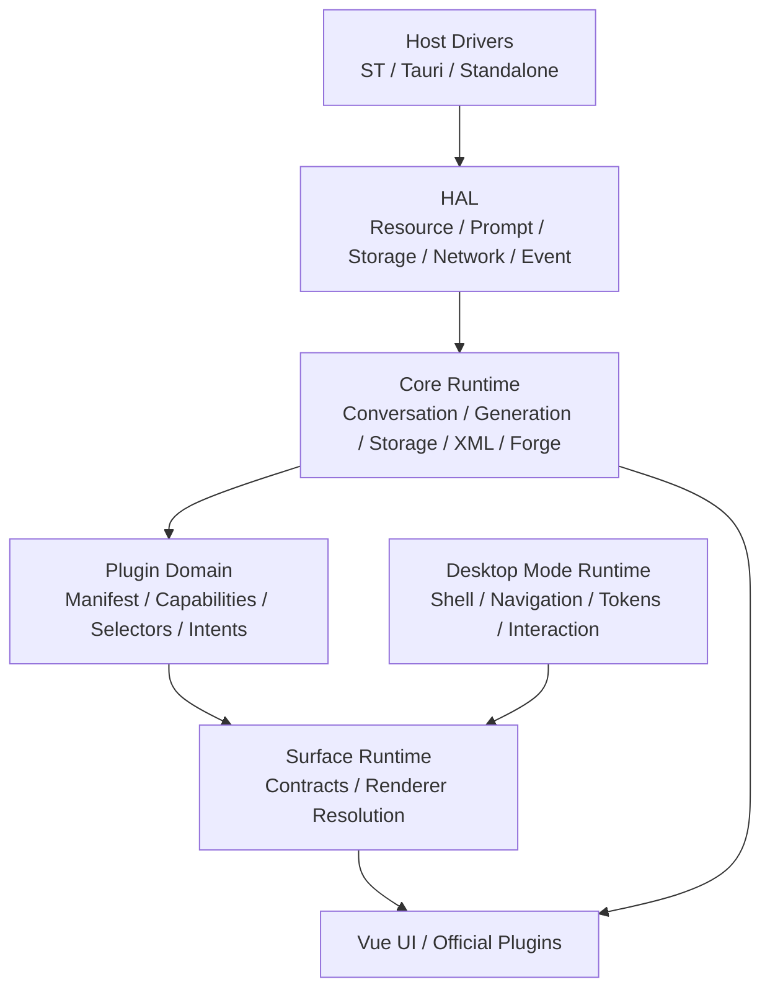
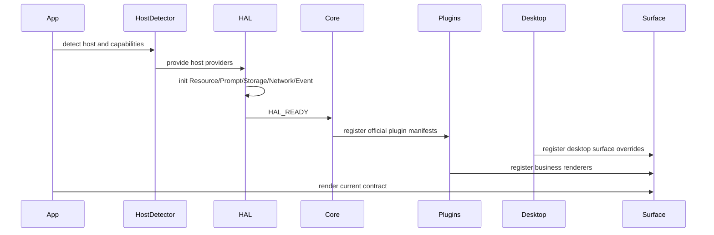
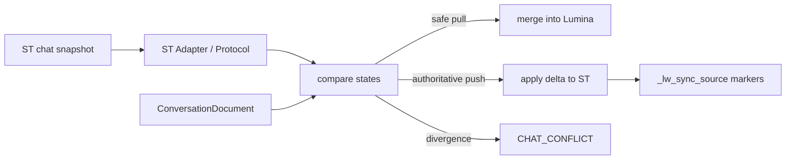
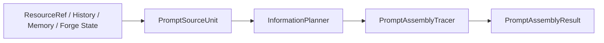

# LuminaWeave 系统架构与设计文档 (System Design)

**版本:** v6.1-docs  
**最后更新时间:** 2026-05-12

本文记录 LuminaWeave 长期系统设计、模块边界、数据流和不可破坏的工程约束。短版入口见 `docs/architecture.md`，产品目标见 `docs/overall/PDR.md`。

## 1. 架构目标

LuminaWeave 的核心架构目标是“深度接管”与“绝对隔离”同时成立：

- 深度接管：Prompt、生成流、同步、世界线、事务、资源和工作区由 Lumina 核心统一协调。
- 绝对隔离：宿主 I/O、核心业务、插件能力、桌面模式、surface renderer 和存储层保持明确边界。

系统应避免两类结构性错误：

- UI 或插件直接读写宿主全局对象、ST 消息数组或持久化文件。
- 桌面模式、主题或 surface renderer 复制业务逻辑，绕过 Core/HAL/Service。

## 2. 总体分层



### 2.1 Host Drivers

Host Drivers 只负责宿主物理交互。

职责：

- 探测和访问 SillyTavern、TauriTavern、Standalone 等运行环境。
- 读写宿主资源、事件、网络和基础存储。
- 封装宿主全局对象、TavernHelper、Tauri ABI、local fallback。

禁止：

- 承载业务状态机。
- 组装业务 Prompt。
- 直接决定资源合并、世界线、事务或 UI 行为。

### 2.2 HAL

HAL 是 Host Abstraction Layer，负责把宿主能力和多源资源组装为领域视图。

核心域：

| 域 | 职责 |
| ---- | ---- |
| Resource | 注册、浏览、读取、导入、导出、fork 多源资源 |
| Prompt | Prompt Source、Information Planner、Prompt Assembly、来源 trace |
| Storage | extensionStore、local fallback、写入策略、workspace snapshot |
| Network | HTTP、SSE、Tauri invoke、Nexus 生成网关 |
| Event | 宿主事件规范化为 Lumina 领域事件 |

HAL 内部模块禁止直接访问宿主全局变量或 host driver 具体类。需要宿主能力时，必须通过注入接口消费。

### 2.3 Core Runtime

Core Runtime 是业务真相层。

职责：

- ConversationDocument、消息节点、世界线和当前上下文。
- Generation、流式状态、停止、恢复和错误处理。
- Storage、事务日志、幂等、序列对账和迁移。
- XML/LuminaView 解析、标签注册和显示派生。
- Forge 项目、Agent runtime、Prompt context、typed effects。
- API Facade 和 domain services。

约束：

- Core 不 import 具体桌面 shell、theme 或插件页面 Vue 组件。
- Core 通过 HAL 消费宿主与资源能力。
- UI 只能通过 service/store/intents 与 Core 交互。

### 2.4 Plugin Domain

Plugin Domain 描述插件能力，而不是直接定义固定 UI 插槽。

插件通过 manifest 注册：

- capabilities
- selectors
- intents
- settings schema
- surfaces
- business renderers
- navigation slots

插件特殊 UI 通过 business renderer 暴露给 Surface Runtime。插件不得把同步、存储、Prompt 或事务逻辑复制到组件内部。

### 2.5 Desktop Mode Runtime

Desktop Mode Runtime 定义完整工作方式。

职责：

- shell renderer
- navigation model
- surface map / overrides
- component overrides
- interaction policy
- tokens
- settings schema

约束：

- 桌面模式可以改变信息架构和交互方式。
- 桌面模式不得改变核心会话、同步、Prompt、事务和存储语义。

### 2.6 Surface Runtime

Surface Runtime 是 Plugin Domain 与 Desktop Mode Runtime 的连接层。

解析优先级：

```text
desktop override > plugin business renderer > core default renderer > empty renderer
```

Renderer 接收：

- state snapshot
- intents
- theme context
- runtime bridge

Renderer 不直接写 Core 内部状态。

## 3. 启动与运行流程



启动规则：

- Bootstrap 存储只保存加载 HAL 前必需的极小配置。
- 领域存储必须在 HAL 就绪后使用。
- 插件初始化应走 manifest/runtime context，不应依赖 App 手工传递所有 props。

## 4. 会话与存储设计

### 4.1 ConversationDocument

统一会话文档是主聊天与 Forge 会话的共同物理契约。

至少承载：

- 会话元数据。
- 消息节点池。
- active leaf。
- 插件数据。
- 事务游标。
- 迁移后的 legacy 数据。

节点仍是一条消息一个事实单元，外层容器统一为 `ConversationDocument`。

### 4.2 事务日志

事务日志用于保存写入序列和恢复现场。

状态机：

```text
pending -> running -> committed | aborted | rolled_back
```

关键机制：

- 每次写入携带 idempotency key 和 expected seq。
- 后端或持久化层基于事务日志执行幂等重放。
- 序列不连续时返回冲突，阻断过期写入覆盖。
- 重连后按序列拉取未确认事务，回滚悬挂事务后重试。

### 4.3 消息字段口径

AI 消息至少区分：

| 字段 | 角色 |
| ---- | ---- |
| `pluginRaw` | 原始 LLM 输出，包含 XML / thinking / 协议标签 |
| `mesRaw` | 清洗后的内容本体 |
| `mesST` | 写回 ST 的文本 |
| `mes` | Lumina UI 派生展示文本 |
| `fingerprint` | 内容本体指纹 |
| `stFingerprint` | ST 写回口径指纹 |
| `thinkingText` | 本地折叠展示用思维链 |

`pluginRaw` 是最高级原始事实来源。`thinkingText` 默认不写回 ST，也不参与后续 Prompt 回注。

## 5. 同步设计

同步链路负责在 Lumina 独立存储和 ST 线性聊天之间保持可解释一致。

基本原则：

- Lumina 独立存储是插件介入后的主要事实源。
- 当前 ST 活跃聊天可参与物理同步。
- 非当前 ST 活跃聊天默认走 Lumina 独立存储视图，不强制切换宿主聊天。
- 发现不可自动合并分歧时通知并等待用户决议。
- Lumina 写回 ST 时注入来源标记，回读时抑制回灌。

核心流程：



## 6. 生成与 Prompt 设计

### 6.1 Prompt Assembly Pipeline

Prompt 不应只输出最终 messages，还应保留来源与变换 trace。



`PromptSourceUnit` 区分：

- control
- information
- state

Trace 应记录：

- 来源资源。
- 保留、摘要、隐藏、截断等 transform。
- 输出 message index 和 offset。
- diagnostics。

### 6.2 ST Engine Resource Policy

当使用 ST 原生合成或 ST 预设直通时，只有 ST-owned ResourceRef 可直接 passthrough。Lumina local 或 subscription 资源不得静默混入 ST prompt。

后续转换必须由用户显式选择，例如：

- fork/import 到 ST。
- 虚拟世界书注入。
- 宏注入。

### 6.3 生成流

生成链路应支持：

- SSE 流式输出。
- raw buffer 保存。
- `generationId` 级别状态查询和续传。
- 主动停止后的同步收口。
- 后端 committed 事件通知前端权威同步。

## 7. Resource / VFS / Shell 设计

Resource Domain 是资源事实源的抽象层，VFS 是路径化视图。

典型路径：

```text
/sources/<sourceId>/...
/library/...
/workspaces/forge/<projectId>/...
/workspaces/chat/<conversationId>/...
```

规则：

- `/sources` 和 `/library` 只映射 Resource Domain，不复制资源真相。
- `/workspaces` 由 ShellWorkspaceService 提供共享且可持久化的 workspace。
- 外部资源写入必须经过 Resource Write Policy。
- ST 和订阅源不得被静默改写。
- Agent shell 的写入和网络访问必须经过 ShellPermissionService 与 ShellNetworkPolicyService。

## 8. Forge 设计

Forge 以项目为长期容器。

核心实体：

- `forgeProjectId`
- `conversationId`
- workspace path
- project memory
- virtual lorebook
- draft tree
- review staging
- Prompt Preset bindings

典型项目路径：

```text
/workspaces/forge/<projectId>/project.json
/workspaces/forge/<projectId>/memory/tree.json
/workspaces/forge/<projectId>/drafts/tree.json
/workspaces/forge/<projectId>/review/staging.json
/workspaces/forge/<projectId>/lorebook/entries/*.json
```

Forge Runtime 分工：

- Planner：规划与对齐。
- Conversation：普通协作对话。
- Analyst：隔离读取上下文并回注摘要。
- Executor：隔离重写和高精度执行。

写入规则：

- 模型输出先进入 typed runtime events 或 proposals。
- 用户确认后进入 staging 或 workspace。
- 发布到真实 ST 世界书或导出是后置动作。

## 9. XML 与 LuminaView

XMLTagRegistry 是 XML 标签元数据真相源。

应统一管理：

- canonical 名称。
- 别名。
- 生命周期。
- 状态文案。
- 协议展示。
- 插件动态注册。

流式解析应基于同一份原始 XML buffer 派生 display text、status text 和 filtered count，避免多处重复解释导致闪烁或状态错位。

## 10. API Facade 与 Domain Services

`LuminaWeaveAPI` 不应继续膨胀为所有能力的主要实现边界。

长期方向：

- `DesktopSurfaceService`：surface 注册、打开和桌面模式 bridge。
- `HostInteractionService`：toast、confirm、宿主交互。
- `ConversationDomainService`：会话来源、列表、上下文、消息、世界线命令。
- `GenerationDomainService`：发送、重生成、PromptInspector 自定义生成和生成状态。
- `SettingsDomainService`：设置读写、legacy key、导入导出和监听。

Facade 可保留委托入口，但新增 UI 应优先消费明确 domain service。

## 11. 后端服务设计

`luminaweave-server/src/` 是后端源码。

核心服务：

- `StorageService`：本地存储。
- `StreamingManager`：生成状态、SSE、断线恢复。
- `NexusService`：Provider 路由和生成。

约束：

- `luminaweave-server/index.js` 是构建产物。
- `luminaweave-server/data/` 是本地数据目录，禁止提交用户数据。
- 后端 API 或 SSE 事件变化必须同步更新 API、配置、存储和测试文档。

## 12. 不变量

系统长期必须维护以下不变量：

- Core 不依赖具体插件页面、桌面 shell 或主题实现。
- HAL 不直接访问宿主全局变量。
- UI 不直接操作 ST 消息数组或 Lumina 持久化文件。
- VFS 不成为第二份资源事实源。
- 外部资源不被静默改写。
- 事务写入必须可幂等、可对账、可恢复。
- Prompt 输入必须可追溯来源和 transform。
- 阶段性任务记录不得继续堆入本文。

## 13. 文档维护

以下变化必须同步更新本文：

- 分层边界或依赖方向变化。
- 会话、事务、同步、生成、Prompt、资源或 Forge 数据流变化。
- 公共 API、surface contract、desktop mode manifest 或 plugin manifest 的破坏式变化。
- 新增持久化格式、迁移策略或宿主适配路径。

重大取舍应新增 ADR。
