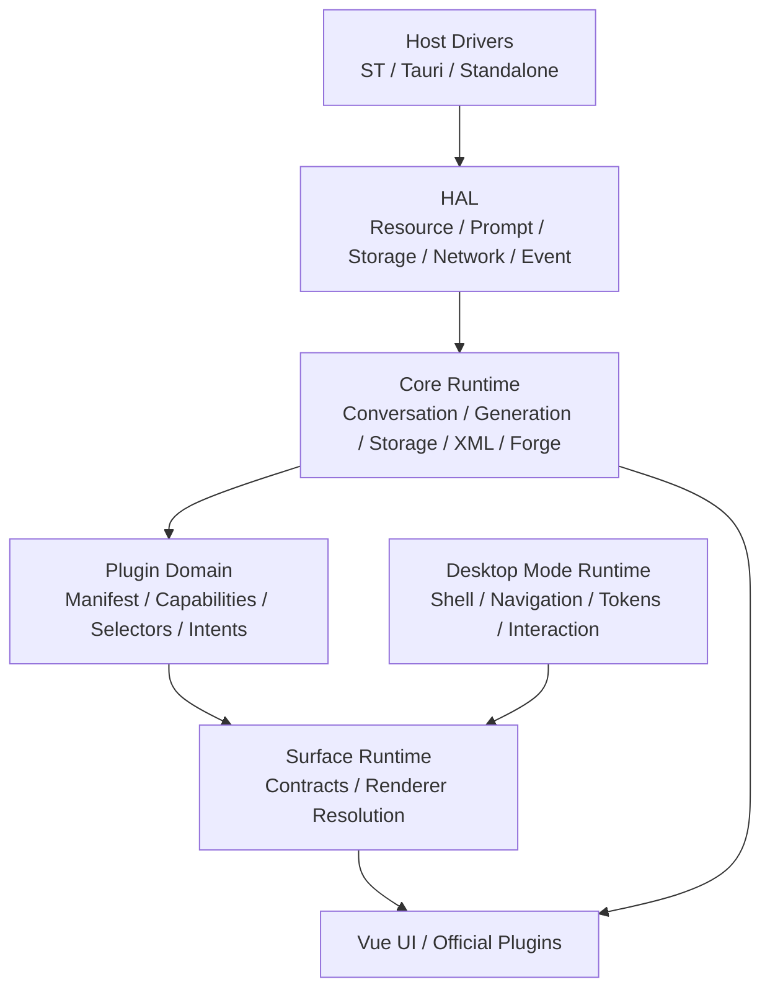
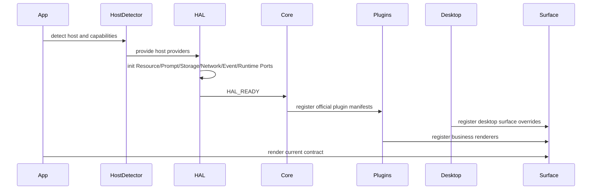
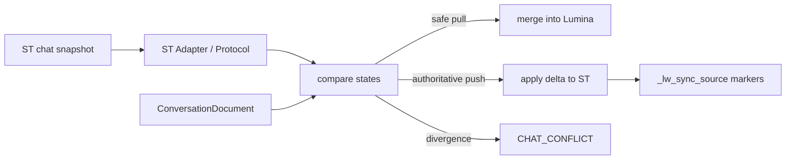

# LuminaWeave 系统架构与设计文档 (System Design)

**版本:** v6.1-docs  
**最后更新时间:** 2026-05-21

本文记录 LuminaWeave 长期系统设计、模块边界、数据流和不可破坏的工程约束。短版入口见 `docs/architecture.md`，产品目标见 `docs/overall/PDR.md`。

## 1. 架构目标

LuminaWeave 的核心架构目标是“深度接管”与“绝对隔离”同时成立：

- 深度接管：Prompt、生成流、同步、世界线、事务、资源和工作区由 Lumina 核心统一协调。
- 绝对隔离：宿主 I/O、核心业务、插件能力、桌面模式、surface renderer 和存储层保持明确边界。

系统应避免两类结构性错误：

- UI 或插件直接读写宿主全局对象、ST 消息数组或持久化文件。
- 桌面模式、主题或 surface renderer 复制业务逻辑，绕过 Core/HAL/Service。

## 2. 总体分层



### 2.1 Host Drivers

Host Drivers 只负责宿主物理交互。

职责：

- 探测和访问 SillyTavern、TauriTavern、Standalone 等运行环境。
- 宿主探测按两层分类表达：`runtimeEnvelope` 区分 `plugin-hosted` 与 `standalone-app`，`physicalHost` 区分 `sillytavern`、`tauritavern`、`generic-tauri` 与 `web`。普通 Tauri 客户端不得被归入 TauriTavern 插件宿主。
- 读写宿主资源、事件、网络和基础存储。
- 封装宿主全局对象、TavernHelper、Tauri ABI、local fallback。
- 普通 Tauri Android 客户端的 native layout bridge 只输出宿主布局契约：监听 Android `WindowInsets`，将 raw physical px 转为 Web CSS px 后注入 `--lw-native-safe-*` / `--lw-native-ime-bottom`，由 shell/root layout 消费；root fullscreen panel 保持 full-bleed，状态栏区域沿用 panel 背景覆盖，内容通过 `--lw-root-safe-*` padding 避让；不得把 safe-area 修正散落到插件组件内部。
- ST 世界书、会话目录、物理消息列表、角色资料、Forge 测试聊天宿主资料、环境就绪、生成函数定位等宿主物理操作必须通过 `host-drivers/st/*Driver` 或 HAL ST provider 暴露给 Core / Facade。

禁止：

- 承载业务状态机。
- 组装业务 Prompt。
- 直接决定资源合并、世界线、事务或 UI 行为。

### 2.2 HAL

HAL 是 Host Abstraction Layer，负责把宿主能力和多源资源组装为领域视图。

核心域：

| 域 | 职责 |
| ---- | ---- |
| Resource | 注册、浏览、读取、导入、导出、fork 多源资源 |
| Prompt | Prompt Source、Prompt Assembly Router、Information Planner、Prompt Assembly、来源 trace |
| Storage | extensionStore、local fallback、写入策略、workspace snapshot |
| Network | HTTP、SSE、Tauri invoke、Nexus 生成网关 |
| Event | 宿主事件规范化为 Lumina 领域事件 |
| Runtime Ports | conversation、generation、settings、presets、extensionStore 的运行时能力端口 |

HAL 内部模块禁止直接访问宿主全局变量或 host driver 具体类。需要宿主能力时，必须通过注入接口消费。

例外边界：`hal/adapters/st/*` 是 ST 宿主 provider 的实现层，可以依赖 `host-drivers/st/*`。`hal/prompt/*` 等 HAL 通用模块不得直接 import ST 具体类。

Resource source、世界书物理 I/O、宿主正则同步等带宿主实现的能力必须在对应 adapter / host-driver 注册侧接入；`hal/resource/*`、`core/lorebook/*` 等通用模块只消费端口、注册表或 host-neutral service。

Runtime port 模式：

- `st-plugin-enhanced`：SillyTavern 插件宿主下的 HTTP 增强 runtime，访问 `/api/plugins/luminaweave`。
- `tauri-native`：TauriTavern 原生 runtime，访问 Tauri invoke、原生扩展存储和本地生成能力。
- `standalone-local`：纯前端本地 runtime，用 localStorage / in-memory 能力维持可运行状态。

普通 Tauri App 在专属 runtime port 落地前按 `standalone-app + generic-tauri` 归类，并继续走 `standalone-local`。TauriTavern 仍是 `plugin-hosted + tauritavern`，因为它承载 ST Web 内容并暴露 TauriTavern 专属宿主 ABI。

生产代码不得再通过 `BridgeDispatcher` 或 `ILuminaBridge` 获取运行时能力；Core、插件和 UI 统一消费 `HALContext.instance.runtime`。

### 2.3 Core Runtime

Core Runtime 是业务真相层。

职责：

- ConversationDocument、消息节点、世界线和当前上下文。
- Conversation / Prompt / Generation command services，承接 Facade public method 背后的业务命令编排。
- Generation、流式状态、停止、恢复和错误处理。
- Storage、事务日志、幂等、序列对账和迁移。
- XML/LuminaView 解析、标签注册和显示派生。
- Forge 项目、Agent runtime、Prompt context、typed effects。
- API Facade 和 domain services。

约束：

- Core 不 import 具体桌面 shell、theme 或插件页面 Vue 组件。
- Core 通过 HAL 消费宿主与资源能力。
- UI 只能通过 service/store/intents 与 Core 交互。
- `LuminaWeaveAPI` 的 public methods 是兼容 Facade；消息更新、Prompt 探测、生成路由等业务流程应委托 Core command services。
- Command services 不进入 HAL，也不由各宿主 adapter 分别实现；宿主差异通过 host writer、prompt probe、generation invoker、token counter、macro resolver 等窄端口表达。

### 2.4 Plugin Domain

Plugin Domain 描述插件能力，而不是直接定义固定 UI 插槽。

插件通过 manifest 注册：

- capabilities
- selectors
- intents
- settings schema
- surfaces
- business renderers
- navigation slots

插件特殊 UI 通过 business renderer 暴露给 Surface Runtime。插件不得把同步、存储、Prompt 或事务逻辑复制到组件内部。

### 2.5 Desktop Mode Runtime

Desktop Mode Runtime 定义完整工作方式。

职责：

- shell renderer
- navigation model
- surface map / overrides
- component overrides
- interaction policy
- tokens
- settings schema
- root safe-area padding 契约。普通 Tauri Android 的 safe-area 由 root shell 统一消费，第三方插件和子页面本阶段不获得单独覆盖状态栏背景的 API。

约束：

- 桌面模式可以改变信息架构和交互方式。
- 桌面模式不得改变核心会话、同步、Prompt、事务和存储语义。

### 2.6 Surface Runtime

Surface Runtime 是 Plugin Domain 与 Desktop Mode Runtime 的连接层。

解析优先级：

```text
desktop override > plugin business renderer > core default renderer > empty renderer
```

Renderer 接收：

- state snapshot
- intents
- theme context
- runtime bridge

Renderer 不直接写 Core 内部状态。

## 3. 启动与运行流程



启动规则：

- Bootstrap 存储只保存加载 HAL 前必需的极小配置。
- 领域存储必须在 HAL 就绪后使用。
- 插件初始化应走 manifest/runtime context，不应依赖 App 手工传递所有 props。
- HTTP 后端只在 `st-plugin-enhanced` 模式下作为 ST 插件增强能力使用；Tauri 和 Standalone 不通过通用 HTTP bridge 默认访问后端。

## 4. 会话与存储设计

### 4.1 ConversationDocument

统一会话文档是主聊天与 Forge 会话的共同物理契约。

至少承载：

- 会话元数据。
- 消息节点池。
- active leaf。
- 插件数据。
- 事务游标。
- 迁移后的 legacy 数据。

节点仍是一条消息一个事实单元，外层容器统一为 `ConversationDocument`。

### 4.2 事务日志

事务日志用于保存写入序列和恢复现场。

状态机：

```text
pending -> running -> committed | aborted | rolled_back
```

关键机制：

- 每次写入携带 idempotency key 和 expected seq。
- 后端或持久化层基于事务日志执行幂等重放。
- 序列不连续时返回冲突，阻断过期写入覆盖。
- 重连后按序列拉取未确认事务，回滚悬挂事务后重试。

### 4.3 消息字段口径

AI 消息至少区分：

| 字段 | 角色 |
| ---- | ---- |
| `pluginRaw` | 原始 LLM 输出，包含 XML / thinking / 协议标签 |
| `mesRaw` | 清洗后的内容本体 |
| `mesST` | 写回 ST 的文本 |
| `mes` | Lumina UI 派生展示文本 |
| `fingerprint` | 内容本体指纹 |
| `stFingerprint` | ST 写回口径指纹 |
| `thinkingText` | 本地折叠展示用思维链 |

`pluginRaw` 是最高级原始事实来源。`thinkingText` 默认不写回 ST，也不参与后续 Prompt 回注。

## 5. 同步设计

同步链路负责在 Lumina 独立存储和 ST 线性聊天之间保持可解释一致。

基本原则：

- Lumina 独立存储是插件介入后的主要事实源。
- 当前 ST 活跃聊天可参与物理同步。
- 非当前 ST 活跃聊天默认走 Lumina 独立存储视图，不强制切换宿主聊天。
- 发现不可自动合并分歧时通知并等待用户决议。
- Lumina 写回 ST 时注入来源标记，回读时抑制回灌。

核心流程：



## 6. 生成与 Prompt 设计

### 6.1 会话绑定与 Prompt Engine

会话绑定只回答“材料从哪里来”，Prompt Engine 只回答“如何合成”。二者必须分离。

会话绑定类型：

- `st-chat`：会话绑定到 ST 聊天，可读取 ST 角色卡、世界书、预设、历史等资源。
- `plugin-session`：会话在 Lumina 插件内独立打开，可用于 Chat、Forge、Director 等来源。

Prompt Assembly Target 描述本次合成目的：

- `chat.continuation`
- `forge.card`
- `forge.conversation`
- `forge.planner`
- `forge.analyst`
- `forge.executor`
- `director.memory`

Prompt Engine 能力边界：

| Engine | 能力 | 限制 |
| ---- | ---- | ---- |
| `st-native` | 使用 ST 原生聊天合成链路 | 只允许 `chat.continuation`，且必须存在 `st-chat` 绑定 |
| `lumina` | 使用 Lumina/HAL Prompt 合成链路 | 支持 Chat、Forge、Director；可读取 ST 绑定资源，但合成由 Lumina 接管 |

路由规则：

- 非 `chat.continuation` 目标必须走 `lumina`。
- `st-native` 是显式选择，不因会话绑定到 ST 而自动启用。
- `lumina-assembly` 是显式策略别名，表示插件形态下也由 Lumina 生成 payload；该路径不依赖 ST dry-run prompt probe。
- Forge / 制卡 / Agent 协作场景永远不走 `st-native`；若绑定 ST，ST 只作为资源来源。
- UI、插件和 Core 只提交合成意图、会话绑定、source policy 和 preset 选择，不在组件内拼接最终 prompt。
- ST native prompt probe 是兼容、调试和对比路径，不是 Lumina-owned Prompt Assembly 的必需输入。

### 6.2 Prompt Assembly Pipeline

Prompt 不应只输出最终 messages，还应保留来源与变换 trace。

```mermaid
flowchart LR
    Request["PromptAssemblyRequest\nTarget / Binding / Policy"]
    Router["PromptAssemblyRouter"]
    Engine["ST Native or Lumina Engine"]
    Sources["ResourceRef / History / Memory / Forge State"]
    Units["PromptSourceUnit"]
    Planner["InformationPlanner"]
    Composer["PromptAssemblyTracer"]
    Result["PromptAssemblyResult"]

    Request --> Router
    Router --> Engine
    Engine --> Sources
    Sources --> Units
    Units --> Planner
    Planner --> Composer
    Composer --> Result
```



`PromptSourceUnit` 区分：

- control
- information
- state

Trace 应记录：

- 来源资源。
- 保留、摘要、隐藏、截断等 transform。
- 输出 message index 和 offset。
- diagnostics。

### 6.3 ST Engine Resource Policy

当使用 ST 原生合成或 ST 预设直通时，只有 ST-owned ResourceRef 可直接 passthrough。Lumina local 或 subscription 资源不得静默混入 ST prompt。

后续转换必须由用户显式选择，例如：

- fork/import 到 ST。
- 虚拟世界书注入。
- 宏注入。

### 6.4 生成流

生成链路应支持：

- SSE 流式输出。
- raw buffer 保存。
- `generationId` 级别状态查询和续传。
- 主动停止后的同步收口。
- 后端 committed 事件通知前端权威同步。

## 7. Resource / VFS / Shell 设计

Resource Domain 是资源事实源的抽象层，VFS 是路径化视图。

典型路径：

```text
/sources/<sourceId>/...
/library/...
/workspaces/forge/<projectId>/...
/workspaces/chat/<conversationId>/...
```

规则：

- `/sources` 和 `/library` 只映射 Resource Domain，不复制资源真相。
- `/workspaces` 由 ShellWorkspaceService 提供共享且可持久化的 workspace。
- `BashTerminalRuntime` 只负责通用 shell runtime 和 mount 编排：默认挂载 `/sources`、`/library`、`/workspaces`，调用方可通过 `extraMounts` 注入额外 `IFileSystem`；HAL 不 import Forge 业务代码。
- Forge Agent 暴露给模型和调试 UI 的 `./...` 是项目语义 VFS，由 `ForgeSemanticVfsProvider` / `ForgeProjectSemanticVfsService` 生成公开内容；Forge runtime 将该 provider 包装为 `ForgeSemanticBashFs` 并挂载到 Forge shell 的项目根。绝对 `/sources/...`、`/library/...` 保持底层 VFS 直通。
- 外部资源写入必须经过 Resource Write Policy。
- ST 和订阅源不得被静默改写。
- Agent shell 的写入和网络访问必须经过 ShellPermissionService 与 ShellNetworkPolicyService。

## 8. Forge 设计

Forge 以项目为长期容器，协作线程是项目内的 ConversationDocument 分支。

核心实体：

- `forgeProjectId`
- `conversationId` / thread session id
- workspace path（按项目，而不是按线程）
- project memory
- virtual lorebook
- draft tree
- workspace patch audit log
- Prompt Preset bindings

边界：

- 项目资源以 `forgeProjectId` 为 owner，保存在 `/workspaces/forge/<projectId>`。
- 协作线程以独立 `id` / `conversationId` 保存消息世界线，可共享同一项目资源。
- 项目标题使用 `projectTitle` 表达，线程标题使用 ConversationDocument `title` 表达；项目中心不得用最新线程标题覆盖项目标题。
- 协作线程的底层 VFS 路径为 `/workspaces/forge/<projectId>/chat/<conversationId>`；公开语义 VFS 使用 `./threads/目前/` 和 `./threads/NN标题/`，不得要求模型记忆或输出 `conversationId`，线程消息事实仍由 ConversationDocument 保存。
- 协作线程 VFS 目录同时投影到 `/workspaces/chat/<conversationId>` 和 `/workspaces/forge/<projectId>/chat/<conversationId>`，包含 `thread.json` 与 `messages.json` 作为可检查快照；该投影不得取代 HAL ConversationDocument 真源。
- 新建线程必须继承项目 VFS 中的项目记忆、草稿树、文件版本记录和虚拟世界书，而不是创建新的项目资源根。
- 删除线程只删除该线程的 ConversationDocument 与索引绑定，不删除项目 VFS。
- 删除项目会删除该项目下所有线程、workspace binding 和项目 VFS。
- 项目中心 UI 只能调用 store / repository 意图，不直接访问 HAL runtime、宿主会话或 VFS 实现。

典型项目路径：

```text
/workspaces/forge/<projectId>/project.json
/workspaces/forge/<projectId>/memory/tree.json
/workspaces/forge/<projectId>/drafts/tree.json
/workspaces/forge/<projectId>/review/staging.json   # legacy publish/export boundary, not AI direct-write gate
/workspaces/forge/<projectId>/lorebook/entries/*.json
/workspaces/forge/<projectId>/chat/<conversationId>/thread.json
/workspaces/forge/<projectId>/chat/<conversationId>/messages.json
/workspaces/chat/<conversationId>/thread.json
/workspaces/chat/<conversationId>/messages.json
```

Forge Agent 语义 VFS：

```text
./AGENTS.md
./.forge/agent/SYSTEM.md
./.forge/agent/UI_DSL.md
./.forge/agent/REASONING.md
./.forge/agent/PLANNER.md
./.forge/agent/CONVERSATION.md
./.forge/agent/ANALYST.md
./.forge/agent/EXECUTOR.md
./agent/skills/<skill-name>/SKILL.md
./.pi/agent/skill-overrides/<skill-name>/SKILL.patch
./memory/AUTO/Checklist.md
./memory/用户偏好.md
./threads/目前/thread.md
./threads/目前/messages.md
./threads/NN标题/thread.md
./threads/NN标题/messages.md
./lorebook/
./review/
/library/...
/sources/...
```

语义规则：

- `./` 是当前 Forge 项目根；工具入参允许省略 `./`，显示和调试输出统一规范化为 `./...`。
- `./threads/目前/` 是当前 active 协作线程的动态别名，不作为持久线程 id 保存到模型记忆。
- `./threads/目前/thread.md` 暴露当前线程可读元信息，`./threads/目前/messages.md` 暴露当前线程消息摘要；历史线程稳定路径使用 `./threads/NN标题/thread.md` 与 `./threads/NN标题/messages.md`，由内部 `conversationId` 映射维护。
- `AGENTS.md` 是 Agent 工作契约，不是系统提示词；它规定工具使用、`workspace_patch` 审计、session tree、timeline 和回滚规则，不表达模型应该如何思考。
- `./.forge/agent/SYSTEM.md` 是默认系统提示词，`./.forge/agent/<MODE>.md` 是模式提示词，`./.forge/agent/UI_DSL.md` 是 Forge `<V>` 组件 DSL，`./.forge/agent/REASONING.md` 是隐藏思维链与可见工作笔记边界；`./.pi/agent/prompts/` 不再作为 Forge prompt 主路径。
- Forge 预设不再面向 Agent 暴露为 slot 拼接列表，而是提供 Agent 资源包与提示词编排：`AGENTS.md contract + ./.forge/agent/SYSTEM.md + ./.forge/agent/<MODE>.md + UI_DSL.md + REASONING.md + skills / capabilities + memory index + context files + branch messages`。Forge Agent 预设工作台是预设资源包维护入口；内置预设只读，自定义副本可编辑提示词、预设技能元数据、加载策略和正文。项目覆盖优先于 active preset，active preset 优先于 bundled fallback。
- `./memory/**/*.md` 是 Forge 项目长期记忆正文；默认 prompt 编排只注入 `./.pi/agent/context/memory-index.md`，列出路径、标题、来源、更新时间和摘要。需要正文时必须通过同一 Semantic VFS / `readFile` 读取，不把完整长期记忆灌入 system prompt。
- 技能统一通过 `./agent/skills/<skill-name>/SKILL.md` 加载。项目技能优先，active preset skill 次之，内置技能回退；preset skill 支持 `on_demand` / `always` 加载策略，参考提炼能力作为默认主预设的按需技能提供，不再作为独立参考提炼预设暴露。内置技能正文保存在 `src/resources/forge-skills/*.md`，registry 只负责声明 metadata 与加载资源；用户修改内置技能时应创建项目级同名 skill 覆盖，不改 bundled base。
- `ForgePiResourceLoader`、`ForgePiToolBridge.readFile()`、Forge shell 和“项目 VFS”面板必须消费同一个语义 VFS provider/projection；不得再各自拼接 prompt、skill、thread 或 raw storage 路径。

Forge Runtime 分工：

- Planner：规划与对齐。
- Conversation：普通协作对话。
- Analyst：只读分析与上下文整理。
- Executor：高精度条目重写与执行。
- Graph：只提供阶段、状态、写入边界和能力索引，不再合成最终 prompt，也不再预先塞入完整 skill。
- pi-style Agent Runtime：Forge Agent kernel 位于 `src/api/core/forge/agent-app`，已收敛到前端内嵌版 `pi-agent-core` runtime。`ForgePiAgentSession` / `ForgePiSessionManager` / `ForgePiResourceLoader` / `ForgePiExtensionRunner` / `ForgePiToolBridge` 参考 `pi-coding-agent` 结构实现浏览器 adapter 版本，负责 session tree、context engineering、最终提示词合成、tool execution 和 runtime event trace。
- 模型适配：Forge Agent 模型协议层使用浏览器可用的 `@earendil-works/pi-ai`。`ForgePiModelRegistry` 创建 pi-ai model 并返回 provider 包装的 `streamSimple()` 兼容 `streamFn`；`ForgePiNexusProvider` 直接把现有 Nexus preset / API 配置映射为 pi-ai provider model 与 request options，不再拼接旧模型协议消息。一次 Forge turn 可能包含多次 pi-ai provider 调用，调试面板必须按调用链展示每次 provider 记录的 pi messages、provider payload、provider response、stream lifecycle、final text 和 error。前端 Forge runtime 不得引入 `@earendil-works/pi-coding-agent`、`pi-agent-core/node`、AI SDK tool/message 协议或 Node-only `fs/child_process`。
- Reasoning artifact 边界：Forge 必须区分 provider raw message、replay-safe pi message 与用户可见/业务记忆内容。带 provider 签名或加密语义的 reasoning artifact 只允许在同 provider / 同模型的短期 pi replay 通道中原样回传；无签名 raw thinking、跨 provider / 跨模型 reasoning、普通 `<thinking>` 文本不得进入用户可见消息、workspace patch 内容、Forge memory、虚拟世界书或长期 prompt 回注。调试 trace 可以展示 raw / sanitized 差异，但 raw trace 不等于下一轮模型输入。
- Forge UI：`src/plugins/forge` 对标 pi-tui 的交互分层，只负责输入、消息展示、调试面板、文件版本/项目资源面板、历史暂存与发布边界、store action controller。Vue 组件不得承载 Agent loop、模型请求、工具执行或最终提示词合成；只能通过 `ForgePiRuntimeClient` / store controller 消费 runtime snapshot 和提交用户意图。“项目 VFS”面板浏览 `ForgeProjectSemanticVfsService` 生成的 Agent 可见语义 VFS 投影，并以 `./...` 项目相对路径显示；目录节点显示子项清单，文件节点显示完整内容。该面板允许对受管理的 `./AGENTS.md`、`./.forge/agent/SYSTEM.md`、`./.forge/agent/PLANNER.md`、`./.forge/agent/CONVERSATION.md`、`./.forge/agent/ANALYST.md`、`./.forge/agent/EXECUTOR.md` 与 `./agent/skills/<skill-name>/SKILL.md` 创建/编辑项目覆盖，写入项目 VFS 并追加 `workspace_patch`。raw workspace storage 只作为内部映射源，`./chat/<conversationId>`、`project.json`、`memory/tree.json`、`lorebook/entries/*.json`、`review/*.json` 等内部结构不得暴露给模型或主视图。
- Prompt Preview：Agent Inspector 与 Forge Prompt Preview 的主模型视图必须以 `ForgePiAgentSession.preparePrompt()` 的 dry-run 输出为事实源。旧 Forge Prompt Context / Prompt Assembly 只提供 source-unit trace / attention 解释，不代表最终发给 pi agent 的 system prompt，也不作为主模型 preview payload 输入来源；旧 `PromptBuilder` 仅保留 Chat / ST 世界书提示词挂载能力，不再提供 Forge Agent prompt 构建 API。
- Direct project write：写入类 pi tool 使用 `writeFile(path, content)`、`editFile(path, old_string, new_string)`、`deleteFile(path)` 的直接语义，默认写入 Forge 项目 VFS 并追加 `workspace_patch`。`bash` 的 project-write-request 写入同样进入 direct patch reducer；资源 VFS、运行时 prompt、内置 skill、线程消息投影等只读目标必须返回明确错误且不得部分写入。真实 ST 世界书发布、导出或覆盖宿主数据仍必须走用户确认边界。

Forge 分支、timeline 与工作区版本：

- 同一 Forge 协作线程对应一个 pi session。Forge UI 中的 fork / 回滚 / 切换是该 pi session tree 内的 `activeNodeId` 变化，不创建新的 Forge thread，也不复制新的 workspace session。
- 分支操作优先基于用户请求节点。选择历史 user node 时，runtime 应将 `activeNodeId` 切到该 user 的 parent，并把 user content 放回输入框供用户修改后重新发送；选择 assistant / tool / staging 节点时可 checkout 查看当前分支，重新生成时应定位到最近的 user 分支点。
- pi session 持久化格式应是 flat append-only entries，使用 `id / parentId` 重建 tree、branch messages、timeline projection 和 workspace patch 审计状态。`children`、timeline rows、console messages、文件变更列表和 model debug summary 都是 projection，不是长期事实源。
- Forge timeline 是从 pi session tree 派生的用户可见投影，可以合并、隐藏或重组 context / tool / assistant 节点，但必须保留 user input、workspace patch/checkpoint、branch summary 和 label 等可操作节点的 pi origin。
- timeline item 若来自 pi session，必须携带 `runtime: "forge-pi"`、`sessionId`、`nodeId`、`parentNodeId`、`entryType` 等 origin 字段。用户从 timeline 发起 checkout / branch / 文件版本查看时，timeline 只提交意图和 origin，不能直接改 runtime 内部状态。
- Forge workspace version manager 负责文件、VFS、虚拟世界书投影的分支版本。写入类工具应产生 workspace patch / checkpoint entry；切换对话分支时默认不强制恢复文件，而是询问用户“仅切换对话 / 恢复文件版本 / 查看差异”。
- 文件版本辅助面板应基于 workspace patch / checkpoint history 展示当前分支文件状态、单文件版本历史和 branch diff，并支持撤回或恢复变更。恢复动作直接生成反向或重放 `workspace_patch` 并写回 Forge 项目 VFS，不再生成 Review/Staging 条目。恢复真实 ST 世界书仍必须经过用户确认的发布/导出边界。

写入规则：

- 模型输出先进入 pi session tree、typed runtime events 或 proposals。
- pi 写入工具默认只作用于 Forge 项目 VFS，并必须追加 `workspace_patch` 审计记录。
- `./memory/**/*.md` 和 `./lorebook/entries/*.md` 是一等 Forge 域文件：direct write 同步 runtime state，再持久化项目数据。
- 受保护目标包括 Resource VFS、运行时 prompt、内置 skill、线程消息投影和内部 raw storage；写入请求必须失败且不得产生部分写入。
- 发布到真实 ST 世界书或导出是后置动作，必须由用户显式确认。

## 9. XML 与 LuminaView

XMLTagRegistry 是 XML 标签元数据真相源。

应统一管理：

- canonical 名称。
- 别名。
- 生命周期。
- 状态文案。
- 协议展示。
- 插件动态注册。

流式解析应基于同一份原始 XML buffer 派生 display text、status text 和 filtered count，避免多处重复解释导致闪烁或状态错位。

## 10. API Facade 与 Domain Services

`LuminaWeaveAPI` 不应继续膨胀为所有能力的主要实现边界。

长期方向：

- `DesktopSurfaceService`：surface 注册、打开和桌面模式 bridge。
- `HostInteractionService`：toast、confirm、宿主交互。
- `ConversationDomainService`：会话来源、列表、上下文、消息、世界线命令。
- `GenerationDomainService`：发送、重生成、PromptInspector 自定义生成和生成状态。
- `SettingsDomainService`：设置读写、legacy key、导入导出和监听。

Facade 可保留委托入口，但新增 UI 应优先消费明确 domain service。

当前已落地的收口：

- `LorebookManager` 只维护世界书领域状态、快照和事件派发；ST/TavernHelper/REST 世界书读写由 `STWorldInfoDriver` 承担。
- `LuminaWeaveAPIBase` 的环境等待、ST context / event source 访问由 `STEnvironmentDriver` 承担。
- `LuminaWeaveAPI` 中角色名、用户头像、角色头像等宿主资料读取由 `STCharacterProfileDriver` 承担。

## 11. 后端服务设计

`luminaweave-server/src/` 是后端源码。

核心服务：

- `StorageService`：本地存储。
- `StreamingManager`：生成状态、SSE、断线恢复。
- `NexusService`：Provider 路由和生成。

约束：

- `luminaweave-server/index.js` 是构建产物。
- `luminaweave-server/data/` 是本地数据目录，禁止提交用户数据。
- 后端 API 或 SSE 事件变化必须同步更新 API、配置、存储和测试文档。

## 12. 不变量

系统长期必须维护以下不变量：

- Core 不依赖具体插件页面、桌面 shell 或主题实现。
- HAL 不直接访问宿主全局变量。
- UI 不直接操作 ST 消息数组或 Lumina 持久化文件。
- VFS 不成为第二份资源事实源。
- 外部资源不被静默改写。
- 事务写入必须可幂等、可对账、可恢复。
- Prompt 输入必须可追溯来源和 transform。
- 阶段性任务记录不得继续堆入本文。

## 13. 文档维护

以下变化必须同步更新本文：

- 分层边界或依赖方向变化。
- 会话、事务、同步、生成、Prompt、资源或 Forge 数据流变化。
- 公共 API、surface contract、desktop mode manifest 或 plugin manifest 的破坏式变化。
- 新增持久化格式、迁移策略或宿主适配路径。

重大取舍应新增 ADR。
