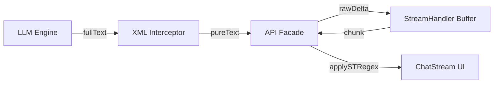

# LuminaWeave 系统架构与设计文档（System Design）

**版本:** v5.3-dev
**最后更新时间:** 2026-04-02

## 一、系统架构理念

作为 SillyTavern 的增强框架，LuminaWeave 的设计核心是 **深度接管与绝对隔离**。通过独立运行于浏览器的"前端微内核"（Lumina Core），实现自身视图层的自治，仅在发生大模型收发时进行"选择性同构写回"。

## 二、核心组件设计与作用边界

### 1. Lumina Core（核心底座）

沟通原生 ST 平台和诸多子插件的中间层，包括：

- **核心快照与记忆中心 (MemoryManager)** [NEW]：负责协调所有子插件的状态持久化。
- **全局文本测量服务 (MeasureService) [NEW]**：集成 `@chenglou/pretext` 库，提供毫秒级、基于 LRU 缓存的文本高度预计算，服务于 Timeline 布局与虚拟列表。
- **上下文自动解析 (Context Resolver) [Standardized]**：
    - **统一 API 探测器 (Unified API Discovery)**：通过 `LuminaWeaveAPIBase` 基类实现。
    - **三层探测机制 (Triple-Layer Discovery)**：
        - `SillyTavern` (容器): 探测全局变量。
        - `getContext()` (数据): 获取当前活跃的会话及其属性快照。
        - `TavernHelper` (工具): 访问更底层的原生控制函数和扩展 API。
    - **EventEmitter 定位器**：针对 `eventSource` 执行 `Context > Main > Window` 的层级搜索，确保跨环境事件监听的 100% 成功率。
    - **逻辑解耦**：所有业务模块（Lorebook, Storage 等）统一接入，不再关心宿主运行模式，极大地增强了系统的鲁棒性。
- **生命周期网关**：截取 Prompt 构建与响应接收期，允许插入系统规则或并行/串行后台任务。
- **同构 RPC 跨环境通信**：前端 UI 渲染请求与后端 Node.js 异步拉取图谱。

### 2. UI 渲染宿主 - 可选的 Shadow DOM 沙盒隔离层 [v5.7 优化]

在 ST 定义的插槽位使用 Vue.js 3 开辟独立绘制区域。默认开启 Shadow DOM 以隔离原生 CSS 污染。
- **严格样式选择性注入 (Strict Style Isolation)**：`index.ts` 中的 `injectStyles` 仅克隆包含 `data-vite-dev-id` 或内容中带有 `LuminaWeave` 特征标识的样式节点。这确保了 Shadow DOM 内部仅应用插件自身样式，彻底杜绝 SillyTavern 全局样式（如对 `input` 和 `button` 的强制覆盖）造成的 UI 异常。
- **兼容性降级**：支持在设置中关闭 Shadow DOM 以增强特定浏览器的兼容性。

### 3. PluginManager（插件管理器解耦层）

所有视图应用（ChatStream、Timeline、Status 等）均抽象为 `src/plugins/` 下的独立模块，由 `PluginManager` 在根组件 `App.vue` 启动时统一动态注册。

### 4. Shadow Buffer & 统一存储代理（Unified Storage Engine）

- **影子图谱缓存**：所有修改首先发生在 `localChatData`（影子数据库）中，UI 层单向订阅。
- **多级作用域（Scope Resolver）**：`Global`、`Character`、`Chat`、`Session` 等多级持久化。
- **选择性同步（Selective Sync）**：用户发送消息后，`commitToST()` 将本地 `localChatData` 压回 `window.chat`，然后通过 TavernHelper 调用生成函数。

### 5. 消息存储分离机制（v4.0 新增）

每条消息对象存储两个文本字段：

| 字段 | 含义 | 用途 |
|---|---|---|
| `pluginRaw` | 完整原始 LLM 响应 | 保存包含 XML 标签的完整输出，作为最原始的数据源 |
| `mesRaw` | 提取后的干净对话文本 | 优先从 `<Chat_Reply>` 提取，用于编辑、同步与内容指纹对比 |
| `mes` | ST 正则处理后的显示文本 | UI 展示 |
| `characterId` | 所属角色 ID | 用于多角色/群组模式后的角色溯源 |

`crudChatRecord()` 写入时，AI 消息优先从 `pluginRaw` 中提取 `<Chat_Reply>` 标签内容存入 `mesRaw`；若无标签则回退至清洗后的全量文本。UI 渲染 (`mes`) 基于 `mesRaw` 应用 `applySTRegex`。

- **独立对话存储架构 (v5.5 优化)**:
    - **一条消息即一个节点**: JSONL 物理结构实现了消息与记忆（Deltas & Snapshots）的强耦合映射。
    - **双标识符机制 [NEW]**: 
        - `id`: 稳定的、不可变的随机 UUID，用于时间线定位。
        - `fingerprint`: 基于内容的哈希值，用于精确追踪内容变更与同步。
    - **高度精简**: 彻底剔除所有 ST 线性环境特有字段（如 `swipes` 系列、`send_date`、`message_id`），消除状态比对中的冗余噪音，仅保留树状引用与内容特征。
    - **智能同步引擎 [NEW]**: 内置前端 `DiffEngine`，根据 `id` 与 `fingerprint` 计算差异，实现“追加优先，全量回退”的性能闭环。
    - **分歧检测 (Divergence Detection) [NEW]**: 只有当本地的分支与 ST 的线性流均包含各自唯一的节点时，系统才判定为“不可自动合并的分歧”，触发 UI 比对。
    - **分支对齐同步 (Branch Alignment Sync) [NEW]**: 冲突解决（以 ST 为准）时不再抹除物理节点池，而是通过重新绑定 parentId 将 ST 的序列强制构筑为一条新的活跃路径。
    - **活跃叶子记忆锚定**: 同步时在活跃节点注入 Tier 1/3 快照。
    - **事务日志层 (v5.8 新增)**: 每个 chat 独立维护 `chat_<chatId>.tx.jsonl`，记录 `id/seq/status/scope/payloadDigest/idempotencyKey/error`。
    - **事务状态机 (v5.8 新增)**: 写路径统一遵循 `pending → running → committed|aborted|rolled_back`，禁止非法跃迁。
    - **幂等与序列校验 (v5.8 新增)**: 请求需携带 `transactionContext(expectedSeq,idempotencyKey)`；后端优先命中幂等重放，序列不一致时返回 `TXN_SEQUENCE_CONFLICT`。
    - **元数据序列锚点 (v5.8 新增)**: `metadata.transaction.lastCommittedSeq` 与 `lastTransactionId` 作为重连和增量写入的对账基准。
    - **对账补偿链路 (v5.8.1 新增)**: 后端事务查询支持 `afterSeq` 增量拉取，前端在重连后若写入命中 `TXN_SEQUENCE_CONFLICT`，会先按序列拉取未确认事务、回滚同幂等键下的 `pending/running` 悬挂事务，并基于刷新后的 `lastCommittedSeq` 自动重试一次。

### 7. 模块导入与初始化时序优化 (v4.1, v5.2)

- **导入规范化**：为了消除 Vite 编译路径歧义，核心 API 模块统一采用静态导入。
- **配置先行原则 (v5.2) [NEW]**：`index.ts` 在挂载 Vue 应用前，强制 `await lwStorage.loadIndependentGlobalData()`。这是因为 Shadow DOM 的创建是不可逆的底层动作，必须先从独立存储中读取 `useShadowDom` 标记，才能决定后续的挂载目标（Shadow Root 或普通 Div）。
- **初始化导入守卫与时序管控 (v5.8.3) [UPDATED]**：
    - `LuminaWeaveAPI.init()` 增加了强时序控制：`initializeAllPlugins()`（插件及其模型注册）必须优于 `syncFromST()`（历史数据同步解析）。
    - 这一时序调整确保了 `MutationEngine` 在处理既有对话中的指令时，相关的 `global`、`inventory` 等模型已经全量挂载，避开了模型未定义导致的运行期错误。
    - 引入 **沙箱分层兜底机制**：`MutationEngine` 沙箱对核心内置模型（如 `characters`, `inventory` 等）实施 `has` 拦截及占位代理（Placeholder Proxy）。即使用户或历史消息中存在提前访问，系统也会优雅降级而非中断解析流程。

### 8. LorebookManager (世界书同步代理) [NEW]

专门负责世界书的高阶管理，其数据一致性通过 **官方函数代理 (Official Function Proxying)** 保证：
- **读操作**：直接监听并解析 `window.world_info`。系统会自动将原始书名列表标准化为对象数组 `[{ name: string, id: string }]`，并统一剥离 `.json` 后缀以增强 UI 显示与 API 调用的鲁棒性。
- **写操作**：封装 `updateWorldInfoEntry` 与 `saveWorldInfo`。修改发生时，Lumina 仅负责发起 UI 指令，通过 ST 内部函数驱动磁盘落盘，从而保持与官方面板的实时同步。
- **边界约束**：禁止将高频易变数据（如单回合的 `<Next_Plan>` 或即刻触发的临时规则）注入世界书，以防造成严重的 UI 卡顿与磁盘 I/O 磨损。此类数据应由 `DirectorPromptBuilder` 拦截处理。
- **解耦式动态表协议 [NEW]**：Tier 1 状态不再硬编码字段，转而使用统一的 `TableRegistry`。每个表通过 `schema` 定义自说明其数据结构，系统自动遍历并注入 Prompt。

### 9. 提示词与宏注入系统 (Prompt Injection & Macro Pipeline) [REFACTORED]

系统彻底抛弃直接深度接管 ST 提示词组装序列的“重发式”侵入逻辑，由于破坏极易随着 ST 引擎升级而失效，现转而采用更高兼容性的**原生融合架构**：

1. **拟态虚拟世界书 (Mimic Virtual Lorebook)**
   - `PromptWorldInfoMount` 负责维护一本插件侧定义的“虚拟世界书”。它在 ST 的 `window.world_info` 体系内动态同步一个专有的输出目标（名称可配置，默认为 `LuminaWeave_System`）。
   - 该世界书仅作为插件规则与提示词片段的“最终渲染输出地”，插件内部 state 是唯一的事实来源。
   - 所有静态规则、框架协议、系统级预设，全部转化成该书下的 `Constant`（常量）条目。这使得 ST 的原生构建引擎（及 Token 裁剪阈值控制）完美接管提示词拼装，彻底解除了代码层层面对 `mesRaw` / `mes` 的脏读取。
2. **动态宏注入管道 (Dynamic Macro Registration)**
   - 作为世界书体系的底层补充，`MacroInjector`（旧为 `PromptBuilder`）提供极度轻量的“最后一公里”替换服务。
   - 当拦截到最终将要传递给模型的 `payload` 时，扫描其中的预设占位符（如 `{{lumina_director_rules}}`）并进行实装，用于精准注入需要绝对前置或后置指令。
3. **插件颗粒度授权 (Sub-plugin Permissions)**
   - 权限管控下放到子插件维度，用户可以随意启停 Timeline, Director 的独立提示词流入，保留绝对的数据安全与控制感。

### 10. 可扩展的 XML 解析与切割流水线 (Interceptor Pipeline) [NEW]

LuminaWeave 提供了一套开放式的正则流式拦截机制，要求所有非对话状态必须通过 XML 标记其生命周期，并以此决定它们如何参与 Prompt 组装。这是“数据标识驱动生命周期 (Tag-Driven Lifecycle)”的核心：

**数据分类与归处 (Lifecycle Schema):**
- **Transient (阅后即焚)**: 仅作为辅助推演过程（如 `<Thoughts>`），提取后直接丢弃或仅记录于 Console，绝不写入 ST 聊天记录，防止污染 Tier 2 上下文。
- **Ephemeral (单次必需)**: 作为下一次生成的指导方针（实现 **规划链 Chain of Planning**），如 `<Current_Plan>` 和 `<Next_Plan>`。提取后暂存于 `DirectorStore`。
- **Persistent (持久状态)**: 结构化突变（如 `<Inventory_Change>`）。支持动态表名感应与 **引导式表头初始化**。
- **Core (核心对话)**: 剔除以上所有标签后的纯文本，如 `<Chat_Reply>`。

**开放扩展机制:**
- **动态注册 (Dynamic Registration)**：向子插件暴露 `registerXMLParser(tagName, options)` 接口，其中 `options` 需明确保定生命周期 (`lifecycle: 'transient' | 'ephemeral' | 'persistent'`)。子插件可据此自由拦截特化指令（如 `<Dice_Roll>`），彻底解耦数据与视图流。

### 10.1 通用增量更新引擎 (Incremental Mutation Engine) [NEW]

为了免去子系统重复开发数据维护逻辑的负担，核心框架提供一套通用增量更新协议。各子插件（如记忆系统、物品栏）仅需专注于“定义数据模型”及“视图渲染”，而大模型端只要输出标准化操作函数指令，系统即会自动拦截并执行对应动作（CRUD），实现模型直调 UI 的自动化闭环：

- **动态数据模型 (Decoupled Tables) [v5.5 增强]**：
  - 采用注册制加载表格，核心模型包含：`global`, `characters`, `inventory`, `skills`, `plot`。
  - 支持第三方插件动态扩展表格，无需修改核心 Store 逻辑。
  - **自说明提示词 (Self-Documenting Prompts)**：每个表格附带 `schema` 描述，自动注入 Prompt，确保 LLM 对动态扩展的表结构保持最高依从性。
- **引擎自动化解析拦截 (Updater Handler)**：
  流式切割流水线探测到 `<Mutation>` 节点后，通过 target 路由到子插件注册的数据模型，执行动作对应的 `add/insert(index, obj)`，`update/replace(index, obj)` 或 `delete(index)` 操作。系统保障数据原子性。子系统仅需通过 Vue Store 的监听即可实现界面的自动响应。

### 10.2 快照与增量绑定的时间游走 (Delta-Snapshot Time Travel) [NEW]

为了支持在时间线图谱 (Timeline) 中任意穿梭而不丢失对应的 Tier 1 状态（如回到过去的节点，物品栏和好感度也应回退至当时的状态），系统采用 **增量 (Delta) + 快照 (Snapshot)** 的混合追踪架构绑定于 `ChatMessage.extra` 字段：

1. **增量记录 (Deltas)**：
   绝大部分普通的生成节点，仅在 `extra.tier1Delta` 中保存本次大模型呼出的 `<Mutation>` 操作集合（如 `[{target:'inventory', action:'add', value:{...}}]`）。
2. **定点快照 (Snapshot)**：
   为了防止由于极长对话导致的回溯重放性能开销，系统每隔 N 个节点（或在分支产生分化时）会在当前节点的 `extra.tier1Snapshot` 中写入一份包含所有模块全量数据的完整副本。
3. **时空倒流/分支切换 (Time Travel/Branching)**：
   当用户点击图谱上的任意历史节点进行切换 (`branchFromNode`)，或者对某条时间线进行剪枝回滚 (`rollbackFromNode`) 时：
   - 系统沿着该节点向上（父节点方向）溯源，直到找到最近的一个带有 `tier1Snapshot` 的定点。
   - 读取该快照注入至 `MutationEngine/Tier1Store` 恢复基准状态。
   - 然后从该快照节点按顺序向下重放 (Replay) 直至目标节点的所有 `tier1Delta` 变更，无缝、精确地重构目标时空的局部变量。

### 10.3 类人记忆向量化方案 (Vector Memory System) [NEW]

为了模拟人类极其精准的剧情召回能力，系统引入了 `MemoryVectorService`:
- **自动切割与索引**: 剧情总结生成的“小总结”被自动分割为带上下文标签的片段。
- **语义加权召回**: 结合最近对话的关键词统计进行 Embedding 检索。

### 10.4 动态上下文压缩 (DCC) 与发送范围控制 [REFACTORED]

为了实现基于“全量+概况+隐藏”的非侵入式上下文管理，系统引入了专用的 **ContextCompactor** 逻辑：

- **分层算法 (Tiered Compaction Strategy)**：
  - **核心计算逻辑**：从活跃叶子节点（Active Leaf）反向向上溯源。
  - **全量区 (FULL)**：在用户设定的 `Full Range` 阈值内（支持条数/Token/字符），消息保持原始内容。
  - **概览区 (SUMMARY)**：超出全量但仍处于 `Overview Range` 内的消息。此时消息内容被物理替换为摘要标签 `<Story_Summary>`，确保大模型能感知背景但大幅降低 Token 消耗。
  - **隐藏区 (HIDDEN)**：超出两级阈值的消息。
- **数据字段解耦 (Field Decoupling)**：
  - **mesST (权威写回字段)**：它是 DCC 处理后的最终产物。同步引擎 `STSyncService` 强制将此字段写入 ST 消息列表，作为发送给模型的真实输入。
  - **mesSummary (摘要存储)**：缓存 AI 生成或提取的消息级剧情快照，作为概览模式的素材来源。
- **is_hidden 物理标记**：计算出的“隐藏区”消息通过 `STClient.updateMessages(..., { is_hidden: true })` 写入原生属性（同时同步 `is_system`）。这实现在不删除消息节点的前提下，阻止 ST 将其组装进请求载荷中。
- **统一访问与生命周期管理 (v5.9) [NEW]**：
    - **Explicit Property Assignment**：移除了基于代理的属性拦截（MessageProxy），改为在 DCC 等阶段显式计算并分配 `mesST` 和 `is_hidden`，提升执行效率并减少生命周期隐患。
    - **透明访问**：同步引擎和视图直接读取计算好的物理属性，不再依赖动态提取函数，大幅降低重复计算开销。
- **同步集成与一致性**：压缩计算发生在 `commitToST` 的预处理阶段，确保“计算 → 压缩 → 写入 ST → 生成”是一次性的原子操作，防止状态延迟。

### 11. 发送流程 (Official OpenAI SDK 增强版)

```
handleSend() → lwApi.sendMessage(text)
  ↓
crudChatRecord('add', text, {is_user:true})
  ↓
triggerGenerate('normal')
  ↓
probePrompt()                                // 拦截并获取 ST 的组装载荷
  ↓
DirectorPromptBuilder.build(payload)         // 【拦截重塑】注入前置状态、`<Next_Plan>`与后置格式锁
  ↓
llmEngine.generateCustomStream(mutatedPayload) // 使用 OpenAI SDK 发送请求给后端处理发信
  ↓
Nexus XML Interceptor                        // 【流式切割】剥离 XML 标签并触发对应的注册扩展
```

#### 11.1 Forge / 制卡会话 (card_maker) 流程 [MVP]
制卡属于**非 ST 会话**：不读取/写入 ST 消息列表，不触发 `syncFromST/commitToST/saveChat/reload`。其核心目标是实现与主聊天**并行生成且状态隔离**。

```
open Forge Panel → 用户选择 preset + 输入需求
  ↓
POST /api/plugins/luminaweave/prompt/compile   // 后端按 preset(prompts + prompt_order) 编译出 messages[] + settings
  ↓
POST /api/plugins/luminaweave/nexus/generate   // 使用 sessionChatId=lw_card_* 发起生成（与 ST chatId 隔离）
  ↓
GET  /api/plugins/luminaweave/nexus/status/:sessionChatId
```

关键约束：
- `sessionChatId` 必须全局唯一，避免覆盖主聊天的后端流式状态。
- Preset 以完整 JSON blob 形式由后端持久化，前端不承担复杂的 preset 业务逻辑（仅 list/select/import/export）。

### 12. llmEngine 路由策略 (OpenAI SDK)

```js
import OpenAI from 'openai';
// 规格化 URL 并创建客户端
const client = this.getClient(node); 
// 后端或前端按需通过 SDK 获取或生成
const response = await client.chat.completions.create({ model: node.model, messages: promptPayload, stream: true });
```

### 13. ST 正则后处理与过滤网关 (v5.2)



为了确保流式输出过程中“平滑度（Smoothness）”与“正则过滤（Regex Filtering）”的兼容性，系统在 `LuminaWeaveAPI` 层面实现了一个 **事件网关 (Event Gateway)**：
- **原始数据流**：`StreamHandler` 仅负责管理原始文本的缓冲与分发，确保差量计算（Delta）基于稳定的原始字符，解决正则替换导致的长度偏移问题。
- **统一流式语义**：过滤模式下，`XMLInterceptor.deriveStreamState()` 基于同一份原始 XML 缓冲同步推导 `displayText/statusText/filteredCount`，`StreamHandler` 成为唯一派生点，负责平滑输出、状态稳定和恢复重建。
- **轻量事件网关**：`LuminaWeaveAPI` 转发 `BUFFER_UPDATED` 时不再自行重算过滤统计，仅对 `displayText` 应用 `applySTRegex` 后透传给 UI，避免同一批缓冲被重复解释成不同状态。
- **最终一致性**：生成结束时，`onDone` 强制对完整文本再次应用正则，并由 `crudChatRecord` 写入影子数据库，确保物理保存的数据与视图层完全一致。
- **后端终态透传**：`/nexus/status/:chatId` 返回 `status`、`errorMessage` 与 `rawBuffer`。其中 `rawBuffer` 保留了未被清理的完整 XML 标签流，供前端焦点恢复（Focus Restore）时准确接管状态；前端轮询在 `isGenerating=false` 时按 `success | error | aborted` 分流，分别触发正常收尾或错误事件，避免“静默结束”。
- **中断一致性策略**：`GENERATION_STOPPED` 事件改为先执行同步再收尾；主动停止触发 `aborted` 终态并执行一次强制对齐同步，确保 `activeLeafId`、ST 线性流与影子节点池不出现回退。
- **复用去重策略**：命中同内容子节点时仅切换 `activeLeafId` 并回写当前活跃链路，不再向 ST 追加同 ID 消息，避免归一化阶段生成 `_dup_` 节点。

## 四、对 ST 原生接口的交互方案

### 模型数据网关（Model Gateway）

- **TavernHelper.generate() 优先**：通过 `custom_api` 参数直接将请求路由至第三方 API，无需经过 ST 后端。
- **降级直连 Fetch**：TavernHelper 不可用时，直接从 `lwStorage` 读取用户配置的 API URL + Key，发起跨域 OpenAI 兼容请求。

### PromptInspector dryRun 探针

`probePrompt()` 独立使用 ST 的 `Generate(type, {}, true)` dryRun 模式，监听 `GenerateAfterData` 事件以截获最新完整 Prompt，**不参与**正常生成流程。

### 14. 混合同步与冲突路由控制 (v4.6) [NEW]

- **数据优先策略 (Data Priority Protocol)**: 确立“插件数据源优先”的同步方针。
    1. **初始化引导 (Bootstrap)**: 插件本地数据库为空时，自动从 ST 内存全量拉取。
    2. **权威同步 (Authoritative Push)**: 插件本地存在数据且 ST 仅有陈旧数据时，以插件侧为主，自动向 ST 触发差量追加/更新。
    3. **安全拉取 (Safe Pull)**: 当 ST 存在新生成的游离消息且插件本地无新变动时，静默拉取并合并 ST 消息至本地树中。
- **显式 `forceOverwrite` 决策矩阵 (v5.8.2) [NEW]**:
    1. **显式覆盖**: `options.forceOverwrite=true` 或冲突决议 `resolveIntent='st'`，直接执行 ST 强覆盖对齐。
    2. **启动引导**: 本地空池且独立存储未恢复时，触发 `BOOTSTRAP_EMPTY_LOCAL` 从 ST 构建初始链路。
    3. **非覆盖路径**: 命中 `hasDivergence` 时抛出 `CHAT_CONFLICT` 等待用户决议；本地领先则 `commitToST`，仅 ST 领先则安全拉取，双方一致则不动作。
- **忽略 ST 信息 (Force Ignore ST)**: 支持通过 `options.ignoreST=true` 或全局设置 `lumina-chat.syncIgnoreST=true` 在“本地已有权威数据”前提下强制忽略 ST 侧新增/编辑，始终选择 `commitToST` 以插件侧为准回写（不触发冲突弹窗）。
- **主动分歧嗅探 (Proactive Sniffing)**: 当本地分支与 ST 的线性流产生**真实的不可自动合并**（hasDivergence）分歧时，强制中断同步，抛出 `CHAT_CONFLICT` 事件并交由全局弹窗解决。
- **Swipes 规范化递归 (Swipes Parsing)**: `_normalizeSTMessage` 负责递归解包 ST 的 `swipes_info` 结构。支持将当前活跃的 Swipe 内容合并入 `mes` 字段，确保比对视图内容的完整性。
- **双向数据映射 (Dual-Field Mapping)**: `commitToST()` 在回写时同时维护 `mes` (展示层) 与 `message` (逻辑层) 字段，实现对 SillyTavern 不同版本 API 的全量覆盖。
- **拓扑链还原**: 利用 `parentId` 的指针递归，确保在从独立存储恢复数据时，能完整还原发散的时间线图谱。

### 15. 解耦转换与动态视图路由 (v4.7)

- **MVVM 单向数据流约束**: UI 组件（Vue 组件、LuminaTimeline、ConflictDiffViewer）被严格限制。它们只负责“视图渲染”与“发起意图 (Intent)”，严禁包含同步判定逻辑或调用底层的持久化 API (`commitToST` / `saveToIndependentChat`)。所有状态更改必须通过 `useChatStore` 和 `useTimelineStore` 的单向流完成。
- **ST Adapter Layer (st-adapter 命名空间)**：将 ST 环境 I/O、消息协议与同步门面收敛为稳定边界，后续“对比什么/怎么对比”只需调整协议层（指纹/文本解析），避免业务层散落口径。
- **View Router (动态面板总线)**:
    - **Panel 注册**: 允许任何插件通过 `lwApi.registerPanel` 挂载 UI 单元。
    - **多模态展示**: 统一由 `openPanel` 调度，根据配置或实时参数决定以 Modal (弹窗) 或 Tab (标签页) 形态呈现。
- **条件呈现设置 (Conditional Settings) [v5.8.2]**:
    - **showIf 协议**: 支持在 `settingsManifest` 中注册谓词函数，根据全局状态感应实时切换设置项可见性，显著简化复杂插件的配置界面。
    - **自研扩展组件**: 引入 `LuminaStepper` 等业务驱动的 UI 单元，替换原生及过时的配置控件。

### 16. st-adapter：ST 适配层与差量同步 (v5.9) [REFACTORED]

st-adapter 的目标是把“**ST 环境交互** / **协议转换** / **同步门面**”收敛成一个可维护的命名空间与依赖方向：业务层不再直接触达宿主 API，也不直接拼装 ST 消息结构。

#### 16.1 模块划分与依赖方向

- **协议层 (Pure / Deterministic)**：`src/api/core/st-adapter/STProtocol.ts`
  - **职责**：统一文本解析与清洗、Canonical 指纹计算 `fingerprint`、ST 写回指纹 `stFingerprint`、ST ↔ Lumina 消息互转、独立存储序列化/反序列化。
  - **约束**：不得调用任何宿主 API（不读 `SillyTavern`/`TavernHelper`），保证单测可预测。

- **I/O 层 (Host-bound)**：`src/api/core/st-adapter/STClient.ts`
  - **职责**：封装与 SillyTavern 的物理交互（读写 chat messages、flush、读取 preset、宏替换、CSRF token 等）。
  - **关键点**：`getCsrfToken()` 在此集中管理缓存与降级。

- **门面层 (Facade)**：`src/api/core/STAdapter.ts`
  - **职责**：对业务层暴露“同步相关”的高阶接口：`compareStates()` / `applyDelta()` / `getSnapshot()` 等。
  - **实现**：内部组合 `STProtocol + STClient`，并统一写入 `_lw_sync_*` 来源标记。

依赖方向强制为：`STAdapter → (STProtocol, STClient)`；业务层（如 `ChatManager`/`STSyncService`）只依赖 `STAdapter` 和/或 `STProtocol`，不得再直接依赖 I/O 细节。

#### 16.2 指纹口径（统一对比与“ST 编辑”识别）

- **canonical `fingerprint`**：以“内容本体”为基准（通常来自 `mesRaw`），经统一清洗后计算；用于“内容是否发生质变”的判定。
- **`stFingerprint`**：以“写回 ST 的内容”为基准（通常来自 `mesST`），经统一清洗后计算；用于识别“ST 侧展示/发送口径变化”（如 DCC 压缩、用户在 ST 面板编辑造成的差异）。

> 对比逻辑统一以 `id + fingerprint + stFingerprint + (name/role/is_hidden)` 驱动。需要调整对齐策略或对比口径时，优先修改 `STProtocol` 的文本解析与指纹生成函数。

#### 16.3 差量写回与回灌抑制

- **按需写入**：`STAdapter.applyDelta()` 会在检测到差异时，选择性调用 `STClient.updateMessages / appendMessages / deleteMessages`。
- **写回来源标记**：所有写回统一注入 `_lw_sync_source='lumina'`、`_lw_sync_ts`、`_lw_sync_chat_id`，供回读时在时间窗内抑制回灌。

#### 16.4 迁移映射（旧模块 → 新命名空间）

- `STBridge` → `STClient`（宿主 I/O）
- `ChatConverter` → `STProtocol`（协议转换 + 指纹）
- `SyncUtils.compareStates/applyDelta` → `STAdapter.compareStates/applyDelta`（门面 API）

- **物理回滚与图谱同步策略 (v5.0) [NEW]**:
    - **图谱化存储 (Node Pool)**：底层存储从线性 List 升级为 Graph（节点池），通过 `parentId` 链接形成树图。
    - **性能优化 (Optimized Traversal)**：`WorldlineStore` 维护全局的邻接表（Children Map），将 `getChildren` 和 `removeSubtree` (物理剪枝) 等依赖子节点的查询操作复杂度降至 $O(1)$ 或 $O(N)$ 遍历，确保在大规模数据下的响应稳定性。
    - **活跃路径溯源**：`TimelineManager.getTrace(activeLeafId)` 负责从池中动态计算出当前的线性对话流，供 ST 同步使用。
    - **节点合并算法**：`SyncEngine.mergeNodePool` 确保从 ST 读取新消息时，能正确识别重复节点并链入新分支。
    - **首行元数据机制**：JSONL 存储时在数组首位注入 `{"type":"metadata", "activeLeafId": "..."}`，读取时剥离并恢复状态。
    - **差量截断机制**: `applyDelta` 时比较 Lumina(L) 与 ST(S) 的长度。若 `L.length < S.length`，则从 S 的尾部反向执行 `STClient.deleteMessages`，实现物理意义上的世界线重置。
    - **Dagre 布局引擎 (v5.3) [NEW]**：
        - **高效分层布局**：放弃 `elkjs`，改用 `@logicflow/layout` 中的 Dagre 算法，通过 `rankdir` 实现横/纵向逻辑流自动分层。
        - **轴向对齐布局**：优化 `trackIndex` 映射逻辑，同一分支节点在主轴（深度）一致的同时，在侧轴（轨道）上也严格对齐，彻底消除“阶梯式”重叠干扰。
        - **精准高度感应**：集成 `MeasureService` (pretext)，动态计算 HTML 节点高度并注入 LogicFlow，确保布局无重叠。
        - **动态画布坐标系 (Infinite Canvas)**：放弃基于文档流的 Flex 布局，改用 Absolute 定位 + 动态计算的 `canvasWidth/Height`，支持两个维度的平滑滚动与逻辑自由。
        - **多视角映射 (Orientation Agnostic)**：支持横向 (Depth=X, Track=Y) 与纵向 (Depth=Y, Track=X) 排列状态切换，UI 逻辑自动同步更新贝塞尔连接线锚点。
        - **缩放同步容器 (Master Transform Group)**：引入 `l-canvas-content` 抽象层，封装 SVG 连线与 HTML 节点，实现统一的 `transform: scale()` 变换，确保 zoom 过程中连线与节点坐标 1:1 同步。
        - **Zero-noise 剪枝策略**：递归遍历时，若节点非活跃且其父节点也非活跃，则停止深度遍历。UI 仅保留平行世界的“入口点”。

## 五、后续预演模块
...

- **Lumina Memory Engine 分布式存储**：切割长文并使用 RAG 设计理念反向挂载，减负 Prompt。
- **状态增量补丁（Incremental Patch）**：提取标准化状态 Patch（如 `Modify("Health", -20)`），触发 `STATE_MUTATED` 事件广播。
- **TavernHelper Bridge 深度整合 [已启动]**：已完成世界书（WorldInfo）同步。下一步将引入角色变量与宏动态注入。
